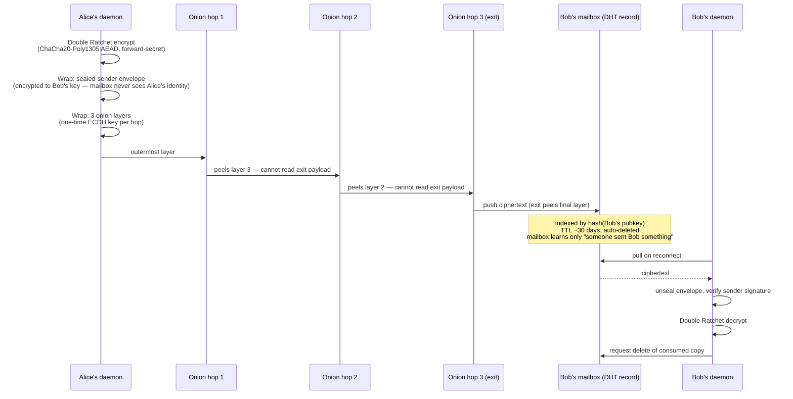
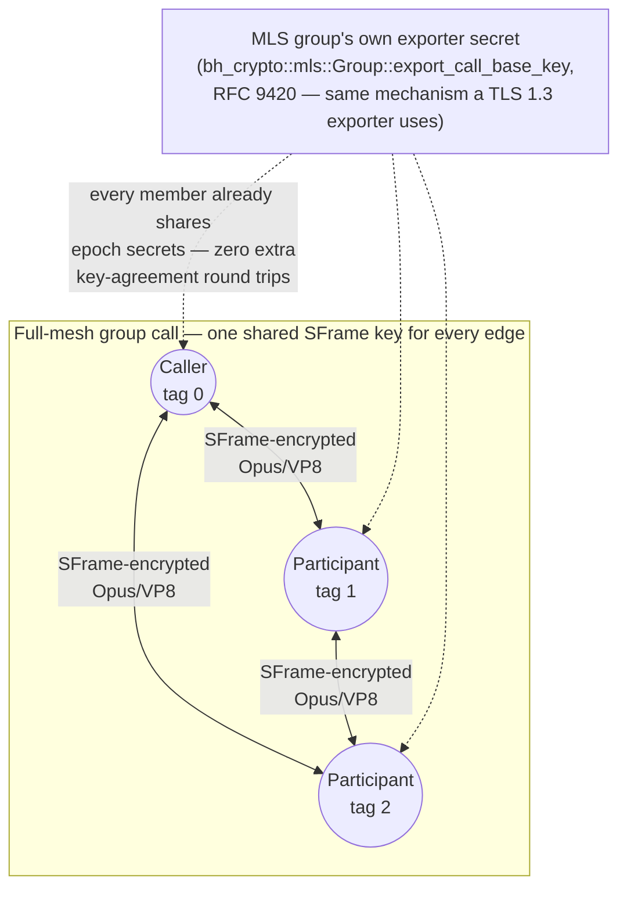
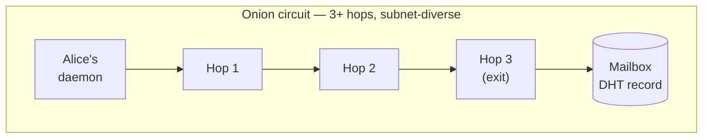
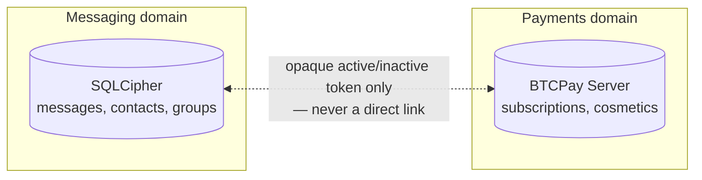

# Blackhole

**Private P2P messaging with real end-to-end encryption, zero-knowledge by
design, no content moderation, no central custody of data — funded by
cosmetic-only in-app purchases paid in cryptocurrency.**

The honest comparison isn't "like Telegram" — it's closer to *Signal +
Session + Tor, combined*. The operator cannot read message content and
cannot reconstruct who talks to whom, not as a policy promise but as a
structural property of the protocol.

📖 Full architecture & rationale: **[docs/SPEC.md](docs/SPEC.md)**
🛡️ Attack surface & known open risks, per subsystem: **[docs/THREAT_MODEL.md](docs/THREAT_MODEL.md)**
📐 Non-negotiables & contributor summary: **[CLAUDE.md](CLAUDE.md)**
⚖️ Decision-making model: **[GOVERNANCE.md](GOVERNANCE.md)**

---

## Status

**Core protocol logic is implemented and tested (328 tests across
`bh-crypto`/`bh-network`/`bh-storage`/`bh-files`/`bh-api`/`bh-calls`/
`bh-push-relay`), and the desktop client is a real, end-to-end wired
product UI with calls (1:1/group/screen-share) fully usable — but there
is still no deployed public P2P network.**
Concretely:

| Piece | State |
|---|---|
| Identity, X3DH + Double Ratchet (1:1 sessions) | ✅ Implemented, tested — **PQ hybrid now integrated into live sessions** (see below) |
| MLS groups (via `openmls`), incl. broadcast channels | ✅ Implemented, tested — state now **survives a daemon restart** |
| Post-quantum hybrid handshake (X25519 + ML-KEM-768) | ✅ Implemented, tested, **and wired into every real X3DH session** — not just a standalone primitive anymore |
| Key Transparency (RFC 6962 Merkle proofs) | ✅ Client-side primitive implemented, tested — **now extended with SignedTreeHead/verify_tree_head**; identities publish their own tree head over the DHT every 10 minutes, best-effort corroboration alongside safety-number verification (THREAT_MODEL.md §3.1) |
| Onion routing (3+ hop circuits) | ✅ Implemented, tested — packet-size **bucketed/padded** (mitigated, not eliminated), see below |
| Kademlia DHT, node selection, Sybil/Eclipse resistance | ✅ Implemented, tested against local multi-node scenarios — **now with routing-table admission control per subnet** (max 4 peers per /24 IPv4 or /48 IPv6, THREAT_MODEL.md §3.5) |
| Mailboxes (store-and-forward) + sealed sender | ✅ Implemented, tested — manifest race now closed (read-merge-write-verify retry + jittered backoff); PoW now enforced server-side |
| Cover traffic, anti-spam PoW | ✅ Implemented, tested, **PoW now verified server-side by mailbox nodes** |
| `bh-network` spawned by the daemon | ✅ Listening and supervised (auto-respawns on the live `yamux` CVE panic) — **now wired into Direct message send/receive**: `bh-api::message_crypto::send_encrypted_over_network` does real X3DH/Double Ratchet + mailbox push; `message_receive::spawn_receive_loop` polls/decrypts/delivers; proven by a genuine two-daemon integration test (`bh-api/tests/api_smoke.rs::direct_message_travels_a_real_network_between_two_daemons_and_decrypts`). **Group conversations not wired yet** — MLS fan-out via `Mailbox::fan_out` is a separate follow-up. |
| Local encrypted storage (SQLCipher), OS keystore, panic wipe | ✅ Implemented, tested — optional PIN layer in front of the DB key, **now also reachable via a WebAuthn passkey's PRF-derived secret** (hardware-backed, not TOTP — THREAT_MODEL.md §3.7) |
| File chunking, per-chunk E2EE, resumable download | ✅ Implemented, tested — **attachments now swept by the disappearing-message timer** (expiry sweeper deletes orphaned chunk directories from disk, not just DB rows) |
| Daemon localhost API (`bh-api`) | ✅ ~90 real endpoints across 28 modules, verified via live HTTP smoke tests + an in-process integration suite — **now with bearer-token auth** (`Authorization: Bearer <token>`, token in 0600 file, THREAT_MODEL.md §3.9) |
| Desktop client (Tauri) | ✅ Real product UI ("Event Horizon") — see [Feature set](#feature-set) below for the full list — **now with full calls UI** (1:1 audio/video/screen-share, group audio, VP8 decode via WebCodecs, `Vp8CanvasRenderer` in `calls.ts`) |
| Voice/video calls, 1:1 (`bh-calls`) | ✅ Real WebRTC + SFrame media encryption, tested — no STUN/TURN yet, **client UI now exists** (Tauri event bridge for `/calls/:call_id/ws`, `call_stream_bridge.rs`) |
| Group calls (full-mesh, MLS-exporter-keyed) | ✅ Implemented, tested — same STUN/TURN gap, **client UI now exists** (audio-only participant grid, `MAX_GROUP_CALL_PARTICIPANTS = 6`) |
| Screen sharing (same VP8/SFrame pipeline as camera) | ✅ Implemented, tested — same STUN/TURN gap, **client UI now exists** (parallel "screen" track, same VP8 decode path) |
| Device sync (keep a linked device's history current) | ✅ Real X3DH/Double Ratchet round-trip — peer is a locally-simulated shadow device, not a real second process yet |
| Cosmetics store, sticker packs | ✅ Implemented, tested — payment *confirmation* deliberately requires a real BTCPay webhook, not reachable from the client |
| Opaque wake-push relay (`bh-push-relay`) | ✅ New, separate, internet-facing binary — real register/wake contract, tested; not yet wired to a real APNs/FCM/UnifiedPush backend or to the daemon's mailbox code |
| Client-side link previews | ✅ Implemented — opt-in (off by default), deliberately bypasses the daemon entirely |
| Local full-text message search (FTS5) | ✅ Implemented, tested — pure local query, nothing leaves the daemon |
| Deployed infrastructure (relay/mailbox nodes, TURN, KT log) | ❌ Not deployed |
| Payments (Monero/BTC/ETH via BTCPay) | ❌ Not implemented — only the cosmetics-store data model + isolation boundary exist |
| Mobile / web clients | ❌ Not started — desktop-only for now |

`cargo fmt` / `cargo clippy -D warnings` clean, CI green on every push/PR
(`.github/workflows/ci.yml`). **Nothing here has been through independent
security review.** Treat every claim below as "implements the intended
design, unreviewed" — see `docs/THREAT_MODEL.md` for the honest per-module
breakdown, especially the onion routing module, the calls media path, and
the `bh-network` integration (now live for `Direct` messages, not yet for
`Group`).

---

## Table of contents

- [Design pillars](#design-pillars)
- [Architecture](#architecture)
- [Feature set](#feature-set)
- [Repo layout](#repo-layout)
- [How a message travels](#how-a-message-travels-1-1-target-design)
- [Group calls & screen sharing](#group-calls--screen-sharing)
- [Cryptography](#cryptography)
- [Network & anonymity](#network--anonymity)
- [Local device security](#local-device-security)
- [Identity, multi-device & recovery](#identity-multi-device--recovery)
- [Moderation & anti-abuse](#moderation--anti-abuse-without-breaking-e2ee)
- [Payments & monetization](#payments--monetization)
- [Threat model summary](#threat-model-summary)
- [Building & running](#building--running)
- [Daemon API surface](#daemon-api-surface-localhost-only)
- [Distribution plans](#distribution-plans)
- [Governance](#governance)
- [License](#license)

---

## Design pillars

Three non-negotiable pillars from `docs/SPEC.md` §0, enforced in
`CLAUDE.md` as things that must not be casually changed:

1. **Real zero-knowledge.** Not even the platform operator can read content
   or reconstruct who is talking to whom. This is a structural guarantee
   (protocol + architecture), not a privacy policy that could change.
2. **No central content moderation authority.** No message content is ever
   scanned or read, under any circumstance — a design principle, not a
   revocable policy.
3. **No profit on privacy.** The messaging core is and always will be free.
   Monetization is strictly cosmetic (profile gifts, themes, badges), paid
   in cryptocurrency. "More privacy" is never sold as an upsell — that
   would break the ethics of the project.

What Blackhole explicitly does **not** attempt to protect against: an
attacker with sustained physical or root control of an already-unlocked
device (OS-level keyloggers, preinstalled malware, forensic imaging). No
messaging app can meaningfully defend against that, and claiming otherwise
would be a false guarantee (`docs/SPEC.md` §1).

---

## Architecture

The client never talks to the P2P network directly — everything goes
through a local daemon that owns key material, the encrypted database, and
(once wired up) the network connection.

```mermaid
graph TB
    subgraph device["User's device"]
        UI["Desktop client (Tauri + TypeScript)<br/>client/desktop — 'Event Horizon' UI"]
        API["bh-api — localhost RPC surface<br/>127.0.0.1 only, JSON over HTTP<br/>~90 routes across 28 modules"]
        Daemon["bh-daemon binary<br/>daemon/"]

        UI <-->|"HTTP, loopback only<br/>never reaches the network directly"| API
        API --- Daemon

        subgraph libs["Library crates owned by the daemon"]
            Crypto["bh-crypto<br/>identity, X3DH + Double Ratchet,<br/>MLS, PQ hybrid, invites,<br/>device linking, backups,<br/>key transparency primitive"]
            Storage["bh-storage<br/>SQLCipher DB, OS keystore,<br/>self-destruct sweeper,<br/>local FTS5 search"]
            Files["bh-files<br/>content-addressed chunking,<br/>per-chunk E2EE, resumable DL"]
            Calls["bh-calls<br/>WebRTC + SFrame media crypto<br/>1:1, group (full-mesh), screen share"]
        end

        Daemon --> Crypto
        Daemon --> Storage
        Daemon --> Files
        Daemon --> Calls

        LinkPreview["link_preview.rs — Tauri command<br/>bypasses the daemon entirely, opt-in"]
        UI -.->|"direct HTTP fetch,<br/>never through the daemon"| LinkPreview
    end

    subgraph net["bh-network — real & tested, not yet wired into the daemon"]
        Transport["libp2p transport<br/>STUN + TURN fallback"]
        DHT["Kademlia DHT<br/>+ Sybil/Eclipse-resistant<br/>node selection"]
        Onion["Onion routing<br/>3+ hop circuits"]
        Mailbox["Encrypted mailboxes<br/>store-and-forward, TTL"]
        Sealed["Sealed sender"]
        Cover["Cover traffic"]
        PoW["Anti-spam PoW, enforced"]

        Transport --> DHT
        DHT --> Onion
        Onion --> Mailbox
        Mailbox --- Sealed
    end

    Daemon -->|"spawned + supervised,<br/>listening — not yet on the<br/>send/receive path"| Transport

    subgraph relay["Separate internet-facing service"]
        PushRelay["bh-push-relay<br/>opaque wake-token relay only —<br/>no content, no identity, opt-in"]
    end

    Daemon -.->|"planned: mailbox arrival →<br/>opaque wake — not wired yet"| PushRelay

    style net fill:#1a1a2e,stroke:#666,stroke-dasharray: 4 4
    style relay fill:#1a1a2e,stroke:#666,stroke-dasharray: 4 4
```



Everything inside `bh-network` is real, tested, working code — it is just
not yet the thing the daemon calls when you hit "send." That integration
(daemon ⇄ network) is the biggest remaining piece of plumbing before
Blackhole is a live network rather than a well-tested protocol stack.
`bh-push-relay` is a new, separate, deliberately minimal service (not part
of the loopback-only daemon) — its wake-only contract is real and tested,
but nothing calls it yet either.

---

## Feature set

Everything below is real, tested code living in the crates/modules named —
not a roadmap. "Client UI" means it's reachable from the desktop app
today; "backend only" means the daemon/API/crypto path is real and tested
but there's no button for it yet (the same gap 1:1 calls already had
before group calls/screen sharing were added — see
[Status](#status)).

| Feature | Client UI | Backend module(s) |
|---|---|---|
| Contacts, conversations, messages | ✅ | `bh-api::{contacts,conversations}` |
| Message reactions, quote-reply | ✅ | `bh-api::reactions` |
| **Message editing** (history preserved, never overwritten) | ✅ | `bh-api::conversations::edit_message` |
| Disappearing-message timers | ✅ | `bh-storage::expiry` |
| Delivery/read receipts | ✅ | `bh-api::receipts` |
| Safety-number verification | ✅ | `bh-crypto::safety_number` |
| Expiring / single-use invites | ✅ | `bh-crypto::invite`, `bh-storage::invites` |
| Encrypted conversation export/import | ✅ | `bh-api::export` |
| Multi-account profiles | ✅ | `bh-storage::profiles` |
| Device linking (local simulation) | ✅ | `bh-api::device_link` |
| **Device sync** (keep a linked device's history current) | ✅ | `bh-api::device_sync` |
| Passkey/TOTP local unlock | ✅ | `bh-api::local_auth` |
| **Database lock via WebAuthn PRF** (gates daemon spawn, not just UI) | ✅ | `client/desktop/src-tauri/src/daemon_lifecycle.rs`, `prf_unlock.rs` |
| Groups (MLS) | ✅ | `bh-api::groups`, `bh-crypto::mls` |
| **Broadcast channels** (owner-only posting) | ✅ | `bh-api::groups`/`conversations` (`broadcast_only`) |
| **Notes to self** (local-only, no session) | ✅ | `bh-storage::conversations::ensure_self_conversation` |
| File/media attachments | ✅ | `bh-api::files`, `bh-files` |
| **Voice messages** | ✅ | `bh-api::files` (`attachment_kind: voice`) |
| **Local full-text message search** | ✅ | `bh-storage::search` (SQLite FTS5) |
| **Cosmetics store** (banners/themes/badges/stickers) | ✅ | `bh-api::cosmetics` |
| **Sticker packs in chat** | ✅ | `bh-api::stickers` |
| **Opt-in "typing…" presence** | ✅ | `bh-api::presence` |
| **Opt-in client-side link previews** | ✅ | `client/desktop/src-tauri/src/link_preview.rs` |
| **Opt-in wake-push registration** | ✅ | `bh-api::push`, `crates/bh-push-relay` |
| Panic wipe, PIN-locked DB key | ✅ | `bh-api::{panic_wipe,security}` |
| Voice/video calls, 1:1 | ✅ | `bh-calls::session`, `bh-api::call_stream`, `client/desktop/src/calls.ts` |
| **Group calls** (full-mesh, MLS-exporter-keyed) | ✅ | `bh-calls::group`, `bh-api::calls` |
| **Screen sharing** | ✅ | `bh-calls::screen`, `bh-api::calls` |
| Crypto payment requests in chat | ✅ | `bh-api::payment_requests` |
| Moderation (block, message requests, reports) | ✅ | `bh-api::moderation` |

---

## Repo layout

```
daemon/                bh-daemon binary — localhost daemon (SPEC.md §6)
                        owns the SQLCipher DB + platform keystore, runs the
                        self-destruct sweeper, exposes the bh-api server,
                        spawns + supervises bh-network.

crates/
  bh-crypto/            Identity, X3DH + Double Ratchet (PQ-hybrid by
                         default), MLS, passkeys/TOTP, invites, device
                         linking, backups, key transparency. (SPEC.md §2-4)
      identity.rs          long-term identity keypair + safety-number verification
      ratchet.rs            X3DH handshake (classical + ML-KEM-768 hybrid) + Double Ratchet
      mls.rs                 group messaging via openmls (RFC 9420); export_call_base_key for group calls
      mls_storage.rs          PersistentMlsProvider — SQLCipher-backed group state, survives restarts
      pq_hybrid.rs             X25519 + ML-KEM-768 hybrid combiner (standalone primitive)
      key_transparency.rs       RFC 6962 Merkle tree hash/inclusion/consistency proofs
      auth.rs                    passkeys/FIDO2 (webauthn-rs) + TOTP backup
      invite.rs                  QR/link contact invites
      device_link.rs              multi-device linking
      backup.rs                    Argon2-derived encrypted backup/PIN keys
      call_keys.rs                  SFrame media key derivation for calls
      envelope.rs                    size-bucketed wire envelope for every message/reaction/receipt/signal
      safety_number.rs                 Signal-style iterated fingerprint
      payment_address.rs                XMR/BTC/ETH address format validation
      qr.rs                              shared QR rendering
      webhook.rs                          HMAC-SHA256 signing for the cosmetics webhook

  bh-network/           libp2p transport, Kademlia DHT, onion routing,
                         Eclipse/Sybil-resistant node selection, cover
                         traffic, mailboxes, sealed sender, anti-spam PoW.
                         (SPEC.md §5) Real, tested against local multi-node
                         scenarios — not deployed against a real network.
      transport.rs          libp2p transport + STUN/TURN
      dht.rs                Kademlia DHT
      eclipse_resistance.rs HMAC-scored node selection + subnet diversity
      onion.rs              multi-hop onion circuits, bucketed packet sizes
      mailbox.rs            store-and-forward encrypted mailboxes, PoW-gated
      sealed_sender.rs      sender identity hidden from relay/mailbox nodes
      cover_traffic.rs      dummy traffic generation
      pow.rs                proof-of-work anti-spam primitive, enforced by mailboxes
      supervised.rs         auto-respawns the node on a panicked event loop

  bh-storage/           SQLCipher-backed data model (contacts,
                         conversations, messages, groups, devices, sessions,
                         files, settings, cosmetics, push registration,
                         search index), platform keystore (Keychain /
                         Credential Manager / Secret Service via `keyring`),
                         panic wipe, self-destruct message sweeper.
                         (SPEC.md §7)
      db_key_lock.rs        optional PIN layer sealing the SQLCipher key
      local_auth.rs          passkey/TOTP credential storage
      cosmetics.rs             inventory/equip state (banners/themes/badges/stickers)
      message_stickers.rs       which sticker (if any) a message carries
      push.rs                    this profile's own wake-relay registration
      search.rs                   local FTS5 full-text search

  bh-files/             Content-addressed file chunking, per-chunk E2EE,
                         resumable download tracking. Storage/transport-
                         agnostic by design — the daemon wires it to disk
                         and the network separately. (SPEC.md §5.5)

  bh-api/               Localhost RPC surface between daemon and UI
                         clients. Binds 127.0.0.1 only. ~90 real endpoints
                         across 28 modules (identity, contacts, moderation,
                         conversations/messages incl. editing, reactions,
                         receipts, safety numbers, invites, export/import,
                         profiles, device linking + sync, local-auth,
                         groups incl. broadcast channels, file/voice
                         attachments, cosmetics/stickers, presence, push,
                         search, call signaling incl. group + screen-share,
                         network status, **message crypto over bh-network
                         for Direct conversations**) — all backed by
                         `bh-storage`/`bh-crypto`/`bh-calls`/`bh-files`,
                         verified end-to-end via live HTTP smoke tests plus
                         an in-process integration suite. (SPEC.md §6, §15-17)

  bh-calls/             Voice/video calls: real WebRTC (ICE/DTLS/SRTP) +
                         independent SFrame media encryption. (SPEC.md §15)
      session.rs            1:1 call setup/signaling + screen-share control
      group.rs               full-mesh group calls, MLS-exporter-keyed (§16)
      screen.rs               cross-platform screen capture → same VP8/SFrame path (§16)
      audio.rs                 Opus capture/encode/decode/playback
      video.rs                  camera capture + VP8 encode (decode left to client)
      media_crypto.rs            SFrame frame encrypt/decrypt
      signaling.rs                offer/answer/candidate signal types
      transport.rs                 WebRTC peer connection + track plumbing

  bh-push-relay/        New, separate, internet-facing binary — relays only
                         an opaque wake token, never content/identity/
                         conversation id. Not part of the bh-api daemon.
                         (SPEC.md §5.6, §16)
      server.rs             POST /register, POST /wake/:token
      state.rs               in-memory registered-token set, no database

client/
  desktop/              Tauri desktop client. Real product UI ("Event
                         Horizon"): identity bootstrap, contacts/
                         conversations/messages incl. editing, reactions,
                         receipts, safety numbers, invites, export/import,
                         multi-profile, device linking + sync, local-auth,
                         **Database lock via WebAuthn PRF** (gates daemon
                         spawn), groups incl. broadcast channels, notes to
                         self, file/voice attachments, local search,
                         cosmetics store + stickers, typing presence, link
                         previews, wake-push toggle, panic wipe. **Calls
                         (1:1/group/screen-share) now have full UI**:
                         in-call overlay, VP8 decode via WebCodecs,
                         camera/screen-share toggle, audio-only group grid.
      src/api.ts             typed request/response surface for daemon_call
      src/link_preview.ts      client-side-only link preview fetch/parse/render
      src-tauri/src/link_preview.rs  the Tauri command backing it (bypasses the daemon)

docs/
  SPEC.md               Full technical specification (source of truth)
  THREAT_MODEL.md        Per-subsystem STRIDE analysis + ranked open risks

.github/workflows/ci.yml  fmt + clippy -D warnings + build + test (Rust,
                           incl. libpipewire/libdbus for screen-capture),
                           typecheck + build (desktop client), on every push/PR
```

---

## How a message travels (1:1, **now live**)

This is the intended end-to-end flow once `bh-network` is wired into the
daemon. **For `Direct` conversations, this is no longer aspirational**:
`bh-api::conversations::send_message` runs a real X3DH + Double Ratchet
handshake (PQ-hybrid, X25519 + ML-KEM-768), wraps the ciphertext in a
sealed-sender envelope, pushes it to the recipient's Kademlia mailbox via
`bh-network`, and a background loop (`message_receive::spawn_receive_loop`)
polls/decrypts/delivers. Proven by a genuine two-daemon integration test
(`bh-api/tests/api_smoke.rs::direct_message_travels_a_real_network_between_two_daemons_and_decrypts`)
— not a same-process shadow session. **`Group` conversations still aren't
wired** — MLS fan-out via `Mailbox::fan_out` is a separate follow-up.



Groups don't repeat this per member: the sender publishes once to the
nodes responsible for the group (fan-out), and each member pulls from
there rather than the sender pushing N individual copies (`SPEC.md` §5.4).

---

## Group calls & screen sharing

No SFU exists yet, so a group call is a genuine **full mesh**: every
participant opens a direct `RTCPeerConnection` to every other participant,
capped at `MAX_GROUP_CALL_PARTICIPANTS = 6` (5 simultaneous connections per
participant — sustainable on a desktop without a media server, honestly
scoped rather than claiming this scales further than it does).



The key insight: instead of a bespoke per-edge Diffie-Hellman scheme (which
would mean *N·(N-1)/2* independent keys for what should be one logical
call), every participant derives the **same** SFrame base key straight from
the call's MLS group — members already share epoch secrets after
processing the same commits, so deriving a call key costs nothing extra and
reuses `openmls`'s own audited key schedule instead of new protocol code
(`CLAUDE.md`'s "no custom crypto primitives" non-negotiable, applied here
exactly as it is everywhere else). Each participant's frames are tagged
with a distinct `ParticipantTag` on the shared `SframeContext`, so mixing
up who-sent-what across the mesh isn't possible even though every edge
carries the same key.

**Screen sharing** rides the exact same pipeline as camera video — capture
(via [`scap`](https://github.com/CapsAdmin/scap), the same cross-platform
crate wrapping ScreenCaptureKit/Windows.Graphics.Capture/PipeWire) → VP8
encode → SFrame encrypt — just on a second, parallel WebRTC track (`id:
"screen"` vs `"video"`). No separate codec, no separate encryption scheme,
no new attack surface beyond "the pixels shown are now the pixels sent,"
which is the client's job to make an obvious, deliberate user action.

Both group calls and screen sharing have complete, tested backend support
**and a full client UI today** — the Tauri event bridge
(`call_stream_bridge.rs`) dials the daemon's `/calls/:call_id/ws`
WebSocket (which the webview can't open directly due to its `Origin`
header), relays events/frames to the webview, and `calls.ts`'s
`Vp8CanvasRenderer` decodes VP8 via WebCodecs. **Same STUN/TURN gap
remains**: peers must be able to reach each other directly.

---

## Cryptography

No custom cryptographic primitives, anywhere. `bh-crypto`'s X3DH/Double
Ratchet is a **from-scratch composition of audited primitive crates**, not
a dependency on Signal's own `libsignal` — that crate isn't published on
crates.io in a usable form (see `bh-crypto/Cargo.toml` for the specifics).
This is "protocol composition from audited primitives," explicitly not
"invented crypto" — but it also means this code has not had independent
review. Treat it as *"implements the right algorithm, unreviewed"* rather
than *"as trusted as libsignal."*

| Layer | Choice | Crate |
|---|---|---|
| 1:1 session handshake | X3DH | `x25519-dalek`, `ed25519-dalek` (composed) |
| 1:1 message encryption | Double Ratchet | `chacha20poly1305` (composed) |
| Group messaging | MLS (RFC 9420) | `openmls` — reference implementation, not custom |
| Post-quantum | Hybrid X25519 + ML-KEM-768, HKDF-combined | `ml-kem` |
| Local DB encryption at rest | SQLCipher | `rusqlite` (bundled-sqlcipher) |
| Keys in hardware / OS store | Keychain / Credential Manager / Secret Service | `keyring` |
| Seed-phrase recovery | BIP-39 | `bip39` |
| Backup key derivation | Argon2 (memory-hard, offline-brute-force resistant) | `argon2` |
| Passkeys / FIDO2 | WebAuthn, daemon as its own relying party | `webauthn-rs` |
| TOTP (2FA backup) | Local-only, no server | `totp-rs` |

**Post-quantum from day one, not a later patch** — mitigates
"harvest-now-decrypt-later" attacks. The hybrid combiner uses HKDF over
*both* legs, so a break in ML-KEM alone degrades to "as secure as X25519
alone," never full compromise. **Now integrated into the live X3DH flow**:
`SignedPreKey`/`PreKeyBundle` carry a second, ML-KEM-768 prekey alongside
the classical X25519 one (both Ed25519-signed and verified before use),
and `x3dh_initiate`/`x3dh_respond` combine both legs via HKDF — every real
1:1 session gets the hybrid protection today, tested for tampering on each
leg independently.

Any future in-house cryptosystem is explicitly deferred and gated on
professional cryptographers, formal verification (Tamarin/ProVerif), and
years of public review *before* replacing any already-audited piece — see
`SPEC.md` §2.2. Attempting to substitute Signal Protocol/MLS without that
process is called out as the project's #1 catastrophic-failure risk.

---

## Network & anonymity



- **Transport**: `libp2p`, STUN hole-punching first, TURN relay fallback
  (~10-20% of connections need it) — TURN only ever forwards ciphertext.
- **Anonymity**: Kademlia DHT for discovery, 3+ hop onion routing over it
  (Tor/Session-style), prioritizing traffic-analysis resistance over
  latency by explicit design choice.
- **Eclipse/Sybil resistance**: circuit-hop selection uses an HMAC-keyed
  score rather than raw DHT closeness (which is gameable), plus enforced
  subnet diversity per hop — tested against a 3-Sybil-node/1-subnet
  scenario. This covers circuit hop selection specifically, not general
  Kademlia routing-table poisoning (a broader S/Kademlia-style hardening
  effort, not undertaken yet).
- **Sealed sender**: the sender's identity and signature live *inside* the
  encryption to the recipient — a mailbox node holding an envelope learns
  only the routing key (recipient), never who sent it. Same principle
  applies to call signaling metadata.
- **Mailboxes**: encrypted store-and-forward, indexed by
  `hash(recipient_pubkey)`, TTL-bounded (~30 days) auto-delete. The daemon
  pulls on reconnect, decrypts locally, and requests deletion of the
  consumed copy.
- **Cover traffic**: constant-interval dummy packets between client and
  entry node, so sending a real message is indistinguishable from being
  idle — evaluated as a configurable option given the battery/data cost.
- **Anti-spam PoW**: a lightweight per-message proof-of-work, bound to the
  specific `(recipient, ciphertext, timestamp)` tuple so a solved
  challenge can't be replayed for a different message.

**⚠️ Known open risk, mitigated but not eliminated — onion packet-size
leak.** Packets are now length-prefixed and padded to the nearest of a
fixed set of size buckets at every hop, so same-bucket payloads of
different real sizes become indistinguishable on the wire. The bucket
ladder was later refined from a coarse 2x-doubling table topping out at
64KiB to a finer ~1.5x progression extended up to 1MiB, and the fallback
stride for anything still bigger dropped from a full extra bucket to a
quarter of one — real, tested reductions in both average padding overhead
and how coarse the size categories are. Unlike Sphinx (constant packet size
end-to-end), this is bucketing, not perfectly constant size: two payloads
straddling a bucket boundary — or one larger than every bucket — are still
distinguishable, and packet-shrinkage patterns can still leak coarse
position-in-circuit information. Still the single most consequential
unresolved gap in the codebase today — see `docs/THREAT_MODEL.md` §3.4.

---

## Local device security

- Long-term keys held in platform-native secure storage (Secure Enclave /
  Keystore-StrongBox on mobile targets; Keychain / Credential Manager /
  Secret Service on desktop via `keyring`).
- Local database encrypted at rest with SQLCipher — verified with a real
  negative test that opens an on-disk DB with the wrong key and asserts
  failure, not just "would fail in theory."
- **Panic wipe**: a tested, irreversible emergency-destruction path,
  reachable via `POST /panic-wipe`, confirmed end-to-end (deletes the data
  directory and exits the process) and wired into the desktop client as a
  button.
- Self-destructing messages, screenshot-blocking in sensitive chats, and
  window-blur content mitigation (all wired into the real client UI).
- **Zero third-party analytics/crash SDKs** — no Firebase Analytics, no
  Crashlytics, nothing. If error reporting is ever added, it will be
  self-hosted and explicitly opt-in.
- **Optional PIN layer in front of the SQLCipher key**: the key itself is
  still generated with the system RNG, but `bh_storage::db_key_lock` can
  now seal that same key under a user-chosen PIN (reusing the existing
  Argon2id + ChaCha20-Poly1305 backup-passphrase primitive rather than a
  new one) — `POST /security/db-pin` sets it, daemon startup and
  profile-switch both enforce it via `BLACKHOLE_DB_PIN`. **Opt-in, per
  profile, off by default**: a fresh profile is exactly as protected as
  before until its owner explicitly sets a PIN. See
  `docs/THREAT_MODEL.md` §3.7.

---

## Identity, multi-device & recovery

- **No mandatory phone number.** Registration doesn't require one; it's an
  optional, never a requirement.
- **Passkeys/FIDO2** as the primary auth method, TOTP as backup. **SMS is
  explicitly avoided** as a second factor — it's vulnerable to SIM
  swapping.
- **Contact discovery**: manual link/QR exchange by default (no friction,
  no address-book leakage); opt-in usernames as a parallel path, with
  rate-limited, proof-of-work-gated, DHT-distributed lookup — never a
  centralized, always-on directory.
- **Key verification**: safety-number / QR verification between contacts
   (Signal-style) is the real trust anchor today, not the display name.
   **Now complemented by Key Transparency gossip**: `bh-crypto::key_transparency`
   implements RFC 6962 Merkle tree hash/inclusion/consistency-proof
   primitives from scratch, exhaustively tested including tampered-proof
   and rewritten-history negative cases, **now extended with
   SignedTreeHead/sign_tree_head/verify_tree_head** — an identity signs
   its own tree head with its long-term signing key and publishes it over
   the DHT every 10 minutes (`bh_network::tree_head`). `get_safety_number`
   returns `key_transparency_corroborated`: best-effort fetch-and-verify
   of the contact's published tree head, **additional evidence alongside**
   (never replacing) manual out-of-band comparison. **Residual gap**: this
   only detects a contact silently getting handed a *different* key over
   the network — if the caller and the contact end up talking to disjoint,
   partitioned network views, gossip alone can't detect that (same caveat
   as any CT-style design without independent monitors).
- **Multi-device**: new devices link via QR scan against an already
  authenticated device; private keys are never uploaded in the clear to
  any server. Users can see and instantly revoke any linked device. Once
  linked, a device's message history stays current via a real X3DH +
  Double Ratchet sync round-trip (`bh-api::device_sync`) — today the
  "linked device" side of that handshake is a locally-simulated shadow
  identity rather than a real second process, same honest-about-scope
  caveat as linking itself.
- **Encrypted backups** with a key only the user controls — the server
  can't read them without it.
- **Seed-phrase recovery, no backdoor**: a 12-24 word BIP-39 phrase
  generated at account creation, kept offline by the user. Lose every
  device *and* the seed phrase, and the account is unrecoverable by
  design — there is no "reset password" escape hatch. This is stated
  explicitly during onboarding, not buried in a ToS.

---

## Moderation & anti-abuse (without breaking E2EE)

Content is never scanned or read — full stop, a design principle rather
than a revocable policy. What *is* implemented, all client-side or
opt-in:

- **User blocking** at the client level.
- **Message requests** by default for unknown senders — they don't land in
  the main inbox until accepted.
- **Voluntary reporting** — the reporting user chooses exactly what from
  their own local history to share; the platform never sees anything the
  user didn't explicitly attach.
- **Network-level anti-spam**, not content-level: the PoW primitive above,
  invisible to a normal user, costly for an automated mass sender — **now
  verified server-side**, mailbox nodes reject a `push`/`fan_out` whose
  solution doesn't check out before doing any storage work, not just
  defined-and-tested in isolation.

---

## Payments & monetization

The messaging core is free, always, no exceptions. Monetization is
strictly cosmetic — profile gifts, banners, themes, badges, sticker packs
— never sold as "more privacy."

**The cosmetics store's data model, isolation boundary, and client UI are
implemented and tested** (catalog, purchase records, entitlement-token
grant, inventory/equip, sticker packs usable in chat — `bh-api::cosmetics`/
`stickers`, `client/desktop`'s Store panel). **What's not implemented yet**
is the real BTCPay HTTP integration: `create_purchase` records an invoice
id the *caller* supplies rather than the daemon creating one itself, and
`mark_purchase_paid` is a stand-in for BTCPay's payment-confirmed webhook —
gated behind an HMAC-SHA256 signature only a real webhook (or someone
reading the keystore directly) could produce, so the client deliberately
has **no button that can complete a purchase today**, by design rather
than oversight. This describes the target design from `SPEC.md` §12.

- **Monero (XMR) as the primary method** — private by default (ring
  signatures, stealth addresses, hidden amounts). The only option that
  genuinely satisfies "hard to trace."
  **Bitcoin and Ethereum as secondary methods** — explicitly labeled
  *pseudonymous, not anonymous* in the UI, since every transaction is
  public on-chain and can be retroactively de-anonymized if the wallet
  ever touches a KYC exchange.
- **No fiat, no cards, no KYC.** Payment infrastructure: BTCPay Server
  (self-hosted, open source), native BTC/Lightning support, Monero via
  plugin; ETH/other altcoins need additional integration work.
- Payment requests are routed through the onion service too, so even the
  payer's IP stays hidden.



**Strict data isolation**: the payments/subscriptions database is never
directly linked to the messaging database — the only bridge is an opaque
token confirming "active/inactive," enforced as a non-negotiable in
`CLAUDE.md`.

---

## Threat model summary

Full STRIDE-style breakdown per subsystem lives in
[docs/THREAT_MODEL.md](docs/THREAT_MODEL.md). Short version:

**Adversaries considered:**

| Adversary | Capability | Trusted with |
|---|---|---|
| Passive network observer | Sees encrypted traffic, not endpoints | Nothing |
| Malicious/compromised relay or mailbox node | Can log, delay, drop, correlate traffic it handles | Ciphertext + connection metadata it directly touches — never sender identity or plaintext |
| Malicious contact | A real, authenticated conversation partner | Only what the user chooses to send |
| Compromised device (post-unlock) | Full access to an already-unlocked device | Everything on it — explicitly **out of scope** |
| The Blackhole operator/maintainers | Publishes the code, open source & (aspirationally) reproducibly built | Nothing, by design |

**Open risks, ranked** (from `docs/THREAT_MODEL.md` §4 — 20 tracked items
total; most of the earliest-identified ones are now FIXED/MITIGATED, kept
in the numbered list with that status rather than renumbered, so
cross-references stay stable). The genuinely still-**open** ones today:

1. **Onion routing packet-size leak** — mitigated (bucketed/padded sizes
   with a finer ~1.5x ladder up to 1MiB + quarter-bucket fallback stride),
   not eliminated: two payloads straddling a bucket boundary are still
   distinguishable (§3.4).
2. **`yamux` remote-panic CVE-2026-32314** — the node auto-respawns on
   crash now (`bh_network::supervised`), but the underlying panic is still
   open, blocked on an upstream `rust-libp2p` release (§3.10).
3. **Key Transparency gossip is deployed, not monitored**: identities
   publish their own tree heads over the DHT every 10 minutes, and
   `get_safety_number` does best-effort fetch-and-verify — but there are
   no independent monitors cross-checking different network views, so a
   partitioned MITM isn't caught by gossip alone (§3.1).
4. **`glib` GTK vulnerability** — dormant until a Linux build ships (§3.10).
5. **Calls have no STUN/TURN or anonymity properties** — applies equally
   to 1:1, group calls, and screen sharing (§3.11/§3.12).
6. **Link previews are a voluntary, by-design metadata leak when
   enabled** — off by default, stated plainly in the toggle's own copy,
   not fixable without proxying through the (not-yet-wired) P2P network
   (§3.12).
7. **Opaque push relay leaks coarse online/timing metadata, registration
   unauthenticated** — inherent to the concept, off by default (§3.12).
8. **Device sync's crypto is real, its peer is not** — same simulated-peer
   caveat as device linking and groups' shadow members (§3.12).
9. **Broadcast-channel posting restriction lives in two places
   (API + storage), not structurally** — same pattern already accepted for
   invite-token consumption (§3.12).
10. **File attachments have no resumability** — swept by the
    disappearing-message timer now, but uploads are still fully
    synchronous with nothing to resume without a live `bh-network` peer
    (§3.11).
11. **Device linking and device sync are same-daemon simulations**, not
    real cross-device/cross-process behavior yet (§3.11/§3.12).
12. **`Group` conversations not wired to `bh-network`** — `Direct` messages
    travel over the real P2P network (proven by a two-daemon integration
    test), but MLS fan-out via `Mailbox::fan_out` hasn't been connected
    yet (§17, `message_crypto.rs` module doc).

Several other historically-tracked items are now **FIXED**: PQ hybrid is
integrated into every live X3DH session (was #4 above), PoW is verified
server-side by mailbox nodes (was #5), an opt-in PIN layer now sits in
front of the SQLCipher key with a **WebAuthn PRF path** that genuinely
gates daemon spawn (was #6), MLS group state survives a daemon restart
(was #7), the mailbox manifest race is closed via read-merge-write-verify
retry + jittered backoff (was #8), **Direct messages now travel over the
real P2P network** with a two-daemon integration test proving it (was #9),
DHT routing-table admission is now bounded per subnet (was #10), the
daemon API now requires bearer-token auth (was #11), the expiry sweeper
now follows profile switches and deletes orphaned file chunks (was #12),
broadcast-channel enforcement now lives at two independent layers (was
#13), **calls have a full client UI** with VP8 decode via WebCodecs (was
#14), and link previews now have an SSRF guard + explicit toggle copy (was
#15) — see `docs/THREAT_MODEL.md` §4 for the full list with what
specifically closed each one.

None of these are hidden — each is called out in the relevant module's own
doc comments. This section (and the doc it summarizes) exists to make the
aggregate picture visible in one place.

---

## Building & running

Requires a stable Rust toolchain, Node.js, [pnpm](https://pnpm.io), and a
system OpenSSL (used to build SQLCipher and the WebAuthn stack), plus
`opus`/`libvpx`/`pkg-config` for `bh-calls` (voice/video, incl. group calls
and screen sharing). If `cargo build` can't find OpenSSL, point it at your
install, e.g. on an Apple Silicon Mac with Homebrew:

```sh
export OPENSSL_DIR=/opt/homebrew/opt/openssl@3
brew install opus libvpx pkg-config
```

On Linux, screen sharing's `scap` dependency additionally needs
`libpipewire-0.3-dev`/`libdbus-1-dev` (its xdg-desktop-portal/PipeWire
screencast backend) — see `.github/workflows/ci.yml` for the exact
`apt-get` line. macOS/Windows use native platform capture APIs and need
nothing extra.

```sh
# daemon + all library crates + the push relay + the Tauri client's Rust side
cargo build --workspace

# run the full test suite (285 tests — a handful of bh-calls tests need
# real UDP loopback and can be flaky under sandboxing/CI resource
# contention; see that crate's test comments)
cargo test --workspace

# run the daemon (binds 127.0.0.1:47853 by default,
# override with BLACKHOLE_DAEMON_PORT)
cargo run -p bh-daemon

# desktop client (in a separate terminal, daemon must be running)
cd client/desktop && pnpm install && pnpm tauri dev

# the opaque wake-push relay (separate, internet-facing — not part of
# the daemon; only needed if you're exercising the push feature)
cargo run -p bh-push-relay
```

CI (`.github/workflows/ci.yml`) runs, on every push/PR:

- `cargo fmt --all -- --check`
- `cargo clippy --workspace --all-targets -- -D warnings`
- `cargo build --workspace`
- `cargo test --workspace`
- desktop client typecheck + `pnpm build`

---

## Daemon API surface (localhost only)

`bh-api` binds `127.0.0.1` exclusively — it is never reachable from the
network by construction, not just by configuration. ~90 routes across 28
handler modules; representative examples per area below rather than an
exhaustive list (see `crates/bh-api/src/server.rs` for the full route
table, or `crates/bh-api/src/*.rs` — one file per area, named to match).

| Area | Example routes | Module |
|---|---|---|
| Identity & lifecycle | `GET/POST /identity`, `POST /panic-wipe` | `identity.rs`, `panic_wipe.rs` |
| Security | `GET/POST /security/db-pin`, `POST /security/db-pin/clear` | `security.rs` |
| Contacts & moderation | `GET/POST /contacts`, `POST /contacts/:id/block`, `POST /reports` | `contacts.rs`, `moderation.rs` |
| Conversations & messages | `GET/POST /conversations/:id/messages`, `PATCH /conversations/:id/messages/:mid` (edit), `GET .../edits` (history) | `conversations.rs` |
| Reactions & receipts | `POST /messages/:id/reactions`, `POST /conversations/:id/receipts` | `reactions.rs`, `receipts.rs` |
| Safety numbers | `GET /contacts/:id/safety-number`, `POST /contacts/:id/verify` | `safety_number.rs` |
| Invites | `POST /invites`, `POST /invites/decode`, `POST /invites/:token/revoke` | `invites.rs` |
| Export/import | `POST /conversations/:id/export`, `POST /conversations/import` | `export.rs` |
| Profiles (multi-account) | `GET /profiles`, `POST /profiles/:id/activate` | `profiles.rs` |
| Device linking & sync | `POST /devices/link/begin`, `GET /devices/:id/sync`, `GET .../sync/status` | `device_link.rs`, `device_sync.rs` |
| Local unlock | `GET /local-auth/status`, `POST /local-auth/totp/enroll/start` | `local_auth.rs` |
| Groups & channels | `POST /groups` (`kind: "group"\|"broadcast"`), `POST /groups/:id/members` | `groups.rs` |
| Files & voice messages | `POST /conversations/:id/attachments` (`duration_secs` ⇒ voice), `GET /attachments/:hash/download` | `files.rs` |
| Cosmetics & stickers | `GET /cosmetics/catalog`, `POST /cosmetics/purchases`, `POST /conversations/:id/stickers` | `cosmetics.rs`, `stickers.rs` |
| Typing presence | `GET/POST /settings/typing-indicators`, `GET/POST /conversations/:id/typing` | `presence.rs` |
| Wake-push registration | `GET/POST /push/register` | `push.rs` |
| Local search | `GET /search?q=...&conversation_id=...` | `search.rs` |
| Calls: 1:1, group, screen-share | `POST /calls`, `POST /calls/group/start`, `POST /calls/:id/screen-share/start` | `calls.rs` |
| Payment requests | `POST /conversations/:id/payment-requests`, `POST /messages/:id/payment-request/paid` | `payment_requests.rs` |
| Network status | `GET /network/status` | `network.rs` |

---

## Distribution plans

No official app stores (App Store / Google Play) by design decision.
Planned channels: F-Droid, direct APK, desktop builds (Windows/Mac/Linux),
and a Tor onion service as an alternate access path in countries that
block the primary domain.

**Open question, unresolved**: Apple restricts installing apps outside the
App Store except in specific regions (currently EU, Japan, Brazil — in
progress, subject to regulatory change). Outside those regions, sideloading
would require enterprise certificates (prohibited by Apple for public
distribution) or TestFlight (10,000-user cap, expires every 90 days). This
must be resolved — accept that limited iOS scope, or reconsider the
"no official stores" policy specifically for iOS — before an iOS client is
started (`SPEC.md` §14).

---

## Governance

**Benevolent dictator** model, the standard pattern for FOSS projects at
this stage (same shape as early Linux/Python/Rust). Anyone can propose
changes via issues and PRs; technical disagreements are worked out in the
open, with the maintainer's final say as a last-resort tie-breaker, not a
substitute for discussion. Changes to `docs/SPEC.md` §2 (cryptographic
architecture) get extra scrutiny — see [GOVERNANCE.md](GOVERNANCE.md) for
the full process.

---

## License

[GNU AGPL-3.0-or-later](LICENSE) — chosen so that anyone running a modified
version of Blackhole as a network service has to share their changes too,
consistent with `SPEC.md` §9's commitment to auditable, reproducible
builds.
