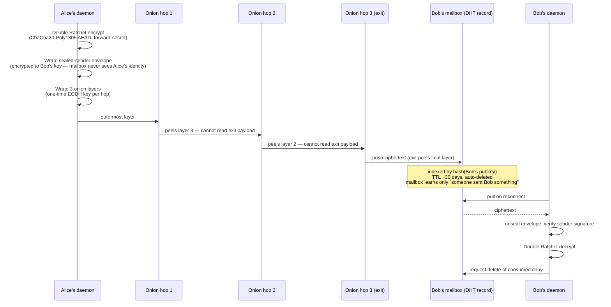
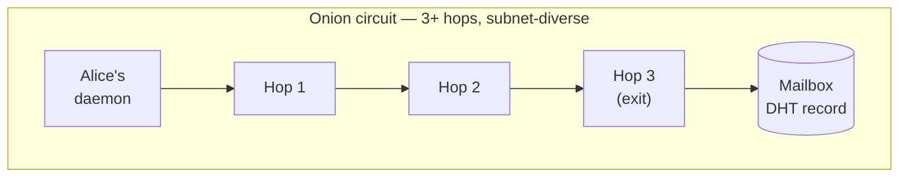
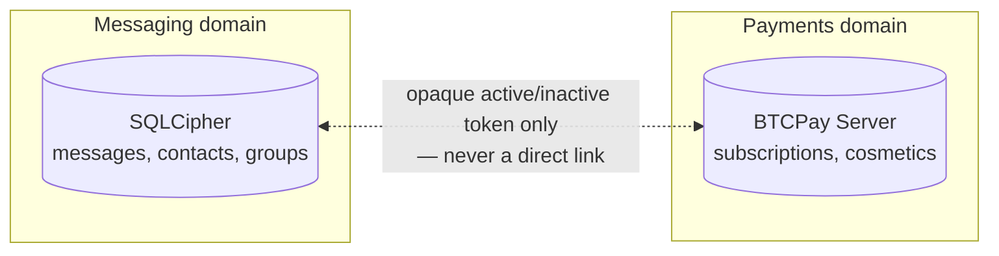

# Blackhole

**Private P2P messaging with real end-to-end encryption, zero-knowledge by
design, no content moderation, no central custody of data — funded by
cosmetic-only in-app purchases paid in cryptocurrency.**

The honest comparison isn't "like Telegram" — it's closer to *Signal +
Session + Tor, combined*. The operator cannot read message content and
cannot reconstruct who talks to whom, not as a policy promise but as a
structural property of the protocol.

📖 Full architecture & rationale: **[docs/SPEC.md](docs/SPEC.md)**
🛡️ Attack surface & known open risks, per subsystem: **[docs/THREAT_MODEL.md](docs/THREAT_MODEL.md)**
📐 Non-negotiables & contributor summary: **[CLAUDE.md](CLAUDE.md)**
⚖️ Decision-making model: **[GOVERNANCE.md](GOVERNANCE.md)**

---

## Status

**Core protocol logic is implemented and tested (93 tests across
`bh-crypto`/`bh-network`/`bh-storage`/`bh-files`), but there is no live
network deployment yet.** Concretely:

| Piece | State |
|---|---|
| Identity, X3DH + Double Ratchet (1:1 sessions) | ✅ Implemented, tested |
| MLS groups (via `openmls`) | ✅ Implemented, tested — state not yet persisted across daemon restarts |
| Post-quantum hybrid handshake (X25519 + ML-KEM-768) | ✅ Implemented, tested — **not yet wired into live X3DH sessions** |
| Onion routing (3+ hop circuits) | ✅ Implemented, tested — **known packet-size metadata leak**, see below |
| Kademlia DHT, node selection, Sybil/Eclipse resistance | ✅ Implemented, tested against local multi-node scenarios |
| Mailboxes (store-and-forward) + sealed sender | ✅ Implemented, tested — manifest has a known race condition under concurrent writers |
| Cover traffic, anti-spam PoW | ✅ Implemented, tested — **PoW not yet enforced anywhere server-side** |
| Local encrypted storage (SQLCipher), OS keystore, panic wipe | ✅ Implemented, tested |
| File chunking, per-chunk E2EE, resumable download | ✅ Implemented, tested |
| Daemon localhost API (`bh-api`) | ✅ Real endpoints, verified via live HTTP smoke tests |
| Desktop client (Tauri) | 🟡 Minimal dev shell — health check, panic wipe button, window-blur mitigation. Not product UI. |
| **`bh-network` wired into the daemon / a live network** | ❌ Not connected yet — network layer is complete and tested standalone but daemon send/receive doesn't talk to it |
| Key Transparency log | ❌ Not implemented — MITM detection is manual-verification-only today |
| Deployed infrastructure (relay/mailbox nodes, TURN, KT log) | ❌ Not deployed |
| Payments (Monero/BTC/ETH via BTCPay) | ❌ Not implemented |
| Mobile / web clients | ❌ Not started — desktop-only for now |

`cargo fmt` / `cargo clippy -D warnings` clean, CI green on every push/PR
(`.github/workflows/ci.yml`). **Nothing here has been through independent
security review.** Treat every claim below as "implements the intended
design, unreviewed" — see `docs/THREAT_MODEL.md` for the honest per-module
breakdown, especially the onion routing module.

---

## Table of contents

- [Design pillars](#design-pillars)
- [Architecture](#architecture)
- [Repo layout](#repo-layout)
- [How a message travels](#how-a-message-travels-1-1-target-design)
- [Cryptography](#cryptography)
- [Network & anonymity](#network--anonymity)
- [Local device security](#local-device-security)
- [Identity, multi-device & recovery](#identity-multi-device--recovery)
- [Moderation & anti-abuse](#moderation--anti-abuse-without-breaking-e2ee)
- [Payments & monetization](#payments--monetization)
- [Threat model summary](#threat-model-summary)
- [Building & running](#building--running)
- [Distribution plans](#distribution-plans)
- [Governance](#governance)
- [License](#license)

---

## Design pillars

Three non-negotiable pillars from `docs/SPEC.md` §0, enforced in
`CLAUDE.md` as things that must not be casually changed:

1. **Real zero-knowledge.** Not even the platform operator can read content
   or reconstruct who is talking to whom. This is a structural guarantee
   (protocol + architecture), not a privacy policy that could change.
2. **No central content moderation authority.** No message content is ever
   scanned or read, under any circumstance — a design principle, not a
   revocable policy.
3. **No profit on privacy.** The messaging core is and always will be free.
   Monetization is strictly cosmetic (profile gifts, themes, badges), paid
   in cryptocurrency. "More privacy" is never sold as an upsell — that
   would break the ethics of the project.

What Blackhole explicitly does **not** attempt to protect against: an
attacker with sustained physical or root control of an already-unlocked
device (OS-level keyloggers, preinstalled malware, forensic imaging). No
messaging app can meaningfully defend against that, and claiming otherwise
would be a false guarantee (`docs/SPEC.md` §1).

---

## Architecture

The client never talks to the P2P network directly — everything goes
through a local daemon that owns key material, the encrypted database, and
(once wired up) the network connection.

```mermaid
graph TB
    subgraph device["User's device"]
        UI["Desktop client (Tauri + TypeScript)<br/>client/desktop"]
        API["bh-api — localhost RPC surface<br/>127.0.0.1 only, JSON over HTTP"]
        Daemon["bh-daemon binary<br/>daemon/"]

        UI <-->|"HTTP, loopback only<br/>never reaches the network directly"| API
        API --- Daemon

        subgraph libs["Library crates owned by the daemon"]
            Crypto["bh-crypto<br/>identity, X3DH + Double Ratchet,<br/>MLS, PQ hybrid, invites,<br/>device linking, backups"]
            Storage["bh-storage<br/>SQLCipher DB, OS keystore,<br/>self-destruct sweeper"]
            Files["bh-files<br/>content-addressed chunking,<br/>per-chunk E2EE, resumable DL"]
        end

        Daemon --> Crypto
        Daemon --> Storage
        Daemon --> Files
    end

    subgraph net["bh-network — real & tested, not yet wired into the daemon"]
        Transport["libp2p transport<br/>STUN + TURN fallback"]
        DHT["Kademlia DHT<br/>+ Sybil/Eclipse-resistant<br/>node selection"]
        Onion["Onion routing<br/>3+ hop circuits"]
        Mailbox["Encrypted mailboxes<br/>store-and-forward, TTL"]
        Sealed["Sealed sender"]
        Cover["Cover traffic"]
        PoW["Anti-spam PoW"]

        Transport --> DHT
        DHT --> Onion
        Onion --> Mailbox
        Mailbox --- Sealed
    end

    Daemon -.->|"planned integration —<br/>not connected today"| Transport

    style net fill:#1a1a2e,stroke:#666,stroke-dasharray: 4 4
```



Everything inside `bh-network` is real, tested, working code — it is just
not yet the thing the daemon calls when you hit "send." That integration
(daemon ⇄ network) is the biggest remaining piece of plumbing before
Blackhole is a live network rather than a well-tested protocol stack.

---

## Repo layout

```
daemon/                bh-daemon binary — localhost daemon (SPEC.md §6)
                        owns the SQLCipher DB + platform keystore, runs the
                        self-destruct sweeper, exposes the bh-api server.

crates/
  bh-crypto/            Identity, X3DH + Double Ratchet, MLS, PQ hybrid,
                         passkeys/TOTP, invites, device linking, backups.
                         (SPEC.md §2-4)
      identity.rs         long-term identity keypair + safety-number verification
      ratchet.rs           X3DH handshake + Double Ratchet session state
      mls.rs                group messaging via openmls (RFC 9420)
      pq_hybrid.rs          X25519 + ML-KEM-768 hybrid handshake (standalone)
      auth.rs               passkeys/FIDO2 (webauthn-rs) + TOTP backup
      invite.rs             QR/link contact invites
      device_link.rs        multi-device linking
      backup.rs             Argon2-derived encrypted backup keys

  bh-network/           libp2p transport, Kademlia DHT, onion routing,
                         Eclipse/Sybil-resistant node selection, cover
                         traffic, mailboxes, sealed sender, anti-spam PoW.
                         (SPEC.md §5) Real, tested against local multi-node
                         scenarios — not deployed against a real network.
      transport.rs          libp2p transport + STUN/TURN
      dht.rs                Kademlia DHT
      eclipse_resistance.rs HMAC-scored node selection + subnet diversity
      onion.rs              multi-hop onion circuits
      mailbox.rs            store-and-forward encrypted mailboxes
      sealed_sender.rs      sender identity hidden from relay/mailbox nodes
      cover_traffic.rs      dummy traffic generation
      pow.rs                proof-of-work anti-spam primitive

  bh-storage/           SQLCipher-backed data model (contacts,
                         conversations, messages, groups, devices, sessions,
                         files, settings), platform keystore (Keychain /
                         Credential Manager / Secret Service via `keyring`),
                         panic wipe, self-destruct message sweeper.
                         (SPEC.md §7)

  bh-files/             Content-addressed file chunking, per-chunk E2EE,
                         resumable download tracking. Storage/transport-
                         agnostic by design — the daemon wires it to disk
                         and the network separately. (SPEC.md §5.5)

  bh-api/               Localhost RPC surface between daemon and UI
                         clients. Binds 127.0.0.1 only. Real endpoints for
                         identity bootstrap, panic wipe, contacts,
                         moderation (block / message-requests / reports),
                         conversations/messages — all backed by
                         `bh-storage`, verified end-to-end via live HTTP
                         smoke tests. (SPEC.md §6)

client/
  desktop/              Tauri desktop client. Minimal dev shell (not
                         product UI): daemon health check, panic wipe
                         button, window-blur content mitigation.

docs/
  SPEC.md               Full technical specification (source of truth)
  THREAT_MODEL.md        Per-subsystem STRIDE analysis + ranked open risks

.github/workflows/ci.yml  fmt + clippy -D warnings + build + test (Rust),
                           typecheck + build (desktop client), on every push/PR
```

---

## How a message travels (1:1, target design)

This is the intended end-to-end flow once `bh-network` is wired into the
daemon. Every stage below already exists as tested code; what's pending is
the daemon calling into it on the send/receive path.



Groups don't repeat this per member: the sender publishes once to the
nodes responsible for the group (fan-out), and each member pulls from
there rather than the sender pushing N individual copies (`SPEC.md` §5.4).

---

## Cryptography

No custom cryptographic primitives, anywhere. `bh-crypto`'s X3DH/Double
Ratchet is a **from-scratch composition of audited primitive crates**, not
a dependency on Signal's own `libsignal` — that crate isn't published on
crates.io in a usable form (see `bh-crypto/Cargo.toml` for the specifics).
This is "protocol composition from audited primitives," explicitly not
"invented crypto" — but it also means this code has not had independent
review. Treat it as *"implements the right algorithm, unreviewed"* rather
than *"as trusted as libsignal."*

| Layer | Choice | Crate |
|---|---|---|
| 1:1 session handshake | X3DH | `x25519-dalek`, `ed25519-dalek` (composed) |
| 1:1 message encryption | Double Ratchet | `chacha20poly1305` (composed) |
| Group messaging | MLS (RFC 9420) | `openmls` — reference implementation, not custom |
| Post-quantum | Hybrid X25519 + ML-KEM-768, HKDF-combined | `ml-kem` |
| Local DB encryption at rest | SQLCipher | `rusqlite` (bundled-sqlcipher) |
| Keys in hardware / OS store | Keychain / Credential Manager / Secret Service | `keyring` |
| Seed-phrase recovery | BIP-39 | `bip39` |
| Backup key derivation | Argon2 (memory-hard, offline-brute-force resistant) | `argon2` |
| Passkeys / FIDO2 | WebAuthn, daemon as its own relying party | `webauthn-rs` |
| TOTP (2FA backup) | Local-only, no server | `totp-rs` |

**Post-quantum from day one, not a later patch** — mitigates
"harvest-now-decrypt-later" attacks. The hybrid combiner uses HKDF over
*both* legs, so a break in ML-KEM alone degrades to "as secure as X25519
alone," never full compromise. It's implemented and tested as a standalone
primitive but **not yet integrated into live X3DH sessions** — real
sessions today don't get PQ protection yet.

Any future in-house cryptosystem is explicitly deferred and gated on
professional cryptographers, formal verification (Tamarin/ProVerif), and
years of public review *before* replacing any already-audited piece — see
`SPEC.md` §2.2. Attempting to substitute Signal Protocol/MLS without that
process is called out as the project's #1 catastrophic-failure risk.

---

## Network & anonymity



- **Transport**: `libp2p`, STUN hole-punching first, TURN relay fallback
  (~10-20% of connections need it) — TURN only ever forwards ciphertext.
- **Anonymity**: Kademlia DHT for discovery, 3+ hop onion routing over it
  (Tor/Session-style), prioritizing traffic-analysis resistance over
  latency by explicit design choice.
- **Eclipse/Sybil resistance**: circuit-hop selection uses an HMAC-keyed
  score rather than raw DHT closeness (which is gameable), plus enforced
  subnet diversity per hop — tested against a 3-Sybil-node/1-subnet
  scenario. This covers circuit hop selection specifically, not general
  Kademlia routing-table poisoning (a broader S/Kademlia-style hardening
  effort, not undertaken yet).
- **Sealed sender**: the sender's identity and signature live *inside* the
  encryption to the recipient — a mailbox node holding an envelope learns
  only the routing key (recipient), never who sent it. Same principle
  applies to call signaling metadata.
- **Mailboxes**: encrypted store-and-forward, indexed by
  `hash(recipient_pubkey)`, TTL-bounded (~30 days) auto-delete. The daemon
  pulls on reconnect, decrypts locally, and requests deletion of the
  consumed copy.
- **Cover traffic**: constant-interval dummy packets between client and
  entry node, so sending a real message is indistinguishable from being
  idle — evaluated as a configurable option given the battery/data cost.
- **Anti-spam PoW**: a lightweight per-message proof-of-work, bound to the
  specific `(recipient, ciphertext, timestamp)` tuple so a solved
  challenge can't be replayed for a different message.

**⚠️ Known open risk — onion packet-size leak.** Unlike Sphinx (constant
packet size end-to-end), this implementation's packets shrink by a fixed
amount at every hop, which leaks a relay's position in the circuit to
anyone observing packet sizes on the wire. This is the single most
consequential unresolved gap in the codebase today — see
`docs/THREAT_MODEL.md` §3.4.

---

## Local device security

- Long-term keys held in platform-native secure storage (Secure Enclave /
  Keystore-StrongBox on mobile targets; Keychain / Credential Manager /
  Secret Service on desktop via `keyring`).
- Local database encrypted at rest with SQLCipher — verified with a real
  negative test that opens an on-disk DB with the wrong key and asserts
  failure, not just "would fail in theory."
- **Panic wipe**: a tested, irreversible emergency-destruction path,
  reachable via `POST /panic-wipe`, confirmed end-to-end (deletes the data
  directory and exits the process) and wired into the desktop client's dev
  shell as a button.
- Self-destructing messages, screenshot-blocking in sensitive chats, and
  window-blur content mitigation (already wired in the desktop shell).
- **Zero third-party analytics/crash SDKs** — no Firebase Analytics, no
  Crashlytics, nothing. If error reporting is ever added, it will be
  self-hosted and explicitly opt-in.
- **Known gap**: the SQLCipher key is currently generated with the system
  RNG and stored directly in the OS keystore — there's no additional
  PIN/passphrase-derived layer in front of it yet. Today, keystore
  compromise alone (without a device PIN) is enough to unlock the
  database. See `docs/THREAT_MODEL.md` §3.7.

---

## Identity, multi-device & recovery

- **No mandatory phone number.** Registration doesn't require one; it's an
  optional, never a requirement.
- **Passkeys/FIDO2** as the primary auth method, TOTP as backup. **SMS is
  explicitly avoided** as a second factor — it's vulnerable to SIM
  swapping.
- **Contact discovery**: manual link/QR exchange by default (no friction,
  no address-book leakage); opt-in usernames as a parallel path, with
  rate-limited, proof-of-work-gated, DHT-distributed lookup — never a
  centralized, always-on directory.
- **Key verification**: safety-number / QR verification between contacts
  (Signal-style) is the real trust anchor today, not the display name.
  Complemented in the target design by a **Key Transparency** log (not yet
  implemented) that would let clients detect the network handing out
  inconsistent keys for the same contact.
- **Multi-device**: new devices link via QR scan against an already
  authenticated device; private keys are never uploaded in the clear to
  any server. Users can see and instantly revoke any linked device.
- **Encrypted backups** with a key only the user controls — the server
  can't read them without it.
- **Seed-phrase recovery, no backdoor**: a 12-24 word BIP-39 phrase
  generated at account creation, kept offline by the user. Lose every
  device *and* the seed phrase, and the account is unrecoverable by
  design — there is no "reset password" escape hatch. This is stated
  explicitly during onboarding, not buried in a ToS.

---

## Moderation & anti-abuse (without breaking E2EE)

Content is never scanned or read — full stop, a design principle rather
than a revocable policy. What *is* implemented, all client-side or
opt-in:

- **User blocking** at the client level.
- **Message requests** by default for unknown senders — they don't land in
  the main inbox until accepted.
- **Voluntary reporting** — the reporting user chooses exactly what from
  their own local history to share; the platform never sees anything the
  user didn't explicitly attach.
- **Network-level anti-spam**, not content-level: the PoW primitive above,
  invisible to a normal user, costly for an automated mass sender. (Not
  yet enforced server-side — see Status table.)

---

## Payments & monetization

The messaging core is free, always, no exceptions. Monetization is
strictly cosmetic — profile gifts, banners, themes, badges — never sold as
"more privacy." **Not implemented yet**; this describes the target design
from `SPEC.md` §12.

- **Monero (XMR) as the primary method** — private by default (ring
  signatures, stealth addresses, hidden amounts). The only option that
  genuinely satisfies "hard to trace."
  **Bitcoin and Ethereum as secondary methods** — explicitly labeled
  *pseudonymous, not anonymous* in the UI, since every transaction is
  public on-chain and can be retroactively de-anonymized if the wallet
  ever touches a KYC exchange.
- **No fiat, no cards, no KYC.** Payment infrastructure: BTCPay Server
  (self-hosted, open source), native BTC/Lightning support, Monero via
  plugin; ETH/other altcoins need additional integration work.
- Payment requests are routed through the onion service too, so even the
  payer's IP stays hidden.



**Strict data isolation**: the payments/subscriptions database is never
directly linked to the messaging database — the only bridge is an opaque
token confirming "active/inactive," enforced as a non-negotiable in
`CLAUDE.md`.

---

## Threat model summary

Full STRIDE-style breakdown per subsystem lives in
[docs/THREAT_MODEL.md](docs/THREAT_MODEL.md). Short version:

**Adversaries considered:**

| Adversary | Capability | Trusted with |
|---|---|---|
| Passive network observer | Sees encrypted traffic, not endpoints | Nothing |
| Malicious/compromised relay or mailbox node | Can log, delay, drop, correlate traffic it handles | Ciphertext + connection metadata it directly touches — never sender identity or plaintext |
| Malicious contact | A real, authenticated conversation partner | Only what the user chooses to send |
| Compromised device (post-unlock) | Full access to an already-unlocked device | Everything on it — explicitly **out of scope** |
| The Blackhole operator/maintainers | Publishes the code, open source & (aspirationally) reproducibly built | Nothing, by design |

**Open risks, ranked** (from `docs/THREAT_MODEL.md` §4):

1. Onion routing packet-size leak — position-in-circuit is inferable from
   packet size today (§3.4).
2. Mailbox manifest race condition under concurrent writers — a message
   isn't lost, but can end up unreferenced (§3.6).
3. No Key Transparency — MITM detection is manual-verification-only (§3.1).
4. PQ hybrid handshake not integrated into the live X3DH flow (§3.3).
5. Anti-spam PoW not enforced anywhere server-side yet (§3.8).
6. No PIN/passphrase layer in front of the SQLCipher key (§3.7).
7. MLS group state not persisted across daemon restarts (§3.2).

None of these are hidden — each is called out in the relevant module's own
doc comments. This section (and the doc it summarizes) exists to make the
aggregate picture visible in one place.

---

## Building & running

Requires a stable Rust toolchain, Node.js, [pnpm](https://pnpm.io), and a
system OpenSSL (used to build SQLCipher and the WebAuthn stack). If
`cargo build` can't find it, point it at your OpenSSL install, e.g. on an
Apple Silicon Mac with Homebrew:

```sh
export OPENSSL_DIR=/opt/homebrew/opt/openssl@3
```

```sh
# daemon + all library crates
cargo build --workspace

# run the full test suite (93 tests)
cargo test --workspace

# run the daemon (binds 127.0.0.1:47853 by default,
# override with BLACKHOLE_DAEMON_PORT)
cargo run -p bh-daemon

# desktop client (in a separate terminal, daemon must be running)
cd client/desktop && pnpm install && pnpm tauri dev
```

CI (`.github/workflows/ci.yml`) runs, on every push/PR:

- `cargo fmt --all -- --check`
- `cargo clippy --workspace --all-targets -- -D warnings`
- `cargo build --workspace`
- `cargo test --workspace`
- desktop client typecheck + `pnpm build`

### Daemon API surface (localhost only)

`bh-api` binds `127.0.0.1` exclusively — it is never reachable from the
network by construction, not just by configuration.

| Method | Path | Purpose |
|---|---|---|
| `GET` | `/health` | Liveness + version check |
| `GET` / `POST` | `/identity` | Read / bootstrap the local identity (create refuses to overwrite an existing one — `409 Conflict`) |
| `POST` | `/panic-wipe` | Irreversibly wipe the data directory and exit |
| `GET` / `POST` | `/contacts` | List / add contacts |
| `POST` | `/contacts/:id/block` | Block a contact |
| `POST` | `/contacts/:id/unblock` | Unblock a contact |
| `GET` | `/conversations` | List conversations |
| `GET` | `/conversations/:id/messages` | List messages in a conversation |
| `GET` | `/message-requests` | List pending message requests |
| `POST` | `/message-requests/:contact_id/accept` | Accept a message request |
| `POST` | `/message-requests/:contact_id/decline` | Decline a message request |
| `POST` | `/reports` | File a voluntary report |

---

## Distribution plans

No official app stores (App Store / Google Play) by design decision.
Planned channels: F-Droid, direct APK, desktop builds (Windows/Mac/Linux),
and a Tor onion service as an alternate access path in countries that
block the primary domain.

**Open question, unresolved**: Apple restricts installing apps outside the
App Store except in specific regions (currently EU, Japan, Brazil — in
progress, subject to regulatory change). Outside those regions, sideloading
would require enterprise certificates (prohibited by Apple for public
distribution) or TestFlight (10,000-user cap, expires every 90 days). This
must be resolved — accept that limited iOS scope, or reconsider the
"no official stores" policy specifically for iOS — before an iOS client is
started (`SPEC.md` §14).

---

## Governance

**Benevolent dictator** model, the standard pattern for FOSS projects at
this stage (same shape as early Linux/Python/Rust). Anyone can propose
changes via issues and PRs; technical disagreements are worked out in the
open, with the maintainer's final say as a last-resort tie-breaker, not a
substitute for discussion. Changes to `docs/SPEC.md` §2 (cryptographic
architecture) get extra scrutiny — see [GOVERNANCE.md](GOVERNANCE.md) for
the full process.

---

## License

[GNU AGPL-3.0-or-later](LICENSE) — chosen so that anyone running a modified
version of Blackhole as a network service has to share their changes too,
consistent with `SPEC.md` §9's commitment to auditable, reproducible
builds.
