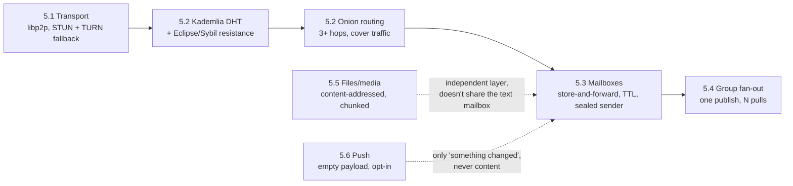
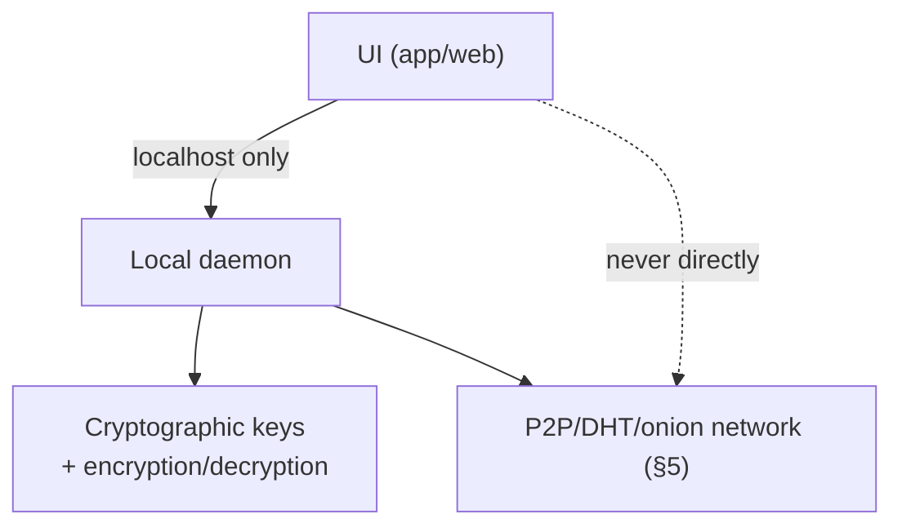
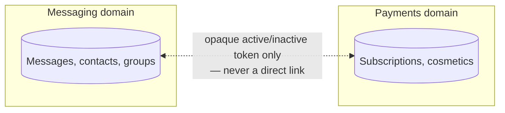

# BLACKHOLE — Technical Specification v0.1

> Private P2P messaging platform with real end-to-end encryption, no central custody of data, no content moderation, funded by a cosmetic subscription paid in cryptocurrency.

This document is the project's base context. It's meant to be handed to a development agent (Claude Code) as a starting point. It captures every architecture decision already made, the reasoning behind each one, and what's explicitly left pending.

📖 Versión original en español: **[docs/SPEC.md](SPEC.md)**

> **Translation note**: this is a faithful English translation of `docs/SPEC.md`, the project's Spanish-language source of truth. If the two ever disagree, `docs/SPEC.md` is authoritative — update it first, then re-sync this file.

## Table of contents

- [0. Vision and scope](#0-vision-and-scope)
- [1. Threat model](#1-threat-model)
- [2. Cryptographic architecture](#2-cryptographic-architecture)
  - [2.1 Base protocol](#21-base-protocol)
  - [2.2 On a proprietary cryptosystem (future)](#22-on-a-proprietary-cryptosystem-future)
  - [2.3 Metadata](#23-metadata)
  - [2.4 Key Transparency](#24-key-transparency)
- [3. Identity and authentication](#3-identity-and-authentication)
- [4. Multi-device, backups, and recovery](#4-multi-device-backups-and-recovery)
- [5. Network architecture (P2P)](#5-network-architecture-p2p)
  - [5.1 Transport layer](#51-transport-layer)
  - [5.2 Routing and anonymity](#52-routing-and-anonymity)
  - [5.3 Offline messaging (store-and-forward)](#53-offline-messaging-store-and-forward)
  - [5.4 Groups at scale](#54-groups-at-scale)
  - [5.5 Files and media](#55-files-and-media)
  - [5.6 Push notifications](#56-push-notifications)
- [6. Client and local daemon](#6-client-and-local-daemon)
- [7. Endpoint (device) security](#7-endpoint-device-security)
- [8. Moderation, spam, and abuse](#8-moderation-spam-and-abuse)
- [9. Transparency and auditability](#9-transparency-and-auditability)
- [10. Distribution](#10-distribution)
- [11. Governance](#11-governance)
- [12. Economic model and payments](#12-economic-model-and-payments)
- [13. Explicitly deferred / on hold](#13-explicitly-deferred--on-hold)
- [14. Decisions pending confirmation](#14-decisions-pending-confirmation)
- [15. Added features (post-v0.1)](#15-added-features-post-v01)
- [16. Added features (second round, post-§15)](#16-added-features-second-round-post-15)
- [17. Wiring up the real network and closing pending risks (post-§16)](#17-wiring-up-the-real-network-and-closing-pending-risks-post-16)
- [18. Shareable blocklists, trust signal, UI preferences, and a fourth hardening round](#18-shareable-blocklists-trust-signal-ui-preferences-and-a-fourth-hardening-round-post-17)
- [Appendix — Reference technology stack](#appendix--reference-technology-stack)
- [Appendix — Mapping to original decisions (1-31)](#appendix--mapping-to-original-decisions-1-31)
- [Stack decisions made at scaffold time](#stack-decisions-made-at-scaffold-time-post-v01)

---

## 0. Vision and scope

Blackhole is a benchmark for real privacy, not marketing privacy. The honest comparison isn't "like Telegram" — it's closer to Signal + Session + Tor, combined. The three non-negotiable pillars:

1. **Real zero-knowledge**: not even the platform operator can read content or reconstruct who any user talks to.
2. **No central content-moderation authority**: no message is ever scanned or read, under any circumstance.
3. **No profit on privacy**: the messaging core is and always will be free. The business lives in cosmetic personalization, not in selling "more security."

---

## 1. Threat model

We protect the user against:
- The platform/operator itself (zero-knowledge by design, not by policy).
- Third parties intercepting network traffic (encryption in transit + onion routing).
- Compromise of an intermediate network node (no individual node can read content or, ideally, full metadata).
- Metadata analysis and traffic correlation (sealed sender, multi-hop onion routing, cover traffic).

We explicitly **do not** attempt to protect against an attacker with sustained, total physical control of the user's device (OS-level keyloggers, preinstalled malware). This is documented publicly so as not to sell false guarantees.

---

## 2. Cryptographic architecture

```mermaid
graph TD
    IK["Long-term identity key<br/>Ed25519 (sign) + X25519 (agree)"]
    SPK["Signed prekey<br/>classical (X25519) + PQ (ML-KEM)"]

    IK --> X3DH["X3DH — 1:1 key agreement<br/>HKDF-combined: classical + PQ legs<br/>(mitigates 'harvest now, decrypt later')"]
    SPK --> X3DH
    X3DH --> DR["Double Ratchet<br/>a distinct message key per message,<br/>forward secrecy + post-compromise security"]

    IK --> MLS["MLS (RFC 9420) — groups<br/>key tree, one commit per membership<br/>change, scales better than N sessions"]

    DR -.->|"never homegrown crypto —<br/>see §2.2"| Audit["Only already-audited primitives<br/>(libsodium or equivalent)"]
    MLS -.-> Audit

    style X3DH fill:#1a1a2e,stroke:#666
    style MLS fill:#1a1a2e,stroke:#666
```

### 2.1 Base protocol
- **Signal Protocol** (X3DH + Double Ratchet) for 1:1 chats.
- **MLS (Messaging Layer Security, RFC 9420)** for groups — scales better than pairwise ratcheting and is purpose-built for this case.
- **Hybrid post-quantum encryption from day one** (X25519 + Kyber/ML-KEM), not as a later patch. Mitigates "harvest now, decrypt later" attacks.
- Cryptographic library: **libsodium** or an equivalent already-audited one. Zero in-house implementations of cryptographic primitives in v1.

### 2.2 On a proprietary cryptosystem (future)
Designing a proprietary cryptosystem down the line has been raised. It's documented here as a design warning: the only serious way to do it is with dedicated professional cryptographers, formal verification (Tamarin Prover / ProVerif), and years of public review **before** replacing any piece of the already-audited protocol. This is not v1 or v2 work. Any attempt to replace Signal Protocol/MLS without this process is the project's #1 catastrophic-failure risk.

### 2.3 Metadata
- **Sealed sender**: the entry server/node doesn't know the sender, only the recipient.
- Same logic applied to **call signaling** (item 31): the signaling node must not be able to reconstruct who-called-whom-when.
- Minimal log retention with aggressive, automatic purging.

### 2.4 Key Transparency
A public, append-only, auditable log of public keys (the same concept as web Certificate Transparency, or Signal's own Key Transparency). Lets any client verify that the public key it receives for a contact is the same one the rest of the network sees — detects a silent, infrastructure-level MITM, complementary to manual (QR/safety-number) verification between two people.

---

## 3. Identity and authentication

- **Registration without a mandatory phone number.** Phone stays optional, never a requirement.
- **Passkeys/FIDO2** as the primary authentication method. TOTP as backup. **SMS explicitly avoided** as a sole second factor (vulnerable to SIM swapping).
- **Contact discovery**:
  - Base method: manual exchange via link / QR / code (no friction, no address-book leakage).
  - **Usernames in parallel**, with mitigations to avoid centralizing or exposing the network:
    - Opt-in (the user decides whether they're "discoverable" — not by default).
    - Aggressive rate limiting on directory lookups (anti-scraping).
    - Minimal cost (proof-of-work) to register a username, anti-Sybil.
    - Directory distributed on the same DHT, not on a proprietary central server.
- **Key verification** between contacts via safety number / QR scan (Signal-style), complemented by Key Transparency (2.4).

---

## 4. Multi-device, backups, and recovery

- **Multi-device sync** via key exchange between devices (same approach as Signal), never uploading private keys in the clear to any server.
- **New device linking**: QR scan between an already-authenticated device and the new one.
- **"Active devices" panel**: the user sees every linked device and can revoke access instantly (critical in case of theft/loss).
- **Encrypted backups** with a key only the user controls (a secure-value-recovery-style scheme — not even the server can read them without the user's key).
- **No-backdoor account recovery**: a *seed phrase* model (12-24 words) generated at account creation, kept offline by the user. If every device and the seed phrase are lost, the account is unrecoverable by design — there is no "reset password" backdoor. This must be communicated very explicitly during onboarding.

---

## 5. Network architecture (P2P)

### 5.1 Transport layer
- **libp2p** as the base (don't reinvent NAT traversal/peer discovery from scratch).
- **STUN** for direct hole punching between peers when possible.
- **TURN** as a fallback relay when hole punching fails (~10-20% of cases); TURN only ever forwards already-encrypted packets, it can't read them.

### 5.2 Routing and anonymity
- **Kademlia-style DHT** for discovery with no central server.
- **Multi-hop onion routing** (3 hops minimum, Tor/Session-style) over the DHT — an explicit decision to maximize traffic-analysis resistance, prioritizing security over latency.
- **Eclipse/Sybil attack mitigation**: node selection with verifiable randomness (not predictably "the closest ones"), and forced diversity per hop (the circuit's 3 hops can't fall on the same subnet/operator).
- **Cover traffic (dummy traffic)**: filler packets at constant intervals between client and entry node, so sending a real message is indistinguishable from being idle. Evaluated as a configurable option given the battery/data cost.

### 5.3 Offline messaging (store-and-forward)
- Encrypted mailboxes on network nodes, indexed by hash of the recipient's public key (the node doesn't know the real identity).
- **TTL** (e.g. 30 days) with automatic deletion.
- The local daemon pulls on reconnect, decrypts locally, and requests deletion of the node's copy.

### 5.4 Groups at scale
- The sender publishes once to the nodes responsible for the group (fan-out), not one push per member. Each member pulls from there.

### 5.5 Files and media
- A separate **content-addressed storage** layer (IPFS-style), with chunking and resumable download, E2EE, and its own lifecycle and size limits (independent of the text-message mailbox).

### 5.6 Push notifications
- Uses **APNs/FCM with empty payloads** ("something's there, check the network") — the push carries no readable content or metadata.
- **UnifiedPush** as an Android alternative, to avoid depending on Google.

---

## 6. Client and local daemon

- **Local daemon** architecture running on `localhost` (its own port) on the user's machine/device.
- The UI (app/web) talks only to the daemon via localhost, never directly to the network.
- The daemon manages: cryptographic keys, encryption/decryption, and the connection to the P2P/DHT/onion network.

---

## 7. Endpoint (device) security

- Keys in **secure hardware**: Secure Enclave (iOS), Keystore/StrongBox (Android).
- **Local database encrypted at rest** (SQLCipher-style), key derived from the user's PIN/passcode — never plaintext on disk.
- Screenshot blocking in sensitive chats.
- Configurable self-destructing messages.
- **Panic wipe**: fast app wipe via an emergency gesture/PIN.
- Warnings/restrictions on jailbroken/rooted devices.
- **Zero third-party analytics/crash-reporting SDKs** (no Firebase Analytics, Crashlytics, etc.). If error reporting is ever needed: an in-house, self-hosted, explicitly opt-in system.

---

## 8. Moderation, spam, and abuse

- **No message content is ever scanned or read, under any circumstance.** This is a design principle, not a revocable policy.
- What *is* implemented, without breaking E2EE:
  - **User blocking** at the client level.
  - **Voluntary reporting**: the reporting user decides what to share from their own history; the platform never accesses messages the user didn't choose to show.
  - "Message requests" by default for contact from strangers (they don't land directly in the main chat until accepted).
- **Network-level anti-spam** (not content-level): a lightweight per-message proof-of-work, invisible to a normal user, costly for an automated mass sender.
- **Shareable blocklists** (implemented, §18): export/import one's own blocklist as a link — always a voluntary courtesy between users, never a centralized or automatically-applied list.

---

## 9. Transparency and auditability

- **Open-source client code on GitHub**, auditable by anyone.
- **Reproducible builds**: anyone can verify that the published binary/APK corresponds exactly to the published source code.
- Independent, published security audits.
- (Bug bounty program / recurring pentesting / continuous fuzzing: see section 13, on hold by explicit decision.)

---

## 10. Distribution

- **No official stores** (App Store / Google Play are out, by project decision).
- Yes to: **F-Droid, direct APK, desktop builds** (Windows/Mac/Linux), and an **onion service (Tor)** as an alternate access path in countries that block the primary domain.
- ⚠️ **Open point, unconfirmed** — see section 14.

---

## 11. Governance

- **"Benevolent dictator"** model (standard in large FOSS projects) for protocol and roadmap decisions.
- Economic incentives for network node operators: **deferred**, see section 13.

---

## 12. Economic model and payments

- **Messaging core 100% free, no exceptions, always.** "More privacy" is never sold as an upsell — it would break the project's ethics.
- **Monetization exclusively in cosmetic personalization**: virtual profile gifts, banners, themes, badges, etc.
- **Payments 100% in cryptocurrency**, no fiat/card, no KYC:
  - **Monero (XMR) as the primary method** — privacy by default and mandatory (ring signatures, stealth addresses, hidden amounts). It's the only option that genuinely satisfies "hard to trace."
  - **Bitcoin and Ethereum as secondary methods**, alongside other cryptos to evaluate. Important: BTC and ETH are **pseudonymous, not anonymous** — every transaction is public and traceable on its blockchain, and can be retroactively de-anonymized if the wallet ever touches a KYC exchange. This must be made explicit in the UI ("Monero: private by design" vs. "Bitcoin/ETH: public on-chain") so the user can choose informed.
- **Payment infrastructure**: BTCPay Server (open source, self-hosted, no imposed KYC), native for BTC/Lightning, with a plugin for Monero. ETH/other altcoins need additional integration, they don't come "out of the box" as maturely — to be resolved during implementation.
- Payment requests are also routed through the onion service, so not even the payer's IP is exposed.
- **Strict data isolation**: the payments/subscriptions database is never directly linked to the messaging one — only an exchangeable opaque token confirms "active/inactive."

---

## 13. Explicitly deferred / on hold

These points were identified but deliberately decided to be handled later — they aren't forgotten gaps, they're purposely postponed decisions:

- **Legal exposure by jurisdiction** (encryption restrictions, countries that block encrypted messaging apps): skipped for now.
- **Economic incentives for node operators**: to be defined once the network's economics are designed.
- **Continuous-assurance program** (permanent bug bounty, recurring pentesting, formal verification, CI/CD fuzzing, public disclosure policy): **on hold**, proposed but not yet prioritized.

---

## 14. Decisions pending confirmation

- **iOS and distribution without an official store**: Apple restricts installation outside the App Store except for regional exceptions (currently the EU, Japan, and Brazil in the process of enabling it — subject to regulatory change). Outside those regions, an iPhone user couldn't install Blackhole without resorting to enterprise certificates (prohibited by Apple for public distribution) or TestFlight (10,000-user cap, expires every 90 days). **This was flagged as an open question and never explicitly confirmed** — before Claude Code starts the iOS client, this decision should be closed: is that limited iOS scope accepted, or is the "no official stores" policy reconsidered specifically for that platform?

---

## 15. Added features (post-v0.1)

Implemented on top of the v0.1 base, without touching any of the non-negotiables (§2.2, CLAUDE.md). All of it lives in `bh-crypto`/`bh-storage`/`bh-api`/`bh-calls`, real and tested (see each crate), except where noted otherwise.

- **Reactions and quote-replies**: emoji reactions (`bh_storage::reactions`) and `reply_to_message_id` on every message. Local storage only — the encrypted transport of a reaction/quote travels as one more variant of `bh_crypto::envelope::Envelope`, indistinguishable from outside from any other encrypted message (see below).
- **Configurable ephemeral messages**: the self-destruct sweeper from §7 already existed; now each conversation has its own timer (`disappearing_timer_secs`, `bh_storage::conversations::set_disappearing_timer`) applied automatically on send (`POST /conversations/:id/messages`).
- **Delivery/read receipts with no metadata for the operator**: instead of a separate "receipts protocol" (which would leak "these two parties are exchanging receipts right now"), a receipt is one more variant of `bh_crypto::envelope::Envelope` (`Envelope::Receipt`) — it travels inside the same already-authenticated Double Ratchet/MLS session as the chat content, so anything outside the recipient sees identical ciphertext regardless of what it contains. See `docs/THREAT_MODEL.md` for the residual ciphertext-length leak.
- **Safety-number verification** (already planned in §3): `bh_crypto::safety_number` implements the iterated fingerprint (SHA-512, same style as Signal) combining both identities, displayable as 12 groups of 5 digits or a QR code. `Contact.verified` (already in the schema) is set via `POST /contacts/:id/verify` after manual comparison — the app never marks "verified" on its own.
- **Expiring / single-use invites**: `bh_crypto::invite::InvitePayload` now carries a random token and an optional expiration. Since there's no server, the only real authority is the issuer: `bh_storage::invites` keeps the local record (`issued_invites`) and `Database::consume_invite` atomically decides whether a redemption attempt is still valid.
- **Encrypted export/import of history**: reuses `bh_crypto::backup::seal`/`open` (Argon2id + ChaCha20-Poly1305), applied to a conversation+messages+reactions+receipts bundle instead of to the whole account backup (`bh-api::export`).
- **Multi-account (isolated profiles)**: each profile is a completely separate SQLCipher database and keystore *service name* (`bh_storage::profiles::ProfileManager`), the same isolation model §12 already requires between payments and messaging, applied here between identities. The profile listing (id/name/date) is the only plaintext data — never content or keys.
- **E2EE voice/video calls** (`bh-calls`, new crate):
  - *Signaling and key agreement* (`bh_crypto::call_keys`, `bh_calls::signaling`): per-call ephemeral ECDH + HKDF, independent of long-term session keys (call-specific forward secrecy). The offer/answer/candidates travel as `Envelope::Call` inside the existing encrypted session — same principle as receipts.
  - *Media encryption* (`bh_crypto::call_keys::SframeContext`): an SFrame-style layer (draft-ietf-sframe) over already-encoded audio/video, with epoch ratcheting — a second encryption layer independent of DTLS-SRTP, so not even a compromised relay/TURN can see the content.
  - *Transport* (`bh_calls::transport`): real WebRTC via `webrtc-rs` (ICE/DTLS/SRTP) — STUN and TURN are configurable (`BLACKHOLE_STUN_SERVERS`/`BLACKHOLE_TURN_SERVERS`+`_USERNAME`+`_CREDENTIAL`, a public STUN server by default), but no TURN server is deployed for this project (same state as `bh-network`'s bootstrap nodes), validated with two real local `RTCPeerConnection`s in the tests.
  - *Audio* (`bh_calls::audio`): Opus (`audiopus`, bindings over libopus) + real capture/playback with `cpal`. The codec round-trip is tested with synthetic PCM; real hardware capture/playback isn't exercised in CI (no microphone/speakers).
  - *Video* (`bh_calls::video`): camera capture (`nokhwa`) + VP8 encoding (`vpx-encode`, over libvpx). **VP8 decoding deliberately out of scope**: no safe Rust VP8-decoding crate exists, and writing our own FFI bindings against libvpx is exactly the kind of unaudited code this project avoids writing (same principle as §2.2, applied to codecs instead of cryptography) — left to the Tauri client, which can decode with the webview's native APIs.
  - Needs `opus`, `libvpx`, and `pkg-config` from the system at build time (via Homebrew/apt/etc.) — see comments in `crates/bh-calls/Cargo.toml`.
- **Crypto payment requests in chat** (`bh_crypto::payment_address`, `bh_storage::payment_requests`, `bh-api::payment_requests`): deliberately the simplest possible design — one more encrypted message carrying an address/suggested amount/memo for XMR, BTC, or ETH. Blackhole never custodies funds or queries a blockchain; settlement happens wallet-to-wallet, entirely outside the app, and "paid" is always a local manual mark (`paid_at`), never an on-chain confirmation. This is intentional and distinct from §12 (cosmetic monetization via BTCPay): by never touching payment infrastructure at all, this feature falls automatically outside §12's payments/messaging isolation requirement, rather than having to satisfy it. `bh_crypto::payment_address` validates the address *format* (base58check+bech32 for BTC, EIP-55 for ETH, base58 with Monero's own Keccak-256 checksum for XMR) to catch typos before showing a QR code — composition of audited hash functions, not a new cryptosystem (same criterion as `safety_number` in §2.2). The amount is never encoded in the URI/deep-link (`bitcoin:`/`ethereum:`/`monero:` + the address only) to avoid a unit-conversion bug (wei, atomic units) silently misstating how much is owed — it's shown separately, as informational text.

---

## 16. Added features (second round, post-§15)

A second batch of features on top of §15, same criterion: nothing touches the non-negotiables (§2.2, CLAUDE.md), everything is real and tested in its corresponding crate except where noted otherwise.

- **Active multi-device sync** (`bh-api::device_sync`): distinct from device linking (§4, already implemented) — once a device is linked, this module keeps its view of history current. Without `bh-network` or a real second process, `GET /devices/:id/sync` still exercises a genuine X3DH + Double Ratchet handshake between the primary device's real identity and a locally-generated "shadow" identity for the linked device's endpoint (the same trick groups' shadow members use for contacts) — every synced entry carries `ratchet_roundtrip_ok` as live proof that encryption/decryption genuinely happened, not a simulation. What does persist across restarts is the delivery cursor (`device_sync_cursor`); the ratchet session itself is process memory, same as `groups.rs`'s MLS state before §3.2 of the threat model.
- **Sticker packs and paid themes** (`bh-storage::cosmetics`/`message_stickers`, `bh-api::cosmetics`/`stickers`): extends §12's cosmetics system with a fourth type (`sticker_pack`) alongside banner/theme/badge. Sending a sticker requires owning it — verified server-side against `cosmetic_inventory` (the messaging database), never against `cosmetic_catalog`/`purchases` (the payments one), preserving the strict isolation §12 requires. Each pack's content (which stickers exist) is static metadata in code — there's no real asset pipeline yet.
- **Notes to self**: a per-profile local singleton conversation with no counterparty (`ConversationKind::SelfNotes`, `contact_id`/`group_id` both `NULL`). Since there's no counterparty, there's no encryption session to establish — the message goes straight into the already-SQLCipher-encrypted database, the same trust boundary as everything else in it, simply without the Double Ratchet/MLS layer on top (that layer protects messages *in transit* between two parties; there's no transit here). Created lazily on the first `GET /conversations` and also eagerly on `POST /identity`, so it covers both new accounts and existing profiles.
- **Editable messages**: editing reuses the same local storage path as sending; it's never a silent overwrite — `Database::edit_message` archives the previous body in `message_edits` (with the timestamp of when it was the live version) before updating the live row, so `edited_at.is_some()` is an always-visible signal that history exists to inspect. Only the user themself can edit their own outgoing messages (`sender_contact_id` null) — editing someone else's message is `403`.
- **Broadcast channels** (`bh-storage::groups`, `bh-api::groups`/`conversations`): a channel is the same MLS group as always with a `broadcast_only` flag — the "only the owner may post" restriction is enforced at the API layer (`send_message` rejects with `403` any send declaring a `sender_contact_id` other than the local user, if the conversation's underlying group is `broadcast_only`), not cryptographically. The underlying MLS group works exactly like any other — this is a posting policy, not a new cryptographic mechanism.
- **Link previews (client-side)**: deliberately **never goes through the daemon**. A separate Tauri command (`fetch_link_preview`, `client/desktop/src-tauri/src/link_preview.rs`) makes the HTTP request directly to the linked site — the daemon has no way of knowing a preview was requested. Off by default: enabling it reveals the user's IP (and that they opened that link) to the linked site's operator, a real and unavoidable privacy cost for this kind of feature, communicated explicitly in the toggle's own copy rather than hidden behind a silent default. Includes a best-effort SSRF guard (rejects loopback/private/link-local; doesn't resolve the hostname, so DNS rebinding is out of scope — acceptable because the user chooses which URL to paste, it isn't an attacker-controlled surface).
- **Opaque push-notification relay** (`crates/bh-push-relay`, new crate — implements §5.6): unlike everything else in this repo, this is a new server component, not a local-daemon feature. Its only job is relaying an opaque "wake up" token — no content, no sender identity, no conversation or contact id. `POST /register` accepts the token; `POST /wake/:token` fires a content-free push toward APNs/FCM/UnifiedPush, itself still a stub (`// TODO(real-push)`, needs platform credentials this repo can't provision). No database, no logging beyond what's operationally necessary. The daemon-side registration (`bh-storage::push`/`bh-api::push`) stores a rotating opaque token + on/off + `relay_url` — opt-in, off by default, since even an opaque push has a metadata cost ("some client, roughly now, wants to wake up") that a fully offline/manual user doesn't pay. **The real wiring is already done**, not just the local registration: when push is enabled with a `relay_url` and a live network, the daemon really calls the relay's `POST /register` and publishes (signed, against the same `identity_public_key` already trusted via X3DH — prevents a malicious DHT node from injecting an attacker-controlled `relay_url`) a `PushRelayRecord` to the DHT (`bh-network::push_relay_directory`); on the send side, `bh-api::message_crypto::wake_recipient_best_effort` genuinely calls `POST {relay_url}/wake/{token}` right after a real message lands in the recipient's mailbox — see CLAUDE.md for the full detail. There's still no `bh-push-relay` instance deployed for real users; that's left to whoever operates a node, same as the DHT's bootstrap nodes or a TURN server.
- **Voice messages**: reuses exactly the same chunked, per-chunk-encrypted attachment path from §5.5/`bh-files` — the only difference is an `attachment_kind: voice` and a duration in seconds. Like a sticker, the message ships with `body: null`; the client identifies it by requesting the attachment instead of parsing an emoji in the text. Recorded with `MediaRecorder` in the webview, inline playback with an on-demand-loaded `<audio>`.
- **Local message search**: real SQLite FTS5 over `messages.body`, indexed inside the same SQLCipher-encrypted database — inherits the same encryption-at-rest as everything else. This is the user searching their own mailbox, already decrypted locally by the daemon, never anything that leaves the process or is visible to a relay/operator — explicitly not "content scanning" in §8/CLAUDE.md's forbidden sense. Queries are sanitized (each word is quoted as an FTS5 literal and joined with `AND`) so that arbitrary punctuation (`"`, `-`, `NOT`, `:`, `*`) is never interpreted as query syntax.
- **Group calls** (`bh-calls::group`): full-mesh WebRTC — every participant opens a direct connection to every other participant, capped at `MAX_GROUP_CALL_PARTICIPANTS = 6` (no SFU exists yet). The shared SFrame base key for the whole call comes straight from the MLS group's own *exporter secret* (`bh_crypto::mls::Group::export_call_base_key`, the same mechanism a TLS 1.3 exporter uses) instead of an invented per-edge key-agreement scheme — every member already shares epoch secrets after processing the same commits, so no extra negotiation round trip is needed and no new cryptographic primitive was written (same criterion as §2.2). Without `bh-network` or real group membership yet, participants other than the caller are locally-generated "shadow" MLS members — the same honest-about-its-scope pattern groups/channels already use.
- **Screen sharing** (`bh-calls::screen`, via the `scap` crate — ScreenCaptureKit on macOS, Windows.Graphics.Capture on Windows, the PipeWire portal on Linux): frames go through the same VP8-encoding + SFrame-encryption pipeline camera video already uses, on a second, parallel WebRTC track (`"screen"` instead of `"video"`) — not a separate codec or encryption scheme. Real capture needs screen-recording permission granted to the process, something a CI sandbox doesn't have, so that specific opening isn't exercised in CI (tests cover the dimension-clamping logic and, separately, that the screen-share track survives a real local WebRTC connection).

---

## 17. Wiring up the real network and closing pending risks (post-§16)

Third batch: unlike §15/§16 (new features), this round connects capability that already existed but ran locally/in isolation, and pragmatically closes several risks already documented in `docs/THREAT_MODEL.md`. Same criterion as always: nothing touches the non-negotiables (§2.2, CLAUDE.md).

- **Real `Direct` messaging over `bh-network`**: until now, `bh-network` (DHT, mailboxes, sealed sender, onion routing) and message sending lived in separate worlds — the daemon spawned the network (`GET /network/status`, read-only) but `POST /conversations/:id/messages` never used it. Now it does: for `Direct` conversations, `bh-api::message_crypto::send_encrypted_over_network` runs a real X3DH + Double Ratchet handshake (reusing `bh_crypto::ratchet` as-is, without touching the protocol), wraps the ciphertext with sealed sender, and pushes it to the recipient's Kademlia mailbox; a background loop (`message_receive::spawn_receive_loop`) polls its own mailbox, decrypts, and delivers. Proven with a genuine integration test across two independent daemons, two real identities, no shared process state — not a same-process "shadow" session like device sync or groups. **`Group` conversations remain unconnected** — real MLS-ciphertext fan-out via `Mailbox::fan_out` is explicitly out of scope for this round.
- **Pragmatic hardening of three already-known risks** (see `docs/THREAT_MODEL.md` for the full STRIDE analysis of each): the onion routing module (§3.4) was rewritten entirely, moving from approximate packet-size bucketing to a real Sphinx (Danezis-Goldberg) packet format via the `sphinx-packet` crate (the Nym mixnet project's own production implementation — composition of an already-audited implementation, not homegrown crypto) — now every packet, at every hop, for every route length and payload size, is *exactly* the same size, closing the leak completely instead of merely narrowing it; the mailbox manifest merge (§3.6) now waits a random backoff between retries instead of retrying immediately, reducing collisions under contention; and local passkey/TOTP unlock (§3.11), which until now only gated the UI *after* the daemon had already opened the SQLCipher database, now has a real alternative: a passkey enrolled specifically for this derives a 32-byte secret via WebAuthn's PRF extension (hardware — Secure Enclave/TPM/security key — not something that has to live readable in the OS keystore), and the Tauri shell doesn't launch the daemon process until it has that secret, passing it as `BLACKHOLE_DB_PIN`. TOTP was investigated and deliberately ruled out for this specific path — a TOTP secret has to be readable by the client to verify a code without the database open, which makes it just as exposed as the very key it would be protecting.
- **DHT routing-table admission bounded per subnet** (`bh_network::routing_admission`): previously, any peer that responded to Identify entered the Kademlia table with no limit. Now at most a handful of distinct peers per IP prefix are admitted (/24 for IPv4, /48 for IPv6), the same subnet-diversity principle onion routing's hop selection already used (§5.2). Not full S/Kademlia — an attacker with genuine IP diversity isn't slowed down by this — but it closes the crudest version of the problem (flooding the table with Sybils from a single address block).
- **Call streaming to the client + full UI** (`bh-calls` already had real transport/encryption since §15, but nothing connected them to a screen): a new `GET /calls/:call_id/ws` channel (`bh-api::call_stream`) — state events as JSON and already-decrypted video/screen-share frames as binary. Audio never travels over this channel: it's decoded and played back natively inside the daemon process itself via `cpal` (`bh-api::call_audio`), so there's nothing the UI needs to render for that. The webview can't open that WebSocket directly (its handshake always carries an `Origin` header, which the daemon's security middleware rejects), so the Tauri process itself bridges it (`call_stream_bridge.rs`, a `tokio-tungstenite` client) and relays events/frames to the webview via Tauri's event system. The client decodes VP8 with the browser's `WebCodecs` API (`Vp8CanvasRenderer` in `calls.ts`) — the daemon never decodes video, same principle §15 already established for VP8. **Scope**: since call-signaling delivery between two real devices isn't wired to the P2P network yet, every call this UI starts plays both caller and callee against the same daemon — the WebRTC connection, media capture/encoding, and end-to-end SFrame encryption are all genuine, only the signaling hop is local instead of going over the network, and the UI says so explicitly (same pattern already used for device linking in §4).
- **Bearer token between the Tauri client and the daemon** (`bh-api::server::require_bearer_token`): closes the gap `docs/THREAT_MODEL.md` §3.9 left open — binding to loopback only defends against the network, not against another local process on the same machine. Every request must now carry `Authorization: Bearer <token>`, a random token generated per daemon process and written to a file with `0600` permissions that the Tauri client reads back — independent of the middleware that already rejected requests with an `Origin` header (defends against a malicious browser tab, not another process).
- **Key Transparency gossip deployed**: `bh_crypto::key_transparency` now has `SignedTreeHead`/`sign_tree_head`/`verify_tree_head` — an identity signs its own tree head with the same long-term signing key that already signs prekeys/safety numbers, and `bh_network::tree_head` publishes it over the DHT under a well-known key derived from the signer's public key. The daemon republishes every 10 minutes (Kademlia records expire); `create_identity` also fires an immediate publish on bootstrap. `get_safety_number` now returns `key_transparency_corroborated`: a best-effort fetch-and-verify of the contact's published tree head, **additional** corroborating evidence (never a replacement) for manual out-of-band comparison — `None` (no network, or the contact never published) is treated as "couldn't verify," not as a red flag; `Some(false)` (a validly-signed tree head that doesn't match the on-file key) is a genuine signal worth surfacing. **Residual gap**: this only detects a contact silently receiving a *different* key over the network — if the caller and the contact end up talking on disjoint/partitioned network views (an attacker controlling *both* sides of the DHT lookup), gossip alone can't detect that; a real Certificate-Transparency-style design would need independent monitors doing cross-checks, explicitly out of scope for a log self-published per identity.

---

## 18. Shareable blocklists, contact trust signal, UI preferences, and a fourth hardening round (post-§17)

Fourth batch: unlike §17 (wiring already-existing capability to the real network), this round adds two small new user-facing surfaces (shareable blocklists, trust signal) plus a client preference with no cryptographic or network component whatsoever (density/font size), and closes half a dozen security gaps already identified or freshly found during this pass. Same criterion as always: nothing touches the non-negotiables (§2.2, CLAUDE.md); see `docs/THREAT_MODEL.md` §3.14 for the full STRIDE analysis.

- **Shareable blocklists** (`bh-api::moderation::{export_blocklist, decode_blocklist,apply_blocklist}`, three new routes under `/moderation/blocklist/*`, with an export/import panel on the client): a courtesy, not a moderation system — a copyable link (`blackhole://blocklist?d=...`, plain base64 JSON, the same convention as `bh_crypto::invite::InvitePayload::to_link`, unencrypted because nothing in it is secret) listing the identity public keys + local label of the contacts this profile already blocked. Decoding only *previews* which entries match the importer's own contacts; applying only ever blocks a contact the importer already has and explicitly selected by id — none of this creates a new contact or blocks anyone automatically, so the "no content moderation, ever" principle (§8) stays intact: the only real effect always ends up as the same local `set_contact_blocked` call the existing block button already used. Sharing the link is an explicit user action, not something that travels on its own — but once shared, the recipient does learn exactly who the exporter blocked; a real metadata leak, though bounded and voluntary (`docs/THREAT_MODEL.md` §3.14 documents it under that name).
- **Contact trust signal** (`bh-api::contacts::{TrustLevel, compute_trust_level}`, exposed as `ContactView` in `GET /contacts`, with a badge on the client): a purely local, never-persisted heuristic — `Blocked`/`Verified`/`Established`/`New` — recomputed on every request from `Contact.blocked`/`Contact.verified` plus a per-contact message count (`bh-storage::contacts::message_counts_by_contact`, a single aggregate query). Only `Verified` reflects a real cryptographic guarantee (a confirmed safety-number comparison); `Established` (≥10 non-deleted messages in a `Direct` conversation over ≥3 days) is a much weaker signal, shown only so that a longtime unverified contact doesn't look identical to one added five minutes ago. Never a substitute for manual safety-number verification (§2.4) — it's a UI datum, not a new trust mechanism.
- **Client UI preferences** (`client/desktop/src/ui_prefs.ts`): conversation-list density and font size, stored in plain `localStorage`, deliberately *not* profile-scoped (unlike `link_preview.ts`'s preference, which is, because it gates real network behavior) since these describe how this device's screen looks, not anything about an identity or content. Never reaches the daemon.
- **Fourth pragmatic hardening round** (see `docs/THREAT_MODEL.md` §3.14 and the corresponding entries in §3.6/§3.7/§3.9/§3.12 for the full detail of each):
  - **Mailboxes**: `mailbox.rs` now caps a manifest's serialized size (`MAX_MANIFEST_BYTES`) and rejects a `push` once a recipient's/group's manifest is already at that limit — closes a cheap denial-of-service where an attacker could solve thousands of trivial proofs-of-work and grow the victim's manifest past the DHT's record-size limit.
  - **Bearer token**: the comparison in `require_bearer_token` is now constant-time (`subtle::ConstantTimeEq`), closing a timing side channel against another local process on the same machine.
  - **Secure delete in SQLCipher**: both `bh-storage::db` and `bh-crypto::mls_storage` now enable `PRAGMA secure_delete = ON` — without this, a removed MLS group member's epoch secrets stayed recoverable in the database file, not truly deleted.
  - **`PushRelayRecord` parser**: `read_u32`/`read_string` now use overflow-checked addition instead of raw addition — this parser processes DHT bytes, from an untrusted peer, *before* signature verification, so a malicious declared length near `u32::MAX` can no longer trigger a panic or a wraparound.
  - **Keystore**: `Backend::File` now creates its directory/file with owner-exclusive permissions (`0o700`/`0o600`) at the moment of creation, instead of via a follow-up `chmod` — closes a brief window where the path existed with looser permissions depending on the process's umask.
  - **TURN credential** (`infra/docker-compose.yml`): coturn now reads the username/credential from a generated config file instead of a `--user=...` command-line flag, so the credential no longer appears in the host's `ps aux`/`docker inspect`/`docker top` — deployment-side hardening, doesn't change the already-accepted fact that it's a static, not ephemeral, credential (`infra/README.md`).

---

## Appendix — Reference technology stack

| Layer | Proposed technology |
|---|---|
| 1:1 encryption | Signal Protocol (X3DH + Double Ratchet) |
| Group encryption | MLS (RFC 9420) |
| Post-quantum | Hybrid X25519 + Kyber/ML-KEM |
| Cryptographic primitives | libsodium |
| P2P transport | libp2p |
| NAT traversal | STUN + TURN |
| Anonymous routing | Multi-hop (3+) onion routing over Kademlia DHT |
| File storage | IPFS-style system (content-addressed, chunked) |
| Local encryption at rest | SQLCipher |
| Keys in hardware | Secure Enclave (iOS) / Keystore-StrongBox (Android) |
| Authentication | Passkeys/FIDO2 + TOTP backup |
| Push | APNs/FCM (empty payload) + UnifiedPush (Android) |
| Payments | BTCPay Server (BTC/Lightning/XMR), additional integration for ETH |
| Distribution | F-Droid, direct APK, desktop builds, onion service |

---

## Appendix — Mapping to original decisions (1-31)

Cross-reference in case the original reasoning behind a decision needs revisiting: threat model (1) → §1; encryption protocol and future proprietary cryptosystem (2) → §2.1-2.2; metadata (3) → §2.3; authentication (4) → §3; multi-device/backups (5) → §4; groups/calls (6) → §2.1, §2.3; infrastructure/P2P network (7) → §5; moderation (8) → §8; transparency/open source (9) → §9; business model (10) → §12; contact discovery/usernames (11) → §3; push (12) → §5.6; onion routing (13) → §5.2; anti-spam (14) → §8; large files (15) → §5.5; group fan-out (16) → §5.4; endpoint security (17) → §7; post-quantum (18) → §2.1; distribution (19) → §10, §14; legal exposure (20) → §13; governance (21) → §11; continuous assurance (22) → §13; sustainability/free+cosmetics (23) → §12; account recovery (24) → §4; encryption at rest (25) → §7; device management (26) → §4; Eclipse/Sybil attacks (27) → §5.2; cover traffic (28) → §5.2; key transparency (29) → §2.4; third-party SDKs (30) → §7; call metadata (31) → §2.3.

---

## Stack decisions made at scaffold time (post v0.1)

Not fixed in v0.1, resolved when the repo was scaffolded:

- **Daemon language: Rust.** Rationale: `libsignal` (Signal's own library for X3DH/Double Ratchet) is written in Rust; `openmls` is the reference implementation of MLS (RFC 9420) in Rust; `rust-libp2p` is a mature libp2p implementation. It's the option with the best direct alignment with sections 2 and 5's stack, minimizing bindings/FFI.
- **Initial client: desktop only (Tauri).** Priority is a functional end-to-end experience on Windows/Mac/Linux before investing in mobile/web. Tauri lets Rust crates be shared between the daemon and the client shell. Mobile (iOS/Android) and web are left for a later phase — §14's open question about iOS distribution remains unresolved and must be closed before that client is started.
- **Payment infrastructure for cosmetic personalization (§12): Monero via BTCPay's official plugin (`BTCPayServer.Plugins.Monero`), not an in-house `monero-wallet-rpc` service.** Reuses the same BTCPay instance already decided on for BTC/Lightning instead of adding and operating a separate piece of infrastructure; the plugin is less mature than BTCPay's native BTC support, an accepted risk in exchange for minimal operational surface. **v1 ships with only XMR + BTC/Lightning — ETH and other altcoins are explicitly deferred**, consistent with BTC/ETH being pseudonymous and not private by design (§12), and avoids putting a non-native BTCPay integration on the critical path to monetization before launch. Neither piece is implemented yet — this closes the architecture decision, not the build work (isolated data model, `bh-api` integration, client store UI all remain pending).
