# Blackhole Threat Model

This turns `SPEC.md` §1's prose threat model into something concrete enough
to check implementation against: what we're protecting, who we're
protecting it from, and — per subsystem — what could go wrong (STRIDE:
Spoofing, Tampering, Repudiation, Information disclosure, Denial of
service, Elevation of privilege) and whether it's mitigated, partially
mitigated, or an open risk today.

This document describes the **current implementation**, not just the
design intent — where something is a known gap, it says so explicitly
rather than describing the aspirational end state.

## Table of contents

- [1. Assets](#1-assets)
- [2. Adversaries and trust boundaries](#2-adversaries-and-trust-boundaries)
- [3. Per-subsystem analysis](#3-per-subsystem-analysis)
  - [3.1 Identity & 1:1 sessions](#31-identity--11-sessions-bh-cryptoidentity-bh-cryptoratchet)
  - [3.2 Groups (MLS)](#32-groups-bh-cryptomls)
  - [3.3 Post-quantum hybrid](#33-post-quantum-hybrid-bh-cryptopq_hybrid)
  - [3.4 Onion routing](#34-onion-routing-bh-networkonion)
  - [3.5 DHT & node selection](#35-dht--node-selection-bh-networktransport-dht-eclipse_resistance)
  - [3.6 Mailboxes & sealed sender](#36-mailboxes--sealed-sender-bh-networkmailbox-sealed_sender)
  - [3.7 Local storage](#37-local-storage-bh-storage)
  - [3.8 Anti-spam PoW](#38-anti-spam-pow-bh-networkpow)
  - [3.9 Daemon API surface](#39-daemon-api-surface-bh-api)
  - [3.10 Third-party dependency vulnerabilities](#310-third-party-dependency-vulnerabilities-github-dependabot)
  - [3.11 Post-v0.1 features](#311-post-v01-features-bh-cryptoenvelopesafety_numbercall_keyspayment_address-bh-storagereactionsreceiptsinvitesprofilespayment_requestslocal_auth-bh-apidevice_linkfiles-bh-calls)
  - [3.12 Second post-v0.1 batch](#312-second-post-v01-batch-bh-apidevice_synccosmeticsstickerspresencepushsearchgroupsconversations-bh-storagepushsearchcosmeticsmessage_stickers-cratesbh-push-relay-bh-callsgroupscreen-bh-cryptomlsexport_call_base_key-clientdesktopsrc-taurisrclink_previewrs)
  - [3.13 Network-wired direct messages and call streaming](#313-network-wired-direct-messages-and-call-streaming-bh-apimessage_cryptomessage_receive-bh-apicall_streamcall_audio-clientdesktopsrc-taurisrccall_stream_bridgers)
  - [3.14 Shareable blocklists, trust level, UI prefs, fourth hardening pass](#314-shareable-blocklists-contact-trust-level-client-ui-prefs-and-a-fourth-hardening-pass-bh-apimoderationcontacts-bh-storagecontacts-clientdesktopsrcui_prefsts-plus-the-mailboxkeystoretokenparser-fixes-folded-into-363739312-above)
- [4. Ranked open risks (28 tracked items)](#4-ranked-open-risks)

---

## 1. Assets

What an attacker might want, roughly in order of severity if compromised:

- **Message/file plaintext** — the actual content of conversations.
- **Long-term identity private keys** — compromise lets an attacker
  impersonate the user indefinitely, including retroactively decrypting
  anything protected only by identity-bound handshakes.
- **Seed phrase** — full account takeover, and it's the *only* recovery
  path (SPEC.md §4), so its loss is also a first-class risk (unrecoverable
  account) not just a disclosure risk.
- **Sender/recipient metadata** — who talks to whom, when, how often, even
  without content.
- **Group membership** — who's in a group, independent of message content.
- **Local device state** — session ratchet state, MLS group state, contact
  list, message history at rest on disk.
- **SQLCipher database key / device signing key** — held in the platform
  keystore (`bh-storage::keystore`); compromise unlocks everything the
  database key protects.

## 2. Adversaries and trust boundaries

| Adversary | Capability assumed | Trusted with |
|---|---|---|
| Passive network observer | Sees encrypted traffic in transit, not endpoints | Nothing |
| Malicious/compromised relay or mailbox node | Runs actual Blackhole node software; can log, delay, drop, or attempt to correlate traffic it handles | Ciphertext + connection metadata *it directly touches* — never sender identity (sealed sender) or plaintext |
| Malicious contact | A real, authenticated conversation partner | Whatever the user chooses to send them — not more |
| Compromised device (post-unlock) | Full access to a device the user has already unlocked | Everything on that device — explicitly **out of scope** per SPEC.md §1 |
| The Blackhole operator/maintainers | Can publish malicious code, but code is open source and (aspirationally, SPEC.md §9) reproducibly built | Nothing, by design — that's the zero-knowledge premise |

**Explicitly out of scope** (SPEC.md §1): an attacker with sustained
physical/root control of an already-unlocked device — OS-level keyloggers,
preinstalled malware, forensic device imaging. No messaging app can
meaningfully defend against that; claiming otherwise would be a false
guarantee.

```mermaid
flowchart TB
    subgraph trusted["Trusted with plaintext"]
        Sender(["Sending device<br/>(post-unlock)"])
        Recipient(["Recipient device<br/>(post-unlock)"])
    end

    subgraph untrusted["Everything in between — ciphertext + coarse metadata only"]
        direction LR
        Observer["Passive network<br/>observer"]
        Relay["Malicious/compromised<br/>relay or mailbox node"]
        Operator["Blackhole operator<br/>/ maintainers"]
    end

    Sender -->|"ciphertext, sealed sender,<br/>onion-routed"| untrusted
    untrusted -->|"ciphertext only"| Recipient

    Contact["Malicious contact<br/>(real, authenticated peer)"] -.->|"trusted only with<br/>what the user chooses to send"| Recipient

    OutOfScope["Compromised device, post-unlock<br/>— explicitly OUT OF SCOPE,<br/>no messaging app defends against this"]

    style untrusted fill:#1a1a2e,stroke:#666,stroke-dasharray: 4 4
    style OutOfScope fill:none,stroke:#a33,stroke-dasharray: 2 2
```

## 3. Per-subsystem analysis

### 3.1 Identity & 1:1 sessions (`bh-crypto::identity`, `bh-crypto::ratchet`)

- **Spoofing**: an identity key is just a keypair; anyone can generate one
  claiming any display name. Mitigated the same way Signal is: safety
  number / QR verification between contacts (SPEC.md §3) is the actual
  trust anchor, not the display name. **Mitigated — Key Transparency
  gossip is now deployed, not just the client-side primitive**:
  `bh_crypto::key_transparency` still implements RFC 6962's Merkle tree
  hash, inclusion, and consistency proofs (exhaustively tested as
  before), now extended with `SignedTreeHead`/`sign_tree_head`/
  `verify_tree_head` — an identity signs its own tree head with the same
  long-term signing key that already signs prekeys/safety-number
  attestations. `bh_network::tree_head` publishes/fetches it over the DHT
  under a well-known key derived from the signer's public key (same
  publish/fetch shape as `prekey_directory.rs`, no read-merge-write retry
  needed since only the owning identity ever writes to its own key).
  Since identities don't rotate their signing key today (SPEC.md — one
  long-term key, generated once), any identity's "log" is always exactly
  one leaf, computed on the fly from `OwnIdentity` rather than a
  separately persisted leaf log (`bh-api::tree_head::publish_own_tree_head`).
  `daemon/src/main.rs` republishes every 10 minutes (Kademlia records
  expire); `create_identity` also fires a best-effort publish immediately
  on bootstrap. `safety_number.rs::get_safety_number` now returns
  `key_transparency_corroborated` alongside the digits: best-effort
  fetch-and-verify of the contact's own published tree head, additional
  corroborating evidence *alongside*, never a replacement for, the manual
  out-of-band comparison — `None` (no network, or the contact never
  published) is treated as "can't check," not a red flag; `Some(false)`
  (a validly-signed tree head that doesn't match the key on file) is a
  genuine signal worth surfacing. **Residual gap**: this only detects a
  contact silently getting handed a *different* key over the network — if
  the caller and the contact end up talking to disjoint, partitioned
  network views (an attacker controlling *both* sides' DHT lookups),
  gossip alone can't detect that; a real Certificate-Transparency-style
  design would need independent, cross-checked monitors, which is
  explicitly out of scope for a per-identity self-published log. Tested
  in `bh-crypto::key_transparency`'s own unit tests (valid/tampered-field/
  wrong-signer cases) and `bh-network::tree_head`'s two-node integration
  tests (publish/fetch/verify round trip, republish-replaces-old-value).
- **Tampering**: X3DH's signed prekey is Ed25519-signed by the identity key
  and verified before use (`ratchet.rs::PreKeyBundle::verify_signed_prekey`,
  tested). Double Ratchet messages are AEAD-authenticated
  (ChaCha20-Poly1305) with the ratchet header as associated data — tested
  against tampering and wrong-AD in `ratchet.rs` tests.
- **Information disclosure**: forward secrecy via the ratchet (each message
  key used once, chain keys deleted after use) and post-compromise security
  via DH ratchet steps — both are inherent to a correct Double Ratchet
  implementation and covered by the "survives many ratchet steps" test.
- **Denial of service**: `MAX_SKIP` bounds how many out-of-order message
  keys get cached per session, so a peer can't force unbounded memory
  growth by sending a message with a huge counter gap.
- **Known gap**: this is a from-scratch implementation of the public X3DH/
  Double Ratchet algorithms (not Signal's own `libsignal`), composed from
  audited primitives — see `bh-crypto/Cargo.toml` for why. It has not had
  independent cryptographic review. Treat it as "implements the right
  algorithm, unreviewed" rather than "as trusted as libsignal."

### 3.2 Groups (`bh-crypto::mls`)

- Uses `openmls`, the reference MLS (RFC 9420) implementation, rather than
  a custom group ratchet — the highest-confidence piece of the crypto
  stack precisely because it's an integration, not new protocol code.
- **Elevation of privilege**: removed members can no longer decrypt new
  epochs (MLS's core property) — covered by
  `mls.rs::removed_member_can_no_longer_be_reasoned_about_as_current`.
- **Mitigated — MLS group state now survives a daemon restart**:
  `MlsMember` is generic over its `openmls_traits::OpenMlsProvider`
  (`MlsMember
`), and `bh_crypto::mls_storage::PersistentMlsProvider` is
  a second, real backend — same audited `openmls_rust_crypto` crypto/RNG
  as before, but storage via `openmls_sqlite_storage::SqliteStorageProvider`
  over a SQLCipher-keyed `rusqlite::Connection` (own database file/key,
  isolated from `bh-storage`'s messaging DB, same pattern as the payments
  DB). `bh-api::groups.rs`'s `GroupRegistry` now constructs
  `MlsMember<PersistentMlsProvider>` for the daemon's own member in every
  group, and persists that member's signature public key as
  `groups.mls_state` — not a secret, just enough to reconstruct the exact
  same member later (`MlsMember::from_stored_signer` reads the stored
  signer keypair rather than generating a fresh one, since a fresh keypair
  would produce a credential `openmls` wouldn't recognize as the existing
  leaf); the group's own ratchet-tree/epoch state is durable on its own
  inside `PersistentMlsProvider`'s storage, reloaded via
  `bh_crypto::mls::Group::load` (wrapping `openmls`'s own `MlsGroup::load`).
  On a `GroupRegistry` cache miss, `ensure_live_group_state` reconstructs
  both pieces from storage before falling through to the in-memory lookup,
  so `add_member`/`remove_member`/`mls-self-test` no longer return `410
  GONE` after an actual daemon restart. Tested at two levels:
  `bh-crypto::mls::tests::
  a_reloaded_persistent_member_and_group_can_still_do_real_mls_after_a_simulated_restart`
  proves the crypto primitives themselves round-trip (create a persistent
  member + group, add a member, encrypt, drop everything, reopen the same
  database file, reload, and encrypt/decrypt a *new* message); `bh-api`'s
  `groups_survive_a_daemon_restart_via_the_http_api` proves the same thing
  through the HTTP API, rebuilding a whole second `AppState`/router against
  the same on-disk profile directory. The shadow-member/shadow-group local
  single-daemon peer simulation (below) is intentionally unaffected — it
  remains process-lifetime-only test scaffolding, not part of what needed
  persisting.
- **Tampering (membership sync)**: `bh-api::groups::add_contact_to_live_group`
  and `remove_member` explicitly fan the resulting MLS commit out to every
  other already-joined member's local view before considering the
  operation complete — an earlier version of this code didn't, and a
  member added/removed after others had already joined silently went
  epoch-desynced and stopped being able to decrypt (caught by
  `groups_round_trip_create_add_remove_and_self_test` in
  `crates/bh-api/tests/api_smoke.rs`, which is exactly why
  `mls-self-test` exists as an explicit, callable proof rather than an
  assumption).
- **Elevation of privilege (no real remote membership yet)**: `bh-api`'s
  group endpoints locally generate one "shadow" `MlsMember` per contact,
  scoped to the daemon process, to exercise `add_member`/`join_group`/
  `decrypt` end to end without a live `bh-network` to fetch a real peer's
  key package from (see `groups.rs` module doc). This proves the crypto
  path works, not that any real remote device has actually joined
  anything — it must be reworked once real key-package exchange over
  `bh-network` exists, and should not be read as "groups are
  network-ready."

### 3.3 Post-quantum hybrid (`bh-crypto::pq_hybrid`)

- Defense in depth by construction: the shared secret is HKDF-combined
  from *both* the X25519 and ML-KEM-768 legs, so a break in ML-KEM alone
  degrades to "as secure as X25519 alone," not full compromise.
  `tampered_ml_kem_ciphertext_breaks_agreement` confirms ML-KEM's
  implicit-rejection behavior (a tampered ciphertext silently yields a
  wrong secret rather than erroring) doesn't break the combiner.
- **Mitigated — now integrated into the live X3DH flow**: `SignedPreKey`/
  `PreKeyBundle` carry a second, ML-KEM-768 prekey alongside the classical
  X25519 one (both Ed25519-signed and both verified before use), and
  `x3dh_initiate`/`x3dh_respond` combine the classical DH output with the
  PQ leg via HKDF (`combine_classical_and_pq`) — real 1:1 sessions now get
  the hybrid protection, not just the standalone `pq_hybrid` module.
  Tested for tampering on *both* legs independently
  (`x3dh_rejects_a_tampered_pq_prekey_signature`,
  `tampering_with_the_pq_ciphertext_changes_the_derived_key`), confirming
  a break in either leg alone doesn't silently succeed.

### 3.4 Onion routing (`bh-network::onion`)

- **Information disclosure — RESOLVED, was the most significant open risk
  in this codebase.** The module was rewritten from a from-scratch,
  recursively-nested AEAD construction with bucket-size padding (real and
  tested, but provably incapable of hiding position-in-circuit — each
  outer layer necessarily contains the entire previous layer plus its own
  header, so it can never be the same size as what it wraps) to real
  Sphinx (Danezis-Goldberg) via `sphinx-packet` (Apache-2.0, the Nym
  mixnet project's own production implementation — composition of an
  existing audited implementation, the same pattern as `openmls` for MLS,
  not homegrown protocol crypto). Every packet this module produces, for
  any supported route length (`MIN_HOPS`=3 to `MAX_HOPS`) and any real
  payload up to the fixed `PAYLOAD_SIZE` budget, is now *exactly* the same
  number of bytes — provably, not just "usually the same bucket" —
  confirmed by
  `every_hop_of_every_route_length_produces_an_identically_sized_packet`,
  which builds a packet at every hop count and every payload size and
  asserts the resulting set of observed lengths has exactly one member.
  An observer watching the wire between any two hops can no longer
  distinguish hop position, route length, or real payload size from
  ciphertext length alone, full stop. The tradeoff every fixed-size mix
  packet format accepts: bandwidth, not anonymity, is what's spent to get
  this — every circuit costs the full fixed payload budget per hop even
  for a two-byte message, and content larger than that budget is rejected
  outright rather than silently truncated
  (`oversized_payload_is_rejected_not_truncated_or_panicked_on`).
  Depending on a real implementation instead of hand-rolling one closes
  the specific "will the filler-string math be correct" risk, but this
  integration itself — address-hashing, the timestamp/freshness
  convention layered on top, the fixed payload sizing — has not had
  independent review, consistent with `docs/SPEC.md` §2.2/§9's standing
  caveat over every protocol decision in this codebase. One property
  changed along the way: the replay-window check (`MAX_PACKET_AGE_SECONDS`/
  `MAX_CLOCK_SKEW_SECONDS`) used to be checked at every layer since the
  old scheme's timestamp was authenticated per-hop; Sphinx's payload stays
  opaque to every hop but the exit by design, so a stale/replayed packet
  is now only rejected at the exit hop instead of at hop one — it's still
  never delivered, which is the property that actually matters here (see
  the module's own doc comment).
- **Spoofing/tampering between hops**: each hop's header is authenticated
  via `sphinx-packet`'s own construction — HMAC-SHA256 header-integrity
  MAC plus AES-128-CTR header encryption, keyed per hop from Sphinx's
  group-element-blinding X25519 ECDH, and the payload is wrapped with
  Lioness (a wide-block PRP, not AEAD-with-a-growing-tag, which is what
  makes the size-preserving property possible) — a relay cannot forge or
  modify a layer without detection, confirmed by
  `wrong_relay_key_fails_to_peel`.
- **Information disclosure between hops**: confirmed by
  `intermediate_hops_cannot_read_final_payload` — an intermediate hop
  provably cannot see the exit payload in either the packet it receives or
  the packet it forwards.
- This is, overall, the least-precedented piece of the protocol stack —
  see `docs/SPEC.md` §2.2/§9: nothing here should be trusted in production
  without independent cryptographic review, and this module most of all.

### 3.5 DHT & node selection (`bh-network::transport`, `dht`, `eclipse_resistance`)

- **Spoofing (Sybil)**: mitigated for circuit-hop selection specifically —
  `eclipse_resistance::select_circuit_nodes` ranks candidates by an
  HMAC-keyed score (not DHT closeness, which is gameable) and enforces
  subnet diversity, tested against a scenario with 3 Sybil nodes on one
  subnet plus 2 honest nodes.
- **Mitigated (not eliminated) — routing-table admission control**:
  `transport.rs`'s `handle_swarm_event` used to call `kad.add_address`
  unconditionally for every peer that connects and responds to Identify —
  the actual (and only) point new peers enter the routing table, with no
  bound at all. `routing_admission::RoutingAdmission` now gates that call:
  no more than `DEFAULT_MAX_PEERS_PER_SUBNET` (4) distinct peer ids from
  the same IP-prefix "subnet" (/24 for IPv4, /48 for IPv6) are admitted,
  reusing the same subnet-diversity principle `eclipse_resistance.rs`
  already applies to circuit-hop selection specifically — this closes the
  "unlimited Sybil peers from one address block flood the whole table"
  version of the gap below, tested in `routing_admission.rs`. **Still not
  a full S/Kademlia rewrite**: no proof-of-work cost to admission, and
  "subnet" is only as meaningful as the peer's *observed* connection
  address — an attacker with genuine IP diversity (a real /24, or many
  different cloud providers/regions) isn't slowed down by this at all,
  and general Kademlia routing-table poisoning by an attacker who isn't
  subnet-concentrated remains open. Also, "subnet diversity" here is a
  coarse IP-prefix grouping, not a real IP→ASN database (that's closer to
  infrastructure than code — see the project's earlier scoping decision
  to defer anything requiring deployed infrastructure).
- **Denial of service**: Kademlia's own protocol-level bounds (bucket
  sizes, query concurrency limits) apply as shipped by `rust-libp2p`;
  nothing Blackhole-specific has been added or reviewed here.
- **FIXED — DHT bootstrap nodes can now keep a stable `PeerId` across
  restarts**: `Node::spawn` previously always called `SwarmBuilder::
  with_new_identity()`, generating a fresh random libp2p keypair on every
  call — including every restart of the daemon process *and* every
  respawn `supervised.rs`'s own auto-restart (§3.10) performs after an
  event-loop panic. A node meant to be a long-lived, publicly-addressed
  DHT bootstrap entry (the `/p2p/<PeerId>` other nodes put in
  `BLACKHOLE_BOOTSTRAP_PEERS`) would silently mint a new identity on
  every one of those events, quietly invalidating every other node's
  configured address with no signal to anyone. `Node::spawn_with_keypair`
  / `SupervisedNetwork::spawn_with_bootstrap_and_keypair` now accept a
  caller-supplied `Keypair` that's reused across every future respawn
  too (`supervisor_detects_a_dead_node_and_respawns_a_working_one` now
  asserts `peer_id()` is unchanged after a forced respawn). Deliberately
  **opt-in only**, via `daemon/src/main.rs`'s
  `BLACKHOLE_PERSISTENT_NETWORK_IDENTITY` — an ordinary end-user daemon
  still gets a fresh random identity every run, same as before this
  existed: nothing today addresses a peer by libp2p `PeerId` (messages
  route by `recipient_key_hash`, derived from the X3DH identity key), so
  making it durable by default would add a new cross-restart-linkable
  network-layer handle for zero benefit to a regular client, only to a
  deliberately-public bootstrap node. When enabled, the keypair itself is
  stored via the same `bh-storage::keystore::Keystore` (a new
  `NETWORK_IDENTITY_KEY_LABEL`) every other long-term secret in this repo
  already goes through — including, for a headless bootstrap-node
  deployment, the `BLACKHOLE_KEYSTORE_BACKEND=file` fallback documented
  in §3.7.

### 3.6 Mailboxes & sealed sender (`bh-network::mailbox`, `sealed_sender`)

- **Information disclosure (sender identity)**: `sealed_sender` puts the
  sender's identity and signature *inside* the encryption to the
  recipient's key — confirmed by
  `envelope_carries_no_sender_information_in_the_clear`, which asserts the
  sender's public key literally does not appear in the serialized
  envelope bytes. A mailbox node holding an envelope learns only the
  routing key (recipient), never the sender.
- **Tampering / repudiation**: the sealed content's signature is verified
  against the *revealed* sender identity on unseal
  (`tampered_ciphertext_is_rejected`), so a mailbox node can't forge a
  message's apparent sender — but see the module doc: there's no
  certificate authority, so "sender identity" here means "whichever
  identity key the recipient's client is shown," which is only meaningful
  if the recipient has separately verified that key belongs to who they
  think it does (same caveat as §3.1).
- **Mitigated (not eliminated) — concurrency**: `push`/`delete` now
  read-merge-write the per-recipient manifest against the Kademlia record
  with verify-and-retry (up to `MAX_MANIFEST_MERGE_ATTEMPTS`): read the
  current record, merge in the new message ID, write, then read back to
  confirm the write actually landed (not clobbered by a racing writer) —
  retrying the whole cycle on mismatch. Confirmed with a real concurrency
  test (`two_concurrent_pushes_to_the_same_recipient_both_survive`, using
  `tokio::join!` on two genuinely simultaneous pushes, not a mocked race),
  and a heavier five-writer version
  (`five_concurrent_pushes_to_the_same_recipient_all_survive`). Retries now
  also wait a short, jittered backoff (`manifest_retry_backoff`, roughly
  `5ms * attempt` plus up to that much jitter) instead of retrying
  immediately — writers that would otherwise keep clobbering each other's
  write in lockstep spread out in time instead, converging faster under
  contention. Still not a CRDT — it's retry-based conflict *avoidance*, not
  conflict-free merging — so it doesn't scale to many simultaneous writers
  as gracefully as a real mergeable structure would, but the specific
  "two sends race, one silently disappears" failure this section used to
  describe is now closed, and backoff narrows the window where heavier
  contention could still exhaust the retry budget.
- **Mitigated — denial of service**: PoW is now verified server-side.
  `Mailbox::push`/`fan_out` take a `pow_solution: &Solution` parameter and
  reject the push if it doesn't verify
  (`push_without_valid_pow_is_rejected`) before doing any storage work —
  `pow.rs`'s primitive (§3.8) is no longer just defined-and-tested in
  isolation, it's the actual gate. TTL-bounded storage still keeps
  abandoned mailboxes from growing forever on top of that.
- **MITIGATED — a second, cheaper denial of service closed: manifest
  size exhaustion**. `POW_DIFFICULTY_BITS` is deliberately low (see its
  own doc comment), so nothing stopped an attacker who knows a target's
  `recipient_key_hash` (unavoidably public — required to message anyone
  at all) from solving thousands of trivial proofs and pushing that many
  tiny messages, growing the recipient's (or a group's) manifest past the
  DHT's own `MAX_DHT_RECORD_BYTES` record-size cap — after which *every*
  future legitimate push/fan-out to that recipient/group started failing,
  silently and unpredictably, until the manifest was next pruned (which
  only happens lazily, on `pull`; an offline or rarely-polling victim
  stayed effectively unreachable indefinitely). `MAX_MANIFEST_BYTES` (96
  KiB, conservative headroom under the 128 KiB DHT cap) now bounds a
  manifest's actual *serialized* byte size — not a guessed entry count,
  since `serde_json`'s array-of-decimal-numbers encoding of each
  `message_id`'s bytes means entry count alone doesn't predict record
  size (same inflation `StoredMessage::to_bytes`'s own doc comment
  already flags for message content) — and `push` now rejects with a
  clear error once a manifest is already at the cap, confirmed by
  `push_is_rejected_once_the_manifests_size_cap_is_reached`. This
  converts an unbounded, silent failure mode into a bounded, immediately-
  reported one; it does not by itself make the underlying PoW cost less
  cheap to pay repeatedly — a determined attacker can still fill a
  target's manifest back up to this cap after every prune. Raising
  `POW_DIFFICULTY_BITS` or adding real per-sender rate limiting at the
  mailbox-node RPC layer remains the deeper fix (this section's own
  "dedicated mailbox-node protocol" long-term direction).

### 3.7 Local storage (`bh-storage`)

- **Information disclosure at rest**: SQLCipher encryption confirmed with
  a real negative test — `wrong_key_fails_to_open_existing_database`
  opens a real on-disk database with the wrong key and asserts it fails,
  not just "would fail in theory."
- **Key management**: the database key and device signing key live in the
  OS credential store (Keychain/Credential Manager/Secret Service via
  `keystore.rs`), never on disk in plaintext next to the database.
- **Known tradeoff, opt-in — headless/server deployments have no OS
  keychain to use**: the Linux `keyring` backend is a pure D-Bus Secret
  Service client (verified against `keyring` 3.x's actual
  `CredentialBuilderApi::build()` path, not just its feature-flag name —
  the `linux-native-sync-persistent` feature's in-kernel `keyutils` half
  turns out to be unreachable through the `Entry::new` API this repo
  uses), so it needs gnome-keyring/kwallet reachable over a session bus.
  A `daemon` running as a DHT bootstrap node in a minimal container has
  neither, and previously would unconditionally `panic!` on first key
  access with no escape hatch short of bundling a full D-Bus +
  keyring-daemon sidecar in the image. `BLACKHOLE_KEYSTORE_BACKEND=file`
  (`keystore.rs`'s `Backend::File`) now provides one: key material is
  hex-encoded into individual `chmod 600` files under
  `<data_dir>/keystore-file-backend/` instead. This is a genuine,
  labeled downgrade, not a free fix — the key sits on the same disk as
  the SQLCipher ciphertext it protects, so read access to that directory
  (a misconfigured volume mount, host compromise, an unencrypted backup)
  compromises both at once, the exact separation the OS-keychain default
  exists to provide. Off by default, and the module doc/`tracing::warn!`
  at startup both call this out explicitly. Acceptable specifically for
  a bootstrap node (holds no real contacts/messages, only its own P2P
  routing identity — see §3.5's `BLACKHOLE_PERSISTENT_NETWORK_IDENTITY`
  entry) with the operational mitigations `infra/README.md` documents
  (dedicated volume, host-level disk encryption, restrictive
  permissions); not recommended for a real end-user profile.
- **MITIGATED — a brief window where a freshly-created keystore
  directory/file was readable by other local users is now closed**.
  `Backend::File`'s old sequence was `create_dir_all` (or `fs::write`)
  followed by a *separate* `restrict_permissions` call — between those two
  calls, a fresh directory or file existed with whatever the process
  umask allowed (commonly group/world-readable), briefly exposing key
  material this backend already labels as a downgrade from the OS
  keychain. `Keystore::create_dir_with_owner_only_permissions`/
  `write_owner_only_file` now apply `0o700`/`0o600` at creation time — via
  `DirBuilder::mode`/`OpenOptions::mode` (the `mkdir(2)`/`open(2)` call's
  own `mode` argument) rather than a follow-up `chmod` — so there is no
  window where the path exists with looser permissions. The subsequent
  `restrict_permissions` call is kept, now purely to heal a directory/file
  left over from before this fix existed (`mode` is a no-op for a path
  `mkdir`/`O_CREAT` finds already present). A narrow, local-attacker-only
  window (same trust boundary as §2's "another local process" adversary),
  not a network-facing one.
- **MITIGATED — deleted rows leave no recoverable plaintext on disk**.
  Both SQLCipher connections this codebase opens (`bh_storage::db`'s main
  profile database, and `bh_crypto::mls_storage`'s separate MLS group-state
  database) set `PRAGMA secure_delete = ON` right after opening — SQLite's
  normal behavior only *unlinks* a deleted row from its B-tree page,
  leaving the actual bytes readable in the file's free space until
  something else happens to overwrite them; `secure_delete` makes SQLite
  zero a freed page immediately instead (`ON`, not the weaker `FAST`
  variant, specifically so pages are actually zeroed rather than left in
  the free-page list for later reuse). Matters most for `mls_storage`:
  removing a group member invalidates that epoch's secrets, but without
  this pragma the *bytes* of those now-inaccessible secrets stayed
  recoverable in the database file for anyone who later obtained its key
  — the same class of gap a removed member's forward secrecy is supposed
  to close.
- **Elevation of privilege / DoS mitigation**: `panic_wipe` gives a tested,
  irreversible emergency destruction path
  (`panic_wipe_removes_keys_and_data_dir`), confirmed end-to-end through
  the daemon (`POST /panic-wipe` actually deletes the data directory and
  exits the process).
- **Mitigated — optional PIN/passphrase layer in front of the DB key now
  exists**: the SQLCipher key is still generated with the system RNG, but
  `bh_storage::db_key_lock` can now wrap that same key under a
  user-chosen PIN — `backup::seal`'s existing Argon2id (deliberately slow)
  + ChaCha20Poly1305 primitive (SPEC.md §4's backup passphrase KDF),
  reused rather than reinvented. The keystore entry then holds a sealed
  blob instead of the raw key; telling the two apart needs no extra flag
  (a raw key is always exactly 32 bytes, a sealed blob is always longer).
  `POST /security/db-pin` (set, from an already-unlocked daemon) /
  `POST /security/db-pin/clear` (requires the current PIN) are the HTTP
  surface (`bh-api::security`); `daemon/src/main.rs::
  load_or_create_db_key` enforces it at startup via `BLACKHOLE_DB_PIN`,
  refusing to start (rather than silently minting a fresh key or starting
  unprotected) if a PIN is set but not supplied. `POST /profiles/:id/
  activate` is PIN-aware too (`db_pin` field), so switching *into* a
  PIN-protected profile requires it — confirmed by
  `switching_into_a_pin_protected_profile_requires_the_pin`, which also
  checks a rejected switch doesn't partially apply. **Opt-in, per
  profile, and not on by default**: a fresh profile is unprotected exactly
  as before until its owner explicitly sets a PIN, so this closes the
  "no such layer exists at all" gap without changing default behavior for
  anyone who doesn't use it. `bh-api::local_auth`'s passkey/TOTP tables
  remain a separate, client-UX-only unlock screen (§3.11) — this entry is
  specifically about the DB key itself, which is what's now actually
  gated.
- **FIXED (passkey path only) — the client-UX-only gate above now has a
  real hardware-backed alternative**: `client/desktop/src-tauri/src/
  daemon_lifecycle.rs` + `prf_unlock.rs`, wired up in `main.ts`'s
  `enrollDatabaseUnlockGate`/`derivePrfSecret`/`ensureDaemonBeforeBoot`.
  The Tauri shell no longer assumes the daemon is already running (it
  wasn't spawning it at all before this): `boot()` now calls
  `ensure_daemon_running` itself, and — if a WebAuthn PRF-capable passkey
  has been enrolled specifically for this (`POST /security/db-pin` sealed
  under `hex(prf_secret)`, reusing the mechanism directly above rather
  than inventing a second one) — waits on a passkey assertion *first*,
  deriving the PRF secret and passing it as `BLACKHOLE_DB_PIN` to the
  spawned process. The daemon genuinely does not exist as a process,
  let alone have an open database, until that assertion succeeds. This
  is sound specifically *because* PRF is hardware-derived (secure
  enclave/TPM/security key) rather than something that has to sit
  readable in OS storage the way the local unlock screen's TOTP path
  would — see `prf_unlock.rs`'s module doc for why TOTP was
  investigated and deliberately **not** used for this: a TOTP secret has
  to be readable by the client to verify a live code without the
  database open, which makes it exactly as exposed as the raw DB key it
  would be protecting, i.e. not a real second factor against this
  section's attacker model (OS-keystore/device access). The
  local-unlock screen's TOTP option — and its passkey option when *not*
  specifically enrolled through this PRF flow — remain client-UX-only,
  per §3.11. **Scope note**: production packaging (bundling the daemon
  as a proper Tauri sidecar with code signing, instead of this module's
  dev-mode `BLACKHOLE_DAEMON_BIN`/monorepo-relative fallback) is a
  separate follow-up, not attempted here; and the PRF extension itself
  needs an authenticator/browser that supports it (most modern platform
  authenticators do, but this can't be verified headlessly — same
  existing limitation as the rest of this repo's WebAuthn surface, see
  §3.11).

### 3.8 Anti-spam PoW (`bh-network::pow`)

- **Denial of service (spam)**: the PoW challenge is bound to the specific
  message (recipient + ciphertext + timestamp) via SHA-256, confirmed by
  `solution_does_not_transfer_to_a_different_message` — a solved PoW can't
  be replayed to cover a different or repeated send.
- **Mitigated — now verified server-side**: mailbox nodes check it before
  accepting a push (see §3.6) — the primitive is no longer just real and
  tested in isolation, it's the actual enforcement point.

### 3.9 Daemon API surface (`bh-api`)

- **Elevation of privilege — mitigated**: the API binds to `127.0.0.1`
  only (`ApiServer::new`/`server.rs`) — never reachable from the network,
  so the UI/daemon boundary can't be attacked remotely as designed. It is
  now also defended against *another local process* on the same machine
  (the gap this entry used to name as out of scope): `require_bearer_
  token` (`server.rs`) requires `Authorization: Bearer <state.api_token>`
  on every request, checked against a fresh random token generated per
  daemon process (`AppState::api_token`) and written to a `0600`-
  permissioned file (`daemon/src/main.rs`'s `write_api_token_file`) the
  Tauri client reads back (`client/desktop/src-tauri/src/lib.rs`'s
  `read_api_token`/`data_dir`, kept in sync with the daemon's own
  `data_dir()` by construction — same directory, same file name). This
  narrows "this device's other processes" from "can freely read/write
  this identity's messages" down to "would need read access to a
  `0600` file under the user's own data directory" — still within the
  general trust level of "this device's other local processes as the
  same user" that's out of scope per §2, but no longer a bare unauthenticated
  TCP port. This is independent of, and composed with,
  `reject_browser_origin` (rejects any request carrying a browser-set
  `Origin` header, defending against a malicious web page rather than
  another local process) — a request needs to pass both middlewares.
- **MITIGATED — the bearer-token comparison itself is now constant-time**.
  `require_bearer_token` used to compare the presented token to
  `state.api_token` with plain `==` on `&str`, which short-circuits at the
  first mismatched byte — the kind of timing side channel
  `bh_crypto::webhook`'s `Mac::verify_slice` already avoids for a
  similarly secret comparison. It now uses `subtle::ConstantTimeEq`
  (`token.as_bytes().ct_eq(state.api_token.as_bytes())`), which compares
  every byte regardless of where the first mismatch falls, so a co-located
  process attempting to brute-force the token file's contents can no
  longer use response-time differences to narrow the search byte-by-byte.
  Low severity in isolation — the attacker in this scenario already needs
  local code execution as this user, at which point reading the `0600`
  token file directly is easier than a timing attack — but a real,
  correct hardening in the direction §2's "another local process" threat
  already takes seriously.
- **Repudiation**: `POST /identity` refuses to overwrite an existing
  identity (`409 Conflict`, verified live in the smoke test) — an
  accidental or malicious re-init can't silently replace a user's identity
  through this endpoint.

### 3.10 Third-party dependency vulnerabilities (GitHub Dependabot)

Reviewed 2026-07-20. GitHub's dependency graph scans `Cargo.lock`
statically — it flags every locked package regardless of whether that
package is actually reachable from compiled code, so each alert below was
individually checked with `cargo tree` (and `cargo tree --target all`,
since some entries are target-gated) to see whether it's live or dormant.

- **`yamux` 0.12.1 — GHSA-vxx9-2994-q338 / CVE-2026-32314, high,
  CORRECTED: not actually live.** A crafted inbound Yamux `Data` frame
  with `SYN` set and an oversized body panics the connection state
  machine (`remove(...).expect("stream not found")`) in the *vulnerable*
  yamux core — remotely triggerable, no authentication required, fixed
  upstream in yamux 0.13.10 (commit `ac71745`, confirmed against the real
  advisory and changelog). This entry previously said that bug was "LIVE
  and now actually running" in `bh-network`'s transport; that was wrong.
  `libp2p-yamux` 0.47.0 does depend on *both* yamux 0.12.1 and 0.13.10
  (renamed `yamux012`/`yamux013` internally, confirmed via `cargo
  metadata`) — but only for API-compatibility reasons: `libp2p_yamux::
  Config` is `Either<Config012, Config013>`, and `impl Default for
  Config` (`libp2p-yamux-0.47.0/src/lib.rs`) resolves to `Config013`, the
  *fixed* core. `crates/bh-network/src/transport.rs` calls
  `yamux::Config::default` with no other yamux configuration anywhere in
  the repo (confirmed via grep) — so every real connection this daemon
  makes or accepts uses the fixed 0.13.10 core. The vulnerable 0.12.1
  copy is compiled into the binary (which is why `cargo tree -i
  yamux@0.12.1` finds it, and why GitHub's static Dependabot scan flags
  it) but is never instantiated: reaching it would require explicitly
  constructing the deprecated `Config012`-only API
  (`yamux::WindowUpdateMode`, marked `#[deprecated]` upstream), which
  nothing in this codebase does — and CI's `cargo clippy --workspace
  --all-targets -- -D warnings` already fails the build on any use of a
  `#[deprecated]` item, so this is structurally guarded against
  regressing, not just documented. `bh_network::supervised::
  SupervisedNetwork`'s auto-restart (polls `Node::is_alive()`, respawns a
  fresh `Node` on death) remains valuable defense-in-depth against *any*
  future panic in the swarm event loop — it just isn't mitigating an
  active exploit of this specific CVE, contrary to what this entry used
  to imply.
- **`hickory-proto` ≤0.25.2 / ≤0.26.0 — GHSA-3v94-mw7p-v465,
  GHSA-q2qq-hmj6-3wpp, dormant.** Pulled transitively via
  `libp2p-mdns → hickory-resolver → hickory-proto`. `libp2p`'s `mdns`
  feature (LAN peer discovery) is not enabled anywhere in this workspace —
  confirmed via `cargo tree -i libp2p-mdns` (and `--target all`), which
  resolves to nothing. Locked in `Cargo.lock` because Cargo reserves a
  compatible version for every optional dependency any crate in the graph
  *could* activate, not just the ones actually turned on. Becomes live the
  moment `mdns` is enabled — worth fixing at that point, not before.
- **`libcrux-chacha20poly1305` <0.0.8 — GHSA-hc3c-63hc-2r9f, dormant.**
  Pulled via `hpke-rs`'s optional `libcrux` backend, which `openmls_rust_crypto`
  (the backend this repo actually uses — see `bh-crypto::mls`) does not
  request. `cargo tree -i hpke-rs-libcrux --target all` resolves to
  nothing.
- **`libcrux-secrets` 0.0.5 (RUSTSEC-2026-0212) and `libcrux-sha3` 0.0.8
  (RUSTSEC-2026-0207, RUSTSEC-2026-0208) — LIVE, found 2026-07-22 by
  wiring up `cargo deny check advisories` (item 4 of the security
  hardening pass; see `deny.toml`).** Unlike the optional libcrux AEAD
  backend above, these are pulled *unconditionally*: `hpke-rs` 0.6.1
  depends directly on `libcrux-sha3` for its own hashing (not gated
  behind the optional `hpke-rs-libcrux` backend), which in turn depends
  on `libcrux-secrets` — both live in the same `openmls_rust_crypto`
  path every MLS group operation goes through. `libcrux-secrets`
  0.0.5's constant-time swap/select on aarch64 (Apple Silicon included)
  could return incorrect results due to an inline-`cmp`-instruction bug
  reading unspecified high bits — a potential timing/correctness side
  channel, fixed in 0.0.6. `libcrux-sha3` 0.0.8 has two separate bugs:
  incorrect output from the incremental SHAKE XOF API across multiple
  `squeeze` calls, and a potential panic in AVX2 SHAKE-256 for certain
  output lengths — the panic path is explicitly relevant to ML-KEM/ML-DSA
  usage, i.e. `bh-crypto::pq_hybrid`. Both fixed upstream (`libcrux-secrets`
  ≥0.0.6, `libcrux-sha3` ≥0.0.10) but blocked in this repo the same way
  yamux is: `hpke-rs` 0.6.1 hard-pins `libcrux-sha3 = "^0.0.8"` and
  `libcrux-aead` 0.0.7 hard-pins `libcrux-secrets = "=0.0.5"` — both are
  0.0.x versions, where Cargo's caret matching treats every patch bump as
  incompatible, confirmed by `cargo update -p libcrux-sha3 --precise
  0.0.10` / `cargo update -p libcrux-secrets --precise 0.0.6` both
  failing to resolve. No fix available from this repo; needs an upstream
  `hpke-rs`/`openmls_rust_crypto` release.
- **`glib` <0.20.0 — GHSA-wrw7-89jp-8q8g, dormant on the platforms built/tested
  so far.** Part of Tauri's Linux GTK backend (`gtk`/`webkit2gtk` →
  `glib`), gated to `target_os = "linux"`. Doesn't appear in `cargo tree`
  for the macOS host target used during development. Linux is an explicit
  distribution target for the desktop client (SPEC.md §10), so this
  **will** need a fix before a Linux build ships — tracked in §4, not
  ignorable indefinitely the way the other two dormant entries are.

### 3.11 Post-v0.1 features (`bh-crypto::{envelope,safety_number,call_keys,payment_address}`, `bh-storage::{reactions,receipts,invites,profiles,payment_requests,local_auth}`, `bh-api::{device_link,files}`, `bh-calls`)

Reviewed 2026-07-20, covering everything added in SPEC.md §15.

- **Mitigated (partially) — ciphertext-length side channel**: `Envelope`'s
  variants (text/reaction/receipt/call-signal) are different sizes before
  encryption, so an observer who can measure ciphertext length across many
  messages could statistically distinguish "this looks like a receipt"
  from "this looks like a long text message" — the same class of leak
  §3.4's onion packet-size gap originally had, not a new category of
  risk, but a new instance of it. Closed with the same bucket-padding
  technique §3.4 used *before* its move to full Sphinx constant-size
  padding: `encode`/`decode` length-prefix and pad to a fixed set of size
  buckets before the ratchet/MLS layer ever sees the bytes, confirmed by
  `different_small_variants_pad_to_the_same_bucket` (a `Reaction` and a
  multi-message `Receipt` land in the same bucket) and
  `encoded_length_is_always_a_known_bucket_size`. Unlike §3.4 today, this
  is still bucket, not perfectly-constant, size — payloads near a bucket
  boundary or larger than the biggest bucket are still distinguishable,
  and there's no equivalent of Sphinx's fixed-size construction planned
  here (this is per-message envelope framing, not a fixed-hop-count mix
  packet, so the same fully-constant-size approach doesn't map directly).
- **Repudiation (safety numbers)**: `bh_crypto::safety_number` computes a
  fingerprint from *whatever* public keys are handed to it — it has no way
  to know the caller resolved the correct contact. `Contact.verified` only
  ever gets set by an explicit `POST /contacts/:id/verify` after a human
  comparison; the crate itself makes no trust claim.
- **Elevation of privilege (invite tokens are issuer-side-only)**: nothing
  stops a scanning party from trying an expired/revoked token anyway —
  `bh_storage::invites::consume_invite` is what actually blocks it, and
  only the *issuer's* daemon ever calls it. A client that skips calling
  `consume_invite` before completing a handshake would silently accept an
  invite it shouldn't — this is a contract on whatever eventually wires
  `bh-network` handshakes to invites, not yet enforced by a type system.
- **Denial of service (profile keystore cache is unbounded)**:
  `ProfileManager` caches one `Keystore` per profile for the daemon's
  lifetime (`keystore_for`) and never evicts entries for profiles that
  still exist — bounded in practice by how many profiles a user creates
  through the UI, not attacker-controlled, but worth noting if profile
  creation is ever exposed to less-trusted callers.
- **Fixed — disappearing-timer sweeper now follows profile switches**: the
  expiry sweeper (§3.7) used to be spawned once in `daemon/src/main.rs`
  against whichever profile was active at startup and never moved.
  Ownership moved into `AppState` (`restart_expiry_sweeper`, called from
  both `AppState::new` and `switch_active`): it aborts whatever sweeper
  was running and respawns one against the newly-active profile's `db`,
  so exactly one sweeper is ever running and it always tracks whichever
  profile is actually active. Confirmed by
  `expiry_sweeper_follows_profile_switches` — an expired message on the
  starting profile gets purged, then after switching to a second profile,
  an expired message *there* gets purged too, without a restart.
- **Calls — STUN present, TURN absent (`bh-calls::transport`)**: a STUN
  server (`transport::default_ice_servers` — a public server by default,
  `BLACKHOLE_STUN_SERVERS`-configurable) now helps two peers behind
  ordinary NATs discover their own reflexive address and connect directly;
  a peer behind a symmetric NAT still won't connect without a TURN relay,
  which remains unimplemented (would need a relay server this project
  would have to host — out of scope, mirrors §3.4/general network state on
  not having deployed infrastructure). Unlike the messaging path, there's
  also no onion routing over call signaling or media, and the STUN server
  itself learns each caller's public IP as an inherent property of how
  STUN works (it's told "what's my reflexive address," not given any call
  content or identity) — `Envelope::Call` gets the same sealed-sender-via-
  session protection as any other envelope, but the WebRTC media itself
  flows directly between the two endpoints once connected (by design —
  SFrame end-to-end encryption, not anonymity, is the property calls get;
  see SPEC.md §15).
- **Calls — VP8 decode intentionally unimplemented (`bh-calls::video`)**:
  by design (SPEC.md §15) rather than an oversight — no audited safe-Rust
  VP8 decoder exists on crates.io, and hand-rolling one against libvpx's
  raw FFI was judged higher-risk than deferring decode/render to the
  client's webview. Tracked here so it doesn't get mistaken for a gap that
  "just needs plumbing" — it needs either a new audited dependency or a
  client-side implementation.
- **Calls — no group-call support**: `call_keys::SframeContext`'s
  `sender_tag` is a single byte distinguishing exactly two parties
  (caller/callee). Extending to N participants needs a per-participant
  tag and key-distribution scheme that doesn't exist yet — noted in
  `call_keys.rs`'s own doc comments.
- **Payment requests — no defense against a compromised endpoint
  (`bh_crypto::payment_address`, `bh-storage::payment_requests`)**: the
  E2EE session (§3.1) guarantees the address arrives unmodified from
  whatever the *sender's device* actually encrypted — it says nothing
  about whether that device's own display/clipboard was already showing a
  swapped address before encryption (malware, a compromised OS clipboard
  manager, a malicious browser extension in a webview context). This is
  the same "endpoint security is out of scope for E2EE" boundary §7
  already draws for message content generally, but it's worth calling out
  specifically here because the consequence for a payment request is
  irreversible fund loss rather than a privacy leak. `validate_address`
  only catches structurally malformed addresses (typos, wrong network,
  bad checksum) — it cannot and does not attempt to verify that an
  address belongs to the person who appears to have sent it. No
  mitigation beyond what already exists (safety-number verification of
  the channel itself, §3.1) is implemented; the client now forces an
  explicit out-of-band-confirmation step before "Mark as paid" can be
  clicked (`renderPaymentBlock` in `client/desktop/src/main.ts` swaps in an
  inline checkbox-gated confirm panel showing the address again), and the
  server enforces this itself — `mark_payment_request_paid`
  (`crates/bh-api/src/payment_requests.rs`) requires a
  `confirmed_out_of_band: true` field in the request body and returns
  `412 Precondition Failed` without touching the DB otherwise, so a direct
  API caller can't skip the UI's nudge. This closes the "no confirmation
  step exists at all" gap, not the underlying endpoint-compromise
  boundary above: nothing stops a user from checking the box without
  actually verifying the address against a second channel, since that's
  inherent to any such consent-gate UI rather than something software can
  enforce.
- **Device linking is a single-daemon simulation (`bh-api::device_link`)**:
  there is exactly one daemon/database in this repo — `begin`/`scan`/
  `accept`/`finish` run against the *same* `AppState`, with the daemon
  playing both the already-trusted and the new device's role. The real
  ECDH/HKDF/AEAD path from `bh-crypto::device_link` runs for real and a
  genuine second row lands in `devices`, but nothing here models a second
  physical device, transfers the SQLCipher DB key, or exercises any
  cross-process behavior. The client UI must keep labeling this a local
  simulation rather than implying real multi-device support exists.
- **Local unlock is client-UX-only, not a DB-key gate
  (`bh-api::local_auth`)** — with one exception, see §3.7: the *ordinary*
  passkey/TOTP enrollment through `bh-api::local_auth` (the
  "Local unlock" settings section) is still purely a client-UI screen
  shown after the daemon has already opened the database, and does not
  gate anything. TOTP specifically never can (§3.7 explains why). A
  *separate*, dedicated enrollment ("Database lock" in settings,
  `enrollDatabaseUnlockGate` in `main.ts`) that requests WebAuthn's PRF
  extension on a passkey **does** gate the database key for real, by
  having the Tauri shell itself withhold spawning the daemon until a PRF
  assertion succeeds — see §3.7 for the full mechanism and why it needed
  a passkey specifically, not TOTP.
- **File attachments — no resumability (expiry sweep now closed)
  (`bh-api::files`, `bh-files`)**: uploads are fully synchronous today (no
  real network fetch to interrupt), so `bh_files::download::DownloadState`/
  `missing_chunks()` stay exercised only by that crate's own unit tests —
  nothing in the daemon has anything to resume from without a live
  `bh-network` peer to fetch missing chunks from. Attachments **are** now
  swept by the disappearing-message timer (`bh_storage::expiry`): the
  sweeper's `ExpirySweepResult` reports which `content_hash`es it just
  orphaned from the `files` table, and `bh-api`'s `AppState::
  restart_expiry_sweeper` removes the matching `data_dir/files/
  <content_hash>/` chunk directory from disk in the same pass — a parent
  message expiring no longer leaves its chunk files behind. Transport is
  base64-in-JSON capped at 25 MiB (`crates/bh-api/src/
  files.rs::MAX_ATTACHMENT_BYTES`), not `axum::extract::Multipart` — fine
  for a localhost daemon today, a real limitation once large-file transfer
  over a live network matters.
- **Payment requests — "paid" is a trust-nothing local flag**: `paid_at`
  is set only by an explicit local action (`POST
  /messages/:id/payment-request/paid`) and is never confirmed against a
  blockchain by design (SPEC.md §15) — the sender marking their own
  request paid, the recipient marking it paid, and reality can all
  diverge, and nothing in this system detects that. This is an accepted
  tradeoff, not an oversight: the alternative (the daemon querying a
  block explorer/node) would leak which addresses a user is watching to
  whatever backend answers that query, in direct tension with the
  zero-knowledge design principle (CLAUDE.md non-negotiables).

### 3.12 Second post-v0.1 batch (`bh-api::{device_sync,cosmetics,stickers,presence,push,search,groups,conversations}`, `bh-storage::{push,search,cosmetics,message_stickers}`, `crates/bh-push-relay`, `bh-calls::{group,screen}`, `bh-crypto::mls::export_call_base_key`, `client/desktop/src-tauri/src/link_preview.rs`)

Reviewed 2026-07-21, covering everything added in SPEC.md §16.

- **Spoofing (device sync's shadow crypto)**: `device_sync.rs` runs a real
  X3DH + Double Ratchet handshake, but — same caveat as groups' shadow
  members (§3.2) — the "device" side of that handshake is a
  locally-generated throwaway identity, not the linked device's real
  signing key from `device_link.rs`. This proves the ratchet machinery
  works end to end; it does not prove any real second device has actually
  received anything. Must be reworked once `bh-network` delivery exists.
- **Mitigated — broadcast channels are still a policy check, not a crypto
  one, but now enforced at two independent layers**: `groups.broadcast_only`
  gates posting in `bh-api::conversations::send_message` (rejects a
  non-owner `sender_contact_id` with `403` — cheap, avoids a query for the
  common non-group case) *and*, independently, in
  `bh_storage::Database::insert_group_message` (re-derives the same
  broadcast-only/owner check from `conversation_id` and
  `sender_contact_id` alone, before the actual `INSERT`). The underlying
  MLS group still has no crypto-level concept of read-only members — that
  part is unchanged — but a future code path that reaches storage
  directly, bypassing the one HTTP handler, is no longer unstopped: it
  would still go through `insert_group_message`'s own check rather than
  the bare `insert_message`. Confirmed by a storage-level test
  (`insert_group_message_rejects_a_non_owner_sender_in_a_broadcast_only_group`,
  `crates/bh-storage/src/messages.rs`) that calls the storage function
  directly with no HTTP layer involved at all.
- **Spoofing (message-sender attribution more broadly)**: `send_message`'s
  `sender_contact_id` field is honored *only* for `Group`-kind
  conversations (needed for the broadcast-channel non-owner-post test and
  for shadow-member simulation generally) and is silently forced to the
  real local user for `Direct`/`SelfNotes` conversations. This was a
  deliberate tightening during integration: honoring an
  attacker-controlled `sender_contact_id` on a 1:1 conversation would let
  a compromised webview (the same XSS-bridge concern `daemon_call`'s own
  doc comment already flags, §3.9) forge messages that appear to come
  from a verified contact. The `Group`-only carve-out is still broader
  than strictly necessary — it trusts the caller not to impersonate a
  fellow *group* member either, bounded today only by the fact that
  `bh-api` has no concept of "which member is making this HTTP request" in
  the first place (single local daemon, single local user).
- **Information disclosure (link previews are the one client-side network
  call that isn't sealed-sender/onion-routed)**: `fetch_link_preview`
  (`client/desktop/src-tauri/src/link_preview.rs`) deliberately never
  goes through the daemon or `bh-network` — it's a direct HTTP GET from
  the user's own device straight to whatever site is linked. This is the
  single largest voluntary metadata leak surface in the client today:
  enabling the feature tells the linked site's operator the user's IP,
  approximate timing, and that they opened that specific link. Mitigated
  as much as a feature like this can be without an anonymizing proxy in
  front of it: off by default, with the tradeoff stated in the toggle's
  own copy rather than buried in a settings submenu, plus a best-effort
  SSRF guard (`is_blocked_host`/`is_non_public_ip`) rejecting literal
  loopback/private/link-local addresses and `localhost`. **Known gap**:
  the guard doesn't resolve the hostname itself, so a public domain that
  resolves to an internal address (DNS rebinding) isn't caught — accepted
  because the URL is always something the user chose to paste/receive,
  not attacker-reachable input, but this code must not be reused anywhere
  the URL *is* attacker-controlled without adding resolve-then-pin-the-IP.
- **Information disclosure (opaque push relay)**: `crates/bh-push-relay`
  is designed to leak the least metadata a wake-push mechanism can — no
  message content, no sender/recipient identity, no conversation id, just
  an opaque token. Residual leak, inherent to the concept of push
  notifications and not fixable by this design: the relay (and by
  extension whatever real APNs/FCM/UnifiedPush backend eventually sits
  behind `forward_to_push_provider`, still a stub) necessarily learns
  "this opaque token's owner wants to be woken, roughly now" — a coarse
  online/timing signal, which is exactly why the feature defaults off in
  both the relay's own design and the client's opt-in toggle. No
  authentication ties a registration to an identity (by design — an
  authenticated token would itself be a stronger identity-linkage risk),
  which means **denial of service**: nothing stops a party who obtains
  someone else's opaque token (e.g. by observing daemon-to-relay traffic,
  since that channel isn't specified/secured here) from waking their
  device repeatedly. Low severity (a wake is content-free and rate-limited
  only by whatever the real push provider enforces) but worth noting as
  unmitigated.
- **MITIGATED — a malicious declared length in a `PushRelayRecord` could
  panic the parsing daemon**: `bh_crypto::push_relay::read_u32`/
  `read_string` parse bytes fetched from the DHT — i.e. from an untrusted
  peer — *before* `verify()` ever runs (`message_crypto.rs::
  wake_recipient_best_effort` calls `from_bytes` first, checks the
  signature second), so a record's declared string length was fully
  attacker-controlled input reaching `*offset + len` with plain (not
  checked) addition. On a build with overflow checks enabled — every
  debug/test build, and increasingly common in release profiles too — a
  length near `u32::MAX` panics that arithmetic outright; on a 32-bit
  release target without overflow checks it would instead silently wrap,
  potentially passing a bogus small `end` value on to the following slice
  index. Both `read_u32` and `read_string` now use `checked_add`,
  confirmed by `a_huge_declared_length_is_rejected_not_a_panic`, which
  feeds a `u32::MAX`-length record through `PushRelayRecord::from_bytes`
  and asserts a clean `Err` rather than a crash. A panic here would only
  ever take down the *fetching* peer's own request-handling task, not
  compromise it, but "any DHT-reachable peer can crash part of your
  daemon by publishing one malformed record" is worth closing regardless
  of severity.
- **Denial of service (local search has no query-cost bound beyond FTS5's
  own)**: `search_messages` caps result count (`MAX_LIMIT = 200`) but not
  match-set size before that cap applies — a pathological query against a
  very large local history could still be slow. Low severity: this is a
  query against the user's *own* local database, so the only party who can
  trigger it is the user themselves (or, per §3.9, another local process
  on the same machine — the same trust level already out of scope).
- **Tampering (FTS5 query-injection) — mitigated**: `sanitize_fts_query`
  quotes every whitespace-separated token as an FTS5 string literal
  (doubling embedded `"`) before it ever reaches `MATCH`, confirmed by
  `escapes_embedded_quotes_and_neutralizes_fts5_operators` — a search
  containing `NOT`, `-`, `:`, or `*` is treated as literal text, not
  reinterpreted as FTS5 boolean/prefix syntax.
- **Elevation of privilege (voice messages reuse the attachment path's
  existing trust boundary)**: no new gap introduced — `duration_secs` is
  validated (`1..=600` seconds) before any chunking/disk work, same
  spirit as the existing `MAX_ATTACHMENT_BYTES` check, so a malformed
  duration is rejected as a `400` rather than silently accepted or
  crashing the chunker.
- **Elevation of privilege (group calls/screen sharing inherit calls'
  existing gaps)**: no new category of risk — `bh-calls::group` and
  `bh-calls::screen` sit on top of the same WebRTC transport and SFrame
  media encryption §3.11 already covers, so "no STUN/TURN" and "media
  flows directly between endpoints once connected, not onion-routed"
  apply identically here, now also to a full mesh of connections and to
  the screen-share track specifically. Screen sharing adds one new
  concern of its own: **information disclosure via the capture surface
  itself** — screen sharing is, definitionally, "give the other party
  live pixels of your screen," and nothing in `bh_calls::screen` (or
  could, at this layer) prevents a user from sharing a window/region that
  contains something they didn't mean to show. This is a UX/consent
  concern (the client should make crystal clear *what* is being shared
  before/while it's shared), not something the transport or encryption
  layer can mitigate — noted here because it's easy to only think about
  "is the pixel data encrypted" (yes) and miss "should this pixel data
  have been sent at all" (a human judgment call every time).
- **Group call participant cap enforced at both layers**: `bh-calls::
  group::MAX_GROUP_CALL_PARTICIPANTS` is checked inside
  `GroupCallSession::offer_to`/`accept_offer` *and* independently at the
  HTTP boundary (`bh-api::calls::start_group_call` rejects an
  over-cap `participant_count` with `400` before doing any MLS/WebRTC
  work) — a request that would exceed the mesh's practical limit is
  rejected outright rather than partially built and left inconsistent,
  confirmed by `group_call_over_the_participant_cap_is_rejected`.
- **Repudiation (message editing preserves history, doesn't erase it)**:
  `Database::edit_message` archives the previous body into
  `message_edits` before overwriting the live row — an edited message is
  never presented as if it always read that way. Only the local user's
  own outgoing messages can be edited (`sender_contact_id.is_some()` is
  rejected with `403`), and an already-deleted/self-destructed message
  can't be "resurrected" via edit (rejected with `404` — there is nothing
  sensible to edit once `body` has been wiped).
- **Cosmetics store isolation extended, not weakened, by sticker packs**:
  `stickers.rs`'s ownership check (`Database::is_cosmetic_owned`) queries
  exclusively the messaging database's `cosmetic_inventory` table — the
  same accessor every other cosmetic-gated action already uses — and
  never touches `state.payments_db()`, preserving CLAUDE.md's payments/
  messaging isolation non-negotiable (SPEC.md §12) for the new cosmetic
  kind exactly as strictly as for the original three.
- **"Notes to self" has no counterparty, so no session to compromise**:
  worth stating explicitly rather than assuming — a self-conversation's
  messages get no Double Ratchet/MLS layer at all (there being no second
  party to protect the message *in transit* from), so their only
  protection is the same SQLCipher-at-rest guarantee (§3.7) as every
  other row in the database, including the local PIN layer if the profile
  has one set. This is by design, not an oversight, but it means a
  self-note is exactly as exposed as, say, a contact's display name — not
  independently hardened the way a real 1:1 message is.

### 3.13 Network-wired direct messages and call streaming (`bh-api::{message_crypto,message_receive}`, `bh-api::{call_stream,call_audio}`, `client/desktop/src-tauri/src/call_stream_bridge.rs`)

Everything in §3.1-3.8 describes what `bh-crypto`/`bh-network` are capable
of; this covers the specific point where `Direct`-conversation message
send/receive and call-state/video streaming actually started running
against a live `SupervisedNetwork`/WebSocket instead of only local
storage or synthetic tests.

- **Spoofing/tampering (message send/receive is genuinely end-to-end,
  not a same-process shadow)**: `message_crypto::send_encrypted_over_
  network` runs a real X3DH handshake (or continues an existing Double
  Ratchet session), wraps the ciphertext with sealed sender
  (`bh_network::sealed_sender`), solves the mailbox's anti-spam PoW, and
  pushes it to the recipient's real Kademlia-addressed mailbox;
  `message_receive::spawn_receive_loop` polls this identity's own
  mailbox, unseals, decrypts, and inserts. Proven by a genuine
  two-daemon integration test
  (`direct_message_travels_a_real_network_between_two_daemons_and_
  decrypts`) — two independent `AppState`s, two independent identities,
  no shared process state — not a same-process shadow-session test the
  way device sync still is (§3.11). `Group` conversations are now wired
  the same way: `send_message`'s `Group` arm encrypts with real MLS and
  fans the ciphertext out over `Mailbox::fan_out`, and real membership
  (not just messages) travels the network too — `groups::add_member`
  fetches a real member's real, DHT-published MLS key package
  (`bh_network::key_package_directory`) before falling back to the
  locally-simulated "shadow member" described in §3.2, and delivers the
  resulting `Welcome`/commit for real. Proven by a genuine three-daemon
  integration test
  (`group_membership_and_messages_travel_a_real_network_between_three_
  daemons`) — three independent `AppState`s, no shared process state,
  same standard the Direct-message test above sets. §3.2's "MLS group
  state remaining process-local" characterization now only applies to the
  shadow-member fallback path, not the real one.
- **Elevation of privilege (call state/video streaming needs the same
  auth `require_bearer_token` provides everywhere else)**: `GET
  /calls/:call_id/ws` sits behind the same `require_bearer_token`
  middleware as every other route (§3.9) — a WebSocket handshake can
  carry a custom `Authorization` header exactly like a normal HTTP
  request, *unless* the client is a browser's own `WebSocket()` API,
  which cannot set one. This daemon's only real caller
  (`call_stream_bridge.rs`, a `tokio-tungstenite` client running in the
  Tauri process, not the webview) isn't subject to that browser
  restriction, so it attaches the token like any other request rather
  than needing a weaker fallback (e.g. the token as a query string,
  which would leak into process listings/logs) — see that module's own
  doc comment. If a future client ever needs the webview to open this
  socket directly, that fallback question becomes live again; it isn't
  today.
- **Information disclosure (call video/screen frames are already
  decrypted before this channel, by design)**: `call_stream.rs` forwards
  the SFrame-decrypted VP8 bitstream from `bh-calls` to the Tauri client
  as base64-encoded binary WebSocket frames — this is the same
  daemon-to-trusted-local-client boundary every other route already
  crosses in plaintext-after-decryption (e.g. `GET
  /conversations/:id/messages`), not a new exposure: anything able to
  read this WebSocket already had `require_bearer_token`-gated access to
  the plaintext conversation anyway. Audio never crosses this boundary
  at all (see `call_stream.rs`'s own module doc) — it's decoded and
  played on this machine's speakers entirely inside the daemon process,
  so there's nothing here for a WebSocket observer to intercept.
- **Denial of service (mailbox push failure is now surfaced, not
  swallowed)**: a `Direct` send that can't complete its mailbox push
  (e.g. `MAX_MANIFEST_MERGE_ATTEMPTS` exhausted despite §3.6's jittered
  backoff, under sustained contention) returns a real error to the
  caller rather than silently degrading to "looks sent, isn't" — the
  same "surface it now, not just in logs" precedent already used for
  camera/screen-capture failures (§3.11, §3.12).

### 3.14 Shareable blocklists, contact trust level, client UI prefs, and a fourth hardening pass (`bh-api::{moderation,contacts}`, `bh-storage::contacts`, `client/desktop/src/ui_prefs.ts`, plus the mailbox/keystore/token/parser fixes folded into §3.6/§3.7/§3.9/§3.12 above)

- **Information disclosure (a blocklist export is a voluntary, explicit
  metadata share, not a leak)**: `moderation::export_blocklist` produces a
  plain base64-JSON blob (`blackhole://blocklist?d=...`, same convention
  as `bh_crypto::invite::InvitePayload::to_link` — no passphrase or
  encryption, since none of the contents are secret) listing the
  identity public keys and local labels of contacts *this* user has
  already blocked. Sharing it is an explicit, user-initiated copy/paste —
  nothing about it travels automatically — but once shared, the recipient
  of that link learns exactly who the exporter has blocked and whatever
  display-name label the exporter attached to each. That is the intended
  function (letting a friend group share a blocklist against a shared bad
  actor), not a bug, but it is a real, if narrow, information disclosure
  the exporter should understand before sharing widely — worth stating
  here rather than leaving implicit. `decode_blocklist` is a pure,
  storage-free preview (mirrors `invites::decode_invite`'s pattern) that
  only ever reports which entries match the *importer's own* existing
  contacts; `apply_blocklist` only ever blocks a contact the importer
  already has and explicitly selected by id — decoding a link never
  creates a contact, and no entry is applied automatically. Keeps
  CLAUDE.md's "no content moderation, ever" intact: every real effect
  bottoms out in the same local, explicit `set_contact_blocked` call the
  existing `POST /contacts/:id/block` button already used, and
  `apply_blocklist` re-checks that a given `contact_id` actually exists
  before touching it — defense in depth against a hand-crafted request
  naming an id the earlier `decode` step never matched.
- **Not a security boundary, by design — the contact trust-level
  heuristic (`bh-api::contacts::compute_trust_level`)**: `Blocked`/
  `Verified`/`Established`/`New` is a purely local UI signal ("how well do
  I actually know this contact"), never persisted (recomputed fresh from
  `Contact.blocked`/`Contact.verified` plus a local message-count/age
  heuristic on every `GET /contacts`) and never a substitute for actually
  comparing a safety number. Only `Blocked` and `Verified` reflect a real
  explicit user action or cryptographic guarantee; `Established` is
  inferred purely from local activity (≥10 non-deleted `Direct` messages
  exchanged over ≥3 days) and carries no security meaning at all — it
  exists only so a longtime unverified contact doesn't render visually
  identical to one added five minutes ago. Nothing about this heuristic
  is network-visible or attacker-influenceable in a way that matters: an
  attacker who wants to look "Established" just has to actually exchange
  ten real, decrypted messages with the victim over three real days,
  which grants them nothing they didn't already have (an authenticated,
  ongoing conversation) — the heuristic doesn't unlock any additional
  trust or capability, only a badge in the contact list UI.
- **No new attack surface — client-only UI preferences
  (`client/desktop/src/ui_prefs.ts`)**: density/font-size/etc. live in
  `localStorage` only, deliberately not namespaced per-profile (unlike
  `link_preview.ts`'s own setting, which *is* profile-scoped since it
  gates a real network-facing behavior) since these are about how this
  device's screen looks, not about any identity or content. Never reaches
  the daemon, never affects encryption, session state, or moderation
  decisions — noted here only for completeness, so a reader scanning this
  document for "what changed" doesn't have to guess whether a new
  client-side module was screened for security relevance.
- **MITIGATED — the TURN long-term credential no longer appears in a
  process listing**: `infra/docker-compose.yml`'s `coturn` service used to
  pass `TURN_USERNAME`/`TURN_CREDENTIAL` as `--user=...` command-line
  flags, visible in plaintext to anyone on the host who can run `ps aux`,
  read `/proc/<pid>/cmdline`, or run `docker inspect`/`docker top` against
  the container — a lower-friction *local* exposure on top of the
  already-accepted "this credential is leaked forever if it leaks at all"
  tradeoff §3.11's TURN entry and `infra/README.md` already call out
  (coturn's `--user` mechanism is static-credential-only, not the
  time-limited `use-auth-secret` scheme). The credential is now written
  (via a generated shell entrypoint, `umask 077`) into a config file
  coturn reads with `-c`, so the actually-running `turnserver` process's
  own argv never contains it. `environment:` values aren't immune to a
  sufficiently privileged local reader either, but they don't appear in
  the default `ps`/`docker top` output the way argv does — a real
  reduction in exposure, not a claim that the credential is now
  unreadable to a determined host-level attacker (that attacker already
  has the config file, which is the accepted tradeoff). Deployment-side
  hardening, not code in this repo's own crates — worth tracking here
  anyway since `infra/` is where "the code is done, the deployment is
  real" work actually lands (see §3.7's file-keystore-backend entry for
  the precedent of documenting `infra/`-level decisions in this file).

## 4. Ranked open risks

Numbering is kept stable across revisions (rather than renumbered as items
close) so cross-references elsewhere in this document keep pointing at the
same item — a **MITIGATED**/**FIXED** tag means the item's own subsection
now describes what closed it, not that the number was removed.

1. **FIXED — onion routing packet-size leak, now full Sphinx
   constant-size** (§3.4). The module moved from bucket-size padding to
   a real Sphinx (Danezis-Goldberg) packet format via `sphinx-packet` —
   every packet at every hop, route length, and payload size is now
   provably the exact same number of bytes, not just bucketed close.
2. **CORRECTED — `yamux` remote panic, CVE-2026-32314, not actually live**
   (§3.10). Previously ranked here as "partially mitigated"; re-verified
   against the actual dependency resolution and found not exploitable as
   described. `crates/bh-network/src/transport.rs` uses
   `yamux::Config::default()`, which `libp2p-yamux` 0.47.0 resolves to
   its fixed 0.13.10 core, not the vulnerable 0.12.1 one it also bundles
   for legacy API compatibility. `bh_network::supervised::
   SupervisedNetwork`'s auto-restart remains in place as general
   defense-in-depth against any future event-loop panic, just not as a
   mitigation for this specific (non-live) CVE.
3. **MITIGATED — mailbox manifest race condition under concurrent
   writers** (§3.6). Read-merge-write-verify retry, confirmed with a real
   concurrent-`tokio::join!` test; not a full CRDT, but the specific
   silent-loss failure is closed.
4. **MITIGATED — Key Transparency gossip now deployed** (§3.1). The RFC
   6962 client-side primitive is now paired with a signed-tree-head
   gossip layer over the DHT (`bh_network::tree_head`) and a best-effort
   corroboration check surfaced in `GET /contacts/:id/safety-number`.
   Not a full third-party-monitored Certificate Transparency deployment
   (each identity self-publishes its own single-leaf log) — closes the
   "nothing gossips signed tree heads" gap specifically, not the broader
   "independent monitors could catch a network-wide partition" property.
5. **FIXED — PQ hybrid integrated into the live X3DH flow** (§3.3). Real
   1:1 sessions now derive their shared secret from both the X25519 and
   ML-KEM-768 legs via HKDF, tested including tamper-detection on each leg
   independently.
6. **FIXED — PoW now enforced** (§3.8). Mailbox nodes verify it
   server-side before accepting a push.
7. **FIXED — PIN/passphrase layer in front of the DB key** (§3.7). Opt-in,
   per profile; `POST /security/db-pin` sets/clears it, daemon startup and
   profile-switch enforce it. Now also reachable via a real
   hardware-backed passkey (WebAuthn PRF extension) instead of a typed
   PIN — the Tauri shell withholds spawning the daemon until the
   assertion succeeds, closing the "local unlock is UI-only" gap for
   that specific enrollment path (TOTP deliberately excluded — see §3.7
   for why it can't provide the same guarantee).
8. **FIXED — MLS group state now survives a daemon restart** (§3.2).
   `mls_storage::PersistentMlsProvider` + generic `MlsMember
` are wired
   all the way through `bh-api::groups.rs`: the own member's signer key is
   persisted (`groups.mls_state`) and the group itself is reloaded via
   `bh_crypto::mls::Group::load` on a `GroupRegistry` cache miss, so
   `add_member`/`remove_member`/`mls-self-test` now work after an actual
   daemon restart instead of returning `410 GONE`. Confirmed by a
   `bh-crypto` unit test that reloads and reuses real MLS state after
   dropping everything and reopening the database file, and a `bh-api` HTTP
   test that rebuilds a whole second `AppState`/router against the same
   on-disk profile.
9. **`glib` GTK vulnerability** (§3.10) — still open, dormant until a
   Linux build ships, needs upstream Tauri/gtk-rs-core to bump first.
10. **MITIGATED — calls now have STUN, still no TURN or anonymity
    properties** (§3.11). `transport::default_ice_servers` adds a
    (configurable) public STUN server, letting ordinary-NAT peers connect
    directly without one side needing a public/forwarded address — closes
    the "nobody behind any NAT could connect" version of this gap. A
    symmetric NAT on either side still won't connect (needs TURN, not
    implemented — would require hosting a relay), and call transport still
    has no onion-routing-equivalent anonymity property, same class of gap
    as #1/#2, now also applicable to call media, not just messaging.
11. **MITIGATED — envelope ciphertext-length side channel** (§3.11). The
    same bucket-padding technique #1 used before its move to full Sphinx
    constant-size, applied independently to `Envelope::encode`/`decode`;
    still has the "buckets, not perfectly constant" caveat #1 no longer
    does.
12. **FIXED — disappearing-timer sweeper now follows profile switches**
    (§3.11). Sweeper ownership moved into `AppState`, restarted against
    the newly-active profile on every `switch_active`, confirmed by a
    test that switches profiles and checks both sides actually get swept.
13. **MITIGATED — payment requests now require an explicit out-of-band
    address confirmation prompt** (§3.11). `renderPaymentBlock`
    (`client/desktop/src/main.ts`) swaps "Mark as paid" for an inline,
    checkbox-gated confirm panel that repeats the address in full before
    the click can fire; `mark_payment_request_paid`
    (`crates/bh-api/src/payment_requests.rs`) itself now rejects the
    request with `412 Precondition Failed` unless the body carries
    `confirmed_out_of_band: true`, so this isn't just a UI nudge a direct
    API caller could bypass. Not tagged FIXED: the consequence (irreversible
    fund loss) still requires an already-compromised endpoint to matter,
    same as before, and nothing stops a user from checking the box without
    actually verifying the address against a second channel — that residual
    is inherent to any consent-gate UI, not something this change (or any
    software fix) can close.
14. **Device linking is a same-daemon simulation, not real multi-device**
    (§3.11) — proves the crypto path, not cross-process/cross-device
    behavior; must be reworked once a second physical device can actually
    be reached.
15. **PARTIALLY MITIGATED — file attachments now swept by the
    disappearing-message timer, still have no resumability** (§3.11). The
    orphaned-chunk-files-on-disk gap is closed: `bh-storage`'s expiry
    sweeper reports which `content_hash`es it just dropped from `files`,
    and `bh-api`'s `AppState::restart_expiry_sweeper` deletes the matching
    `data_dir/files/<content_hash>/` directory in the same pass, confirmed
    by an integration test that expires an attachment and checks the chunk
    directory is actually gone. Resumability is unchanged and still absent:
    uploads remain fully synchronous with nothing to resume from without a
    live `bh-network` peer to fetch missing chunks — a lower-severity data
    hygiene gap, separate from the network-level gaps ranked above.
16. **Link previews are a voluntary, unmitigated-by-design metadata leak
    when enabled** (§3.12). The single largest deliberate exception to
    "nothing leaves the daemon/network stack without going through
    sealed-sender + onion routing" in the whole client — off by default,
    with the tradeoff stated plainly in the opt-in toggle's own copy, but
    once turned on, every link a message contains is fetched directly
    from the user's own IP with no anonymization. Not fixable without
    proxying the fetch through the P2P network itself (not attempted —
    would need `bh-network` wired in first, and even then would need
    careful design to not just relocate the leak to whichever node proxies
    it).
17. **Opaque push relay leaks coarse online/timing metadata by design, and
    registration isn't authenticated** (§3.12). Inherent to the concept of
    a wake-push mechanism, not a bug: the relay learns "this token's owner
    wants to be woken, roughly now." Off by default in both the relay's
    own design and the client. Unauthenticated registration means anyone
    who obtains a user's opaque token could trigger repeated wakes for
    them (low severity — content-free, no privacy loss beyond "device
    woke up") — no mitigation implemented yet.
18. **Device sync's crypto is real, its peer is not** (§3.12) — same class
    of gap as #14 (device linking) and groups' shadow members (§3.2): the
    X3DH + Double Ratchet handshake `device_sync.rs` runs is genuine, but
    the "linked device" side is a locally-generated shadow identity, not
    the real device's own signing key. Must be reworked once `bh-network`
    delivery and real cross-process device sync exist.
19. **MITIGATED — broadcast-channel posting restriction now enforced at
    two independent layers, not just one** (§3.12). The MLS group backing
    a broadcast channel still has no crypto-level concept of read-only
    membership — that's unchanged, and the same pattern already accepted
    for invite-token consumption (#14's neighbor in §3.11) — but
    `bh_storage::Database::insert_group_message` now re-derives and
    enforces the same owner-only check independently of
    `bh-api::conversations::send_message`'s existing `403`, so a future
    code path that reaches storage directly no longer bypasses it. Low
    severity even before this (there was exactly one way to send a
    message, through this one function) but
    worth tracking before this code is refactored.
20. **Group calls and screen sharing inherit calls' no-TURN and
    no-anonymity gaps** (§3.12, same underlying issue as #10 — STUN now
    applies here too, via the same `default_ice_servers` every
    `new_peer_connection` call site uses, mesh edges included) — now also
    applicable to a full mesh of connections and to shared-screen pixel
    data specifically, plus a new, layer-independent concern: nothing
    technical stops a user from screen-sharing something they didn't mean
    to show. That's a client UX/consent responsibility, not something
    transport or media encryption can address.
21. **`libcrux-secrets`/`libcrux-sha3` vulnerabilities, live, blocked
    upstream** (§3.10) — found 2026-07-22 by wiring up `cargo deny check
    advisories` in CI. A constant-time correctness bug on aarch64
    (`libcrux-secrets`, RUSTSEC-2026-0212) and two SHAKE/SHA3 bugs
    (`libcrux-sha3`, RUSTSEC-2026-0207/0208, one of which is explicitly
    relevant to ML-KEM/ML-DSA) sit unconditionally in the
    `openmls_rust_crypto` dependency chain every MLS group operation
    uses. Fixed upstream; blocked in this repo because `hpke-rs`/
    `libcrux-aead` hard-pin exact 0.0.x versions. Same shape as #2 used to
    be before correction: real, live, needs an upstream release, not
    fixable by editing this repo.
22. **FIXED — a contact could point a sender's own daemon at an internal
    address via the push-relay wake path (SSRF)** (§3.12/§3.13).
    `message_crypto::wake_recipient_best_effort` fetches the *recipient's*
    self-signed `PushRelayRecord` from the DHT and, on a real send, has
    the *sender's* daemon issue an HTTP request to whatever `relay_url`
    that record declares — a value chosen entirely by the remote contact,
    not the local user. Without a check, a malicious contact could
    publish a record pointing at a cloud metadata endpoint, `localhost`,
    or another host on the sender's own LAN, and get the sender's own
    daemon to make that request on every message sent to them.
    `bh-api::push::validate_relay_url`/`is_blocked_host`/
    `is_non_public_ip` now reject a loopback/private/link-local/
    unspecified/multicast host before ever calling `register_with_relay`
    or `wake_recipient_best_effort`'s HTTP client — same guard shape
    `client/desktop/src-tauri/src/link_preview.rs`'s existing SSRF check
    already established, applied here to the daemon-side `reqwest` call
    instead of the client-side `ureq` fetch. Closes the DNS-rebinding gap
    a string-only check would leave open too: `pinned_relay_client`
    resolves the host once, re-validates the *resolved* address, and
    pins `reqwest`'s connection to exactly that address, so the checked
    address can't silently differ from the one actually connected to.
    `BLACKHOLE_ALLOW_PRIVATE_RELAY_URL` opts back out for local
    development and this crate's own loopback-bound integration test
    (`sending_a_message_wakes_the_recipients_real_push_relay`) — off by
    default, and only ever weakens a daemon's check on a URL *it* is
    about to fetch, so it can't be used to reopen this gap on anyone
    else's machine.
23. **MITIGATED — mailbox manifest-size denial of service** (§3.6).
    `MAX_MANIFEST_BYTES` bounds a manifest's serialized size and `push`
    now rejects once a recipient's/group's manifest is already at the
    cap, turning an unbounded silent-failure DoS (cheap PoW, unlimited
    tiny pushes) into a bounded, immediately-reported one — the
    underlying cheap-PoW cost itself is unchanged, see §3.6 for what
    still isn't fixed.
24. **MITIGATED — bearer-token comparison is now constant-time** (§3.9).
    `require_bearer_token` uses `subtle::ConstantTimeEq` instead of `==`,
    closing a timing side channel against a co-located local process —
    low severity given that attacker already needs local code execution.
25. **MITIGATED — deleted rows leave no recoverable plaintext on disk**
    (§3.7). Both SQLCipher connections (`bh_storage::db` and
    `bh_crypto::mls_storage`) now set `PRAGMA secure_delete = ON`; matters
    most for MLS group state, where a removed member's now-inaccessible
    epoch secrets previously stayed byte-recoverable in the file.
26. **MITIGATED — a freshly-created keystore file/directory is never
    briefly world-readable** (§3.7). `Backend::File` now applies
    `0o700`/`0o600` at creation time (`DirBuilder`/`OpenOptions` `mode`)
    instead of via a separate follow-up `chmod`, closing the race window
    between the two.
27. **MITIGATED — a malicious `PushRelayRecord` declared length could
    panic the parsing daemon** (§3.12). `read_u32`/`read_string` now use
    `checked_add` instead of raw `+`, rejecting a `u32::MAX`-scale length
    cleanly instead of panicking (debug/test builds) or wrapping (32-bit
    release builds) on DHT-sourced bytes parsed before signature
    verification.
28. **MITIGATED — the TURN long-term credential no longer appears in a
    host process listing** (§3.14). `infra/docker-compose.yml`'s `coturn`
    service now reads it from a generated config file instead of a
    `--user=...` CLI flag, removing it from `ps`/`docker inspect`/`docker
    top` output — deployment-side hardening, the underlying
    static-credential-only tradeoff itself is unchanged.

Two entries deliberately excluded from this list: the `hickory-proto`
alerts (§3.10) are dormant with no path to becoming live short of
enabling a feature (`mdns`) nothing in this repo turns on — re-evaluate
if/when that changes, not before.

None of these are secret — each is called out in the relevant module's own
doc comments. This section exists to make the aggregate picture visible in
one place rather than scattered across the codebase.
