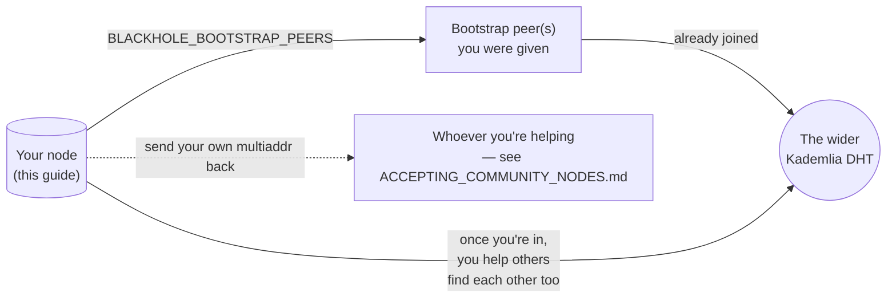

# Running a community DHT bootstrap node

This is for anyone in the community — not the platform operator — who
wants to help other people's Blackhole daemons find each other. You don't
need to run the platform's push-relay or TURN relay for this; a bootstrap
node stands entirely on its own, and every bit it helps benefits the whole
network, not just one operator.

## Table of contents

- [What you're actually running](#what-youre-actually-running)
- [Before you start](#before-you-start)
- [Steps](#steps)
- [Get your own multiaddr (to give back)](#get-your-own-multiaddr-to-give-back)
- [Keeping it working](#keeping-it-working)



## What you're actually running

An ordinary `daemon` (`bh-daemon`) process, same code and image as
`../CLAUDE.md`'s "DHT bootstrap node" — there's no separate
"community-node" binary. Its only real job is staying reachable at a
stable address so other daemons' `BLACKHOLE_BOOTSTRAP_PEERS` can point at
it. It never sees message content, contact lists, or who's talking to
whom — a bootstrap node only helps the Kademlia DHT layer find peers (see
`../docs/SPEC.md` §5 and `../docs/THREAT_MODEL.md` §3.5).

## Before you start

- A host with a public IP (or a router you can port-forward on) and at
  least one port you can open inbound, permanently, while it's running.
- Docker + Docker Compose. (No Docker? See "Bare metal" in
  `README.md`'s bootstrap-node section — the systemd unit there works
  the same way, just point its `BLACKHOLE_BOOTSTRAP_PEERS` the same way
  described below.)
- Modest resources — this is a small process with no media/crypto load
  beyond DHT traffic. A cheap VPS is plenty.
- The multiaddr(es) of at least one already-running bootstrap node to
  join. **Get this from whoever you're helping** — there's no
  registry/discovery mechanism in this codebase beyond this one env var,
  so someone has to hand you the address directly (a docs page, a pinned
  message, etc).

## Steps

```sh
git clone <this repo>
cd blackhole
cp infra/community-node.env.example infra/community-node.env
# edit infra/community-node.env:
#   BLACKHOLE_BOOTSTRAP_PEERS=<the multiaddr(es) you were given>
docker compose -f infra/docker-compose.community-node.yml \
  --env-file infra/community-node.env up -d --build
```

This builds the same image `infra/bootstrap-node/Dockerfile` builds for
the platform's own node — expect the first build to take a while (it
compiles the full Cargo workspace; see that Dockerfile's own comments for
why `bh-daemon` needs codec/media headers even though a bootstrap node
never places a call).

## Get your own multiaddr (to give back)

```sh
docker logs community-bootstrap-node 2>&1 | grep "P2P network stack started"
# copy the peer_id value from that line
```

Your multiaddr is:

```
/ip4/<this host's public IP>/tcp/<COMMUNITY_NODE_PUBLIC_PORT, default 4001>/p2p/<your PeerId>
```

**Send that back to whoever you're helping** (see
`ACCEPTING_COMMUNITY_NODES.md` — that's their side of this process) so
they can add you to the list other daemons are pointed at. Until they do,
your node is up and joined to the network, but nobody new discovers it
through them yet.

## Keeping it working

- **Don't delete the `community-bootstrap-data` volume or recreate the
  container** once you've shared your multiaddr. Doing either generates a
  fresh identity (`PeerId`) next start, silently invalidating the address
  you already handed out — you'd need to redistribute a new one.
  Restarting the *same* container with the *same* volume is fine and
  expected; that's exactly what its `BLACKHOLE_PERSISTENT_NETWORK_IDENTITY`
  default is for.
- **Firewall**: keep the mapped port (`4001/tcp` by default) open
  inbound, permanently. Nothing else needs to be exposed — this image's
  HTTP API binds loopback-only inside the container and was never meant
  to be reached from outside it.
- **Security note**: this image stores its network identity key as a
  `chmod 600` file on disk (`BLACKHOLE_KEYSTORE_BACKEND=file`) rather than
  in an OS keychain, because a headless container has no keychain to use
  — see `README.md`'s bootstrap-node section for why that's an accepted
  trade-off here. Protect the host itself accordingly (don't run this on
  a box other people can get shell access to).
- To stop helping: `docker compose -f infra/docker-compose.community-node.yml down`.
  Let whoever you gave your multiaddr to know, since there's no automatic
  way for them to detect you've stopped other than your node going quiet.
